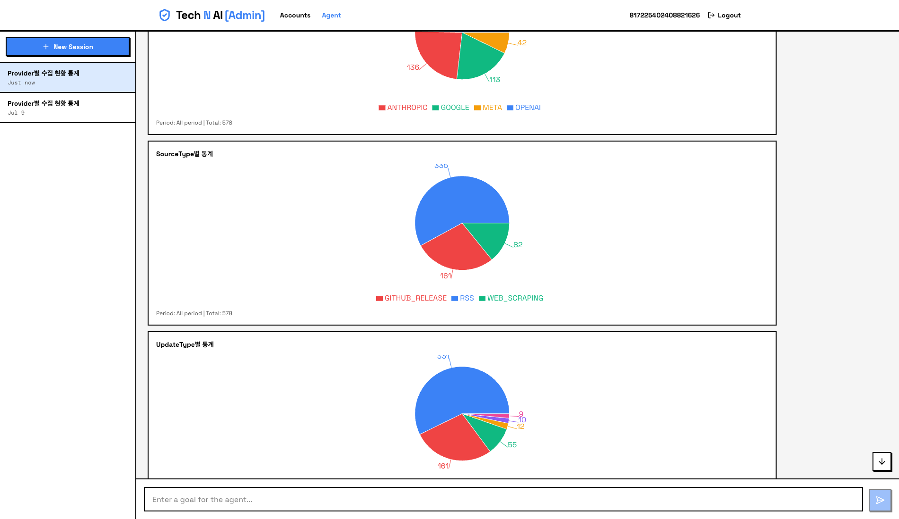
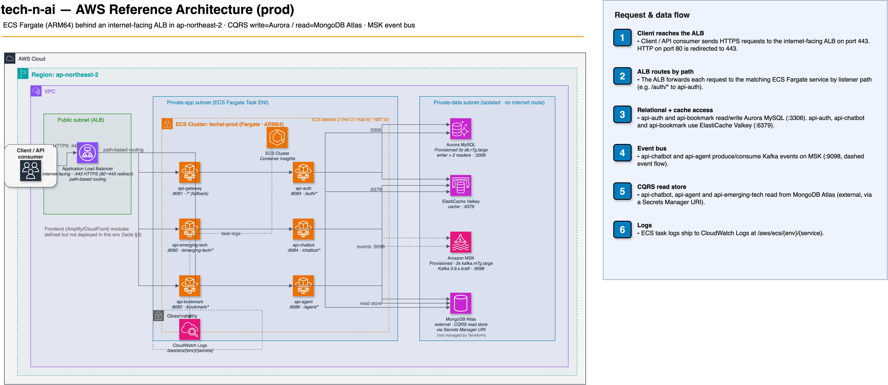

# Tech N AI Demo

빅테크 AI 서비스(OpenAI, Anthropic, Google, Meta, xAI)의 공식 업데이트만 빠짐없이·구조화해 추적하고, 그 위에서 검증 가능한 수치로 트렌드를 집계·시각화하는 Spring Boot 기반 백엔드입니다. 범용 AI 챗봇이 아니라, 정해진 벤더군의 공식 소스만 다루는 좁은 인텔리전스 도구를 목표로 합니다. 인프라는 CQRS(Aurora 쓰기 / MongoDB 읽기)를 Kafka 이벤트로 잇고 Redis로 멱등성을 보장하는 MSA이며, 외부 요청은 API Gateway를 거칩니다.

## 초안 데모 영상

<video src="https://github.com/user-attachments/assets/e2fc8fa9-26bb-48cb-acb4-3b3fde3e9c6d" controls width="100%"></video>

> 프론트엔드 랜딩페이지 연동, RAG 챗봇 멀티턴 대화 구현 초안을 확인할 수 있습니다.

## 기획 의도와 해결

범용 LLM·검색도 최신 AI 소식을 그럭저럭 답합니다. 하지만 "이 5개사 업데이트를 하나도 빠뜨리지 않고"라는 완결성, 지어내지 않은 정량 집계, 공식 출처로만 이어지는 출처 통제, 최신 상태 자동 유지는 주지 못합니다. 이 프로젝트는 범용 대화 성능 대신 이 네 가지를 겨냥하며, 해결 방법은 두 가지입니다.

1. **구조화된 공식 코퍼스**: GitHub 릴리스·RSS·공식 블로그만 화이트리스트로 고정해 수집하고(목록 밖 저장소·호스트는 `ToolInputValidator`가 거부, SSRF 방어 포함), 이종 소스를 `EmergingTechDocument` 하나의 스키마로 정규화합니다. 저장 전 `externalId`→`url` 순으로 기존 도큐먼트를 조회하고 `url`에 unique 인덱스를 두어 중복을 차단합니다. 배치 Job은 `--job.name` 인자로 외부에서 실행하고, 에이전트 스케줄러(6시간 주기)는 `AGENT_SCHEDULER_ENABLED=true`일 때만 동작합니다(기본 비활성).
2. **결정적 집계·시각화**: provider/sourceType/updateType별 통계와 키워드 빈도를 LLM이 아니라 MongoDB Aggregation이 서버에서 계산하고, 그 수치를 `ChartData`(pie/bar)·Markdown 표·Mermaid로 제공합니다. 차트가 주장하는 수치는 코퍼스에서 곧장 나온 검증 가능한 값입니다.

langchain4j RAG 챗봇은 이 코퍼스에 자연어로 접근하는 보조 창구입니다. 최종 답변 문자열은 LLM이 생성하므로 환각 가능성이 남고, 검증이 중요한 정량 정보는 위 결정적 집계가 맡습니다.

**실행 화면** — 관리자 앱에서 Agent가 Tool을 자동 호출해 통계를 집계하고 Pie 차트로 시각화한 결과입니다.



## 시스템 아키텍처

CQRS를 물리적으로 분리했습니다. 쓰기는 Aurora MySQL(정규화, TSID PK, soft delete + 히스토리 테이블), 읽기는 MongoDB Atlas(비정규화, RAG용 Vector Search)가 맡고, 두 쪽은 Kafka 이벤트로 동기화하며 Redis 기반 멱등성 처리(TTL 7일)를 둡니다. 현재 Kafka 이벤트 계약은 대화 세션·메시지 4종이고, 북마크는 Kafka 없이 Aurora 단독으로 처리합니다.



- 환경별(dev·beta·prod) 다이어그램 전체: [devops/aws 갤러리](devops/aws/README.md) · [mermaid 버전](devops/aws/mermaid/architecture.md)
- CQRS·Kafka 동기화 설계: [CQRS Kafka 동기화 설계서](docs/prototype/step11/cqrs-kafka-sync-design.md)
- 인프라(Terraform 코드 기준) 정리: [architecture-facts.md](devops/aws/architecture-facts.md) · [Well-Architected Review](devops/aws/well-architected-review.md)

## 실행 가능한 서비스와 포트

| 서비스 | 포트 | 로컬 MySQL 컨테이너 |
|--------|------|--------------------|
| api-gateway | 8081 | 사용 안 함 |
| api-emerging-tech | 8082 | 사용 안 함 (MongoDB만 사용) |
| api-auth | 8083 | mysql-auth (3308) |
| api-chatbot | 8084 | mysql-chatbot (3310) |
| api-bookmark | 8085 | mysql-bookmark (3309) |
| api-agent | 8086 | mysql-chatbot 공유 (3310) |
| batch-source | - | mysql-batch (3307) |

나머지 모듈은 모두 라이브러리(jar)입니다. Aurora 스키마는 외부에서 관리하며(`ddl-auto: none`), Flyway 의존성과 디렉토리는 있지만 마이그레이션 파일은 아직 없습니다.

## 로컬 실행

```bash
docker compose up -d    # MySQL 4개 + Kafka + 모니터링 스택 (Redis·MongoDB 컨테이너는 없으므로 따로 준비)
cp .env.example .env    # 환경 변수 설정

./gradlew :api-gateway:bootRun    # 서비스별 실행 (기본 local 프로필, KST·UTF-8 강제)
./gradlew test                    # 테스트
```

핵심 환경 변수는 `MONGODB_ATLAS_CONNECTION_STRING`, `REDIS_HOST`/`REDIS_PASSWORD`, `KAFKA_BOOTSTRAP_SERVERS`, `JWT_SECRET_KEY`, `OPENAI_API_KEY`, `EMERGING_TECH_INTERNAL_API_KEY`입니다. 전체 목록은 `.env.example`과 각 모듈 README를 참고하세요. OAuth 클라이언트 ID·Secret은 환경 변수가 아니라 Aurora providers 테이블에서 읽습니다.

## 모듈 구성

Gradle 멀티모듈이며, `settings.gradle`이 `src/`가 있는 디렉토리를 `{parentDir}-{moduleDir}` 이름으로 자동 등록합니다(예: `api/auth` → `api-auth`).

### api

- [api/gateway](api/gateway/README.md) — Spring Cloud Gateway(WebFlux/Netty). JWT 검증·경로별 인가, 위조 identity 헤더 제거, Rate Limiting, Circuit Breaker, 요청 추적, Access Log
- [api/auth](api/auth/README.md) — 회원·관리자 인증. OAuth 2.0(Google·Naver·Kakao), 사용자/관리자 토큰 분리, 로그인 잠금, 감사 추적
- [api/emerging-tech](api/emerging-tech/README.md) — AI 업데이트 조회·검색 공개 API와 내부 저장·승인 API(중복 검사 + 임베딩 생성)
- [api/chatbot](api/chatbot/README.md) — langchain4j RAG 멀티턴 챗봇. Atlas Vector Search 하이브리드 검색(Score Fusion + RRF), Cohere 재순위·웹 검색은 opt-in
- [api/agent](api/agent/README.md) — LangChain4j 자율 Agent(ADMIN 전용). 9개 Tool로 수집·조회·분석, ChartData 구조화 응답, 화이트리스트·루프 감지 등 안전장치
- [api/bookmark](api/bookmark/README.md) — 사용자 북마크. Aurora 단독 처리, soft delete·이력 조회·복구

### batch

- [batch/source](batch/source/README.md) — Spring Batch Job 3종(GitHub Release·RSS·웹 스크래핑). `--job.name` 인자로 외부에서 실행하며, reader는 Spring Data JPA 인터페이스

### client

- [client/feign](client/feign/README.md) — OpenFeign 클라이언트 (OAuth, GitHub, 내부 API)
- [client/rss](client/rss/README.md) — RSS 피드 파서
- [client/scraper](client/scraper/README.md) — 웹 스크래핑 (Jsoup)
- [client/slack](client/slack/README.md) — Slack 알림 클라이언트
- [client/mail](client/mail/README.md) — 이메일 전송 클라이언트

### common

- [common/core](common/core/README.md) — 핵심 유틸리티 (트리 안 무의존)
- [common/exception](common/exception/README.md) — 공통 예외 처리
- [common/kafka](common/kafka/README.md) — Kafka 설정·이벤트 모델
- [common/security](common/security/README.md) — JWT·Spring Security
- [common/conversation](common/conversation/README.md) — 대화 세션/메시지 저장 (Agent·Chatbot 공용, CQRS 영속화)

### datasource

- [datasource/aurora](datasource/aurora/README.md) — Aurora MySQL Command Side. TSID PK, soft delete, 히스토리 테이블, ERD·스키마 상세 포함
- [datasource/mongodb](datasource/mongodb/README.md) — MongoDB Atlas Query Side. 비정규화 컬렉션, ESR 인덱스, Vector Search, 스키마 상세 포함

의존 방향: `api`/`batch`가 `common-*`·`datasource-*`·`client-*`를 조합합니다. 트리 안 무의존은 `common-core` 하나이고, `common-exception`·`common-kafka`는 `datasource-mongodb`에, `common-conversation`은 `datasource-aurora`·`datasource-mongodb`에, `client-*`는 `common-core`(일부는 `common-exception`, feign은 `common-kafka`도)에 의존합니다.

## 주요 API

모든 API는 Gateway(로컬 `http://localhost:8081`)를 통해 접근합니다. 엔드포인트 전체 목록은 각 모듈 README와 [API 통합 명세서](docs/reference/api-specifications/000-overview.md)에 있습니다.

| 경로 프리픽스 | 대상 서비스 | 인증 |
|--------------|------------|------|
| `/api/v1/auth/**` | api-auth | 공개. 단 `/api/v1/auth/admin/**`은 ADMIN JWT (`admin/login`·`admin/refresh`는 공개) |
| `/api/v1/emerging-tech/**` | api-emerging-tech | 공개. 내부 생성·승인 API는 `X-Internal-Api-Key` |
| `/api/v1/bookmark/**` | api-bookmark | USER JWT |
| `/api/v1/chatbot/**` | api-chatbot | USER JWT |
| `/api/v1/agent/**` | api-agent | ADMIN JWT |

인증은 `Authorization: Bearer {access_token}` 헤더를 사용합니다. Access Token은 사용자 60분·관리자 15분, Refresh Token은 사용자 7일·관리자 1일입니다.

## 기술 스택

- Java 21 · Spring Boot 4.0.2 (`spring-boot-starter-classic`) · Spring Cloud 2025.1.0 · Gradle (Groovy DSL)
- Aurora MySQL 3.x (Command) + MongoDB Atlas 7.0+ (Query, Vector Search) — CQRS 물리 분리
- Apache Kafka (이벤트 동기화) · Redis (캐싱, OAuth State, 멱등성)
- langchain4j 1.10.0 · OpenAI GPT-4o-mini + text-embedding-3-small
- Spring Data JPA/Hibernate + QueryDSL · Spring Batch · Spring Security
- Spring REST Docs (Asciidoctor) · OpenFeign · OpenTelemetry + Micrometer 관측
- TSID PK는 64비트 Long이라 JS `Number.MAX_SAFE_INTEGER`를 넘으므로, Jackson 전역 Long→String 직렬화로 프론트엔드 정밀도를 지킵니다

## 참고 문서

### 핵심 아키텍처 설계

- [CQRS Kafka 동기화 설계서](docs/prototype/step11/cqrs-kafka-sync-design.md)
- [langchain4j RAG 기반 챗봇 설계서](docs/prototype/step12/rag-chatbot-design.md) · RAG 개선: [검색 개선](docs/reference/design/004-chatbot-rag-redesign.md) · [하이브리드 검색 Score Fusion](docs/reference/design/005-chatbot-hybrid-search-score-fusion.md) · [세션 타이틀 자동생성](docs/reference/design/006-chatbot-session-title-generation.md)
- [AI Agent 자동화 파이프라인 설계서 (001~007)](docs/reference/agent-pipeline/) · [Agent 테스트 결과](docs/reference/agent-pipeline/tests/)
- [MongoDB Atlas 도큐먼트 설계서](docs/prototype/step1/2.%20mongodb-schema-design.md) · [Aurora MySQL 테이블 설계서](docs/prototype/step1/3.%20aurora-schema-design.md)

### 인증·Gateway 설계

- [Spring Security 인증/인가 설계 가이드](docs/prototype/step6/spring-security-auth-design-guide.md) · [OAuth Provider 구현 가이드](docs/prototype/step6/oauth-provider-implementation-guide.md) · [관리자 인증 보안 강화 설계서](docs/reference/design/002-admin-role-based-auth.md)
- [Gateway 설계서](docs/prototype/step14/gateway-design.md) · [구현 계획](docs/prototype/step14/gateway-implementation-plan.md) · [보안·운영 강화 설계서](docs/reference/design/008-api-gateway-improvement.md)

### API 명세

- [API 통합 명세서](docs/reference/api-specifications/000-overview.md) — [Agent](docs/reference/api-specifications/001-api-agent.md) · [Auth](docs/reference/api-specifications/002-api-auth.md) · [Bookmark](docs/reference/api-specifications/003-api-bookmark.md) · [Chatbot](docs/reference/api-specifications/004-api-chatbot.md) · [Emerging Tech](docs/reference/api-specifications/005-api-emerging-tech.md)
- [사용자 북마크 기능 설계서](docs/prototype/step13/user-bookmark-feature-design.md)

### 기타

- [MySQL Docker 로컬 환경 구축 가이드](docs/reference/guide/003-mysql-docker-local-setup.md)
- [배치 잡 통합 설계서](docs/prototype/step10/batch-job-integration-design.md)
- [AI LLM 통합 분석](docs/prototype/step11/ai-integration-analysis.md) · [Redis 최적화](docs/prototype/step7/redis-optimization-best-practices.md) · [RSS/Scraper 모듈 분석](docs/prototype/step8/rss-scraper-modules-analysis.md) · [Slack 연동 설계 가이드](docs/prototype/step8/slack-integration-design-guide.md)
