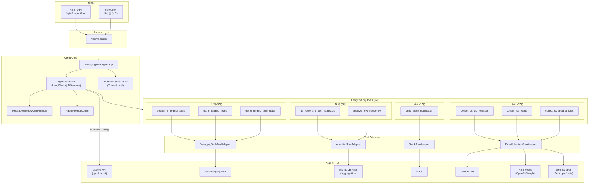

# API Agent 모듈

LangChain4j 기반 Emerging Tech 데이터 분석 및 업데이트 추적 AI Agent 서비스입니다.

## 개요

`api-agent`는 LangChain4j와 OpenAI(gpt-4o-mini)로 빅테크 AI 서비스(OpenAI, Anthropic, Google, Meta, xAI)의 업데이트를 자율 추적·분석하는 Agent입니다. 자연어 목표(Goal)를 받아 GitHub Release 수집, 웹 스크래핑/RSS, 통계 집계, 키워드 빈도 분석을 자동 수행하고 결과를 Markdown 표와 Mermaid 차트로 정리합니다. ADMIN JWT 인증과 `sessionId` 기반 멀티턴 대화를 지원하며, 6시간 주기 스케줄러로도 실행됩니다(실행 실패 시 Slack 알림).

## 아키텍처



## LangChain4j Tools (9개)

#### 조회 (3개)

| Tool | 설명 | 주요 파라미터 |
|------|------|---------------|
| `search_emerging_techs` | 키워드로 Emerging Tech 데이터 검색 | `query`(필수), `provider`(선택) |
| `list_emerging_techs` | 기간/Provider/UpdateType/SourceType/Status 필터 + 페이징 목록 조회 | `startDate`, `endDate`, `provider`, `updateType`, `sourceType`, `status`, `page`, `size` |
| `get_emerging_tech_detail` | MongoDB ObjectId 기반 Emerging Tech 상세 조회 | `id`(필수, 24자 hex) |

#### 분석 (2개)

| Tool | 설명 | 주요 파라미터 |
|------|------|---------------|
| `get_emerging_tech_statistics` | Provider/SourceType/UpdateType별 통계 집계 (MongoDB Aggregation) | `groupBy`(필수), `startDate`, `endDate` |
| `analyze_text_frequency` | title/summary 키워드 빈도 분석 (영어 불용어 필터링, `AnalyticsConfig.stopWords`로 설정·오버라이드) | `provider`, `updateType`, `sourceType`, `startDate`, `endDate`, `topN`(기본20, 최대100) |

#### 알림 (1개)

| Tool | 설명 | 주요 파라미터 |
|------|------|---------------|
| `send_slack_notification` | Slack 채널(#emerging-tech) 알림 전송 (현재 비활성화 - Mock 응답) | `message`(필수) |

#### 수집 (3개)

| Tool | 설명 | 주요 파라미터 |
|------|------|---------------|
| `collect_github_releases` | GitHub 리포지토리 릴리스 수집 → DB 저장 (화이트리스트 기반) | `owner`(필수), `repo`(필수) |
| `collect_rss_feeds` | OpenAI/Google 블로그 RSS 피드 수집 → DB 저장 | `provider`(선택: OPENAI, GOOGLE) |
| `collect_scraped_articles` | Anthropic/Meta 블로그 웹 스크래핑 수집 → DB 저장 | `provider`(선택: ANTHROPIC, META) |

> 분석 Tool(`get_emerging_tech_statistics`, `analyze_text_frequency`)은 실행 시 `ChartData`(pie/bar)를 함께 수집해 응답에 포함합니다. 동일 인자 반복 호출은 `ToolExecutionMetrics`가 차단하며, 한도를 넘으면 `AgentLoopDetectedException`으로 강제 종료합니다.

## Agent 동작 예시

```
Goal: "최근 AI 업데이트 현황을 수집해주세요"

1. get_emerging_tech_statistics("provider", "", "")
   → { totalCount: 179, groups: [{ANTHROPIC:72}, {OPENAI:45}, ...] }
2. get_emerging_tech_statistics("source_type", "", "")
   → { groups: [{WEB_SCRAPING:115}, {GITHUB_RELEASE:64}] }
3. send_slack_notification("데이터 수집 완료: ...")

결과: Provider별/SourceType별 통계 Markdown 표 + 차트(ChartData) + 수집 요약
```

## API 엔드포인트

모든 Agent API는 Gateway(`admin-only-paths`)와 서비스 자체 `SecurityConfig`(`hasRole("ADMIN")`) 양쪽에서 ADMIN JWT를 검증합니다. 컨트롤러는 `@AuthenticationPrincipal UserPrincipal`(JWT 페이로드)로 세션 소유자를 식별합니다.

| Method | Endpoint | 설명 |
|--------|---------|------|
| POST | `/api/v1/agent/run` | Agent 실행 (자연어 목표 입력) |
| GET | `/api/v1/agent/sessions` | 세션 목록 조회 (페이징) |
| GET | `/api/v1/agent/sessions/{sessionId}` | 세션 상세 조회 |
| GET | `/api/v1/agent/sessions/{sessionId}/messages` | 대화 이력 조회 (페이징) |
| PATCH | `/api/v1/agent/sessions/{sessionId}/title` | 세션 타이틀 수동 변경 |
| DELETE | `/api/v1/agent/sessions/{sessionId}` | 세션 삭제 |

### Agent 실행 요청

```http
POST /api/v1/agent/run
Authorization: Bearer {accessToken}
Content-Type: application/json

{
  "goal": "최근 AI 업데이트 현황을 수집해주세요",
  "sessionId": "{기존 세션 ID, 생략 가능}"
}
```

> `sessionId`를 생략하면 새 세션이 생성되어 응답으로 반환되고, 같은 `sessionId`로 재요청하면 이전 대화 맥락을 유지합니다.

### Response

```json
{
  "code": "2000",
  "message": "success",
  "data": {
    "success": true,
    "summary": "## Provider별 통계\n\n| Provider | 건수 |\n|---|---|\n| OPENAI | 145 |",
    "sessionId": "{세션 ID}",
    "toolCallCount": 8,
    "analyticsCallCount": 2,
    "executionTimeMs": 48612,
    "errors": [],
    "chartData": [
      {
        "chartType": "pie",
        "title": "Provider별 통계",
        "meta": { "groupBy": "provider", "startDate": null, "endDate": null, "totalCount": 243 },
        "dataPoints": [
          { "label": "OPENAI", "value": 145 }
        ]
      }
    ]
  }
}
```

## 동작 확인 (로컬 테스트)

로컬 환경에서 자연어 목표 입력 → 자율 Tool 선택 → 수집/분석 → Slack 알림 → MongoDB 저장까지 확인했습니다.

- [실행 요청/응답](../../contents/api-agent/api-agent%20250204_1-실행로그.png) — `POST /api/v1/agent/run`, 메트릭(`toolCallCount`/`analyticsCallCount`) 집계
- [통계 Tool 호출](../../contents/api-agent/api-agent%20250204_2-실행로그.png) — `get_emerging_tech_statistics`로 Provider/SourceType 집계
- [LLM 자율 추론](../../contents/api-agent/api-agent%20250204_4-실행로그.png) — Function Calling으로 다음 Tool 선택
- [시각화 + Slack](../../contents/api-agent/api-agent%20250204_6-실행로그.png) — Markdown 표 정리 후 Slack 알림 전송
- [최종 실행 결과](../../contents/api-agent/api-agent%20250204_7-실행로그.png)
- [MongoDB 저장](../../contents/api-agent/api-agent%20250204_8-실행로그.png) — `emerging_techs` 컬렉션에 수집 데이터 저장

## 단위 테스트

| 테스트 클래스 | 대상 |
|--------------|------|
| `AgentControllerTest` | REST API 컨트롤러 |
| `AgentFacadeTest` | Facade 계층 |
| `EmergingTechAgentImplTest` | Agent 구현체 (루프 감지, 에러 처리) |
| `EmergingTechAgentToolsTest` | Tool 정의 및 검증 로직 |
| `ToolExecutionMetricsTest` | ThreadLocal 메트릭 집계 |
| `AnalyticsToolAdapterTest` / `DataCollectionToolAdapterTest` / `EmergingTechToolAdapterTest` | Tool 어댑터 |
| `ToolErrorHandlersTest` | Tool 오류 처리 전략 |
| `ToolInputValidatorTest` | Tool 입력값 검증 |
| `DataCollectionProcessorUtilTest` | 데이터 수집 결과 가공 유틸 |

## 디렉토리 구조

```
api/agent/src/main/java/.../api/agent/
├── ApiAgentApplication.java
├── agent/        # Agent 인터페이스·구현체, AiServices(AgentAssistant), 실행결과 DTO, dto/ChartData
├── config/       # OpenAI 모델, System Prompt, 분석(불용어), ComponentScan 설정
├── controller/   # AgentController (실행 + 세션 관리 REST API)
├── dto/          # request(실행/세션목록/메시지/타이틀), response(세션목록/메시지)
├── exception/    # AgentLoopDetectedException (루프 감지)
├── facade/       # AgentFacade (Controller ↔ Agent 오케스트레이션)
├── metrics/      # ToolExecutionMetrics (ThreadLocal 실행 메트릭)
├── scheduler/    # EmergingTechAgentScheduler (6시간 주기)
├── service/      # GitHub/RSS/Scraper 수집 서비스 + 세션 타이틀 자동생성(@Async)
└── tool/         # EmergingTechAgentTools(9개) + adapter/ dto/ handler/ util/ validation/
```

## 설정

`application.yml`: 포트 8086, 프로필 include(`common-core`, `kafka`, `api-domain`, `agent-api`, `mongodb-domain`, `feign-github`, `feign-internal`, `slack`, `scraper`, `rss`). Aurora 스키마는 `chatbot`을 공유하며 로컬 MySQL 포트는 `MYSQL_PORT`(기본 3310)로 지정합니다.

`application-agent-api.yml` (Agent 전용 설정):

```yaml
langchain4j:
  open-ai:
    chat-model:
      api-key: ${OPENAI_API_KEY:}
      model-name: gpt-4o-mini
      temperature: 0.3
      max-tokens: 4096
      timeout: 120
      log-requests: ${AGENT_LOG_REQUESTS:false}
      log-responses: ${AGENT_LOG_RESPONSES:false}

internal-api:
  emerging-tech:
    api-key: ${EMERGING_TECH_INTERNAL_API_KEY:}

agent:
  scheduler:
    enabled: ${AGENT_SCHEDULER_ENABLED:false}
    cron: "0 0 */6 * * *"
  analytics:
    default-top-n: 20
    max-top-n: 100
  slack:
    enabled: false    # true로 변경 시 실제 발송 (기본 Mock)
```

### 환경 변수

| 변수명 | 설명 | 필수 |
|--------|------|------|
| `OPENAI_API_KEY` | OpenAI API 키 | Yes |
| `EMERGING_TECH_INTERNAL_API_KEY` | emerging-tech 및 Agent API 인증 키 | Yes |
| `AGENT_SCHEDULER_ENABLED` | 스케줄러 활성화 (true/false) | No |
| `GITHUB_TOKEN` | GitHub API 토큰 (Rate Limit 완화) | No |

## 대상 AI 서비스 (GitHub 화이트리스트)

`ToolInputValidator`로 아래 조합만 허용하며, 목록 밖 저장소 호출은 거부합니다.

| Provider | Owner | Repository |
|----------|-------|------------|
| OpenAI | openai | openai-python, whisper, tiktoken |
| Anthropic | anthropics | anthropic-sdk-python, claude-code |
| Google | google | generative-ai-python, gemma.cpp |
| Google | google-deepmind | gemma |
| Meta | meta-llama | llama-models, llama-stack |
| xAI | xai-org | grok-1 |

## 의존성

```gradle
dependencies {
    // 프로젝트 모듈
    implementation project(':common-core')
    implementation project(':common-exception')
    implementation project(':common-conversation')
    implementation project(':common-security')
    implementation project(':common-kafka')
    implementation project(':datasource-aurora')
    implementation project(':datasource-mongodb')

    // LangChain4j Core + OpenAI (1.10.0: Tool Error Handler 지원)
    implementation 'dev.langchain4j:langchain4j:1.10.0'
    implementation 'dev.langchain4j:langchain4j-open-ai:1.10.0'

    // Agent Tool용 클라이언트 모듈
    implementation project(':client-feign')
    implementation project(':client-slack')
    implementation project(':client-scraper')
    implementation project(':client-rss')    // RSS 피드 수집용

    // HTML 파싱
    implementation 'org.jsoup:jsoup:1.17.2'

    annotationProcessor 'org.springframework.boot:spring-boot-configuration-processor'
}
```

## 실행

```bash
./gradlew :api-agent:build     # 빌드
./gradlew :api-agent:bootRun   # 실행 (8086)
./gradlew :api-agent:test      # 테스트
```

## 연동 모듈

- **api-emerging-tech**: 업데이트 검색 API 제공
- **datasource-mongodb**: MongoDB Aggregation 기반 통계/빈도 집계
- **client-feign**: GitHub API, Internal API Feign 클라이언트
- **client-slack** / **client-scraper** / **client-rss**: Slack 알림, 웹 크롤링, RSS 수집

## 참고 자료

- 설계 문서: [Agent 파이프라인 설계서 (Phase 1~7)](../../docs/reference/agent-pipeline/) — 데이터 수집, Tool 래퍼, Agent 통합, 분석 Tool 재설계, 데이터 수집 Agent, Query Tool 개선, 미지원 요청 처리
- 테스트 결과: [Agent 테스트 결과 문서](../../docs/reference/agent-pipeline/tests/)
- 공식 문서: [LangChain4j](https://docs.langchain4j.dev/) · [Tools](https://docs.langchain4j.dev/tutorials/tools) · [AI Services](https://docs.langchain4j.dev/tutorials/ai-services) · [Spring Data MongoDB Aggregation](https://docs.spring.io/spring-data/mongodb/reference/mongodb/aggregation-framework.html) · [OpenAI API](https://platform.openai.com/docs/api-reference)
```