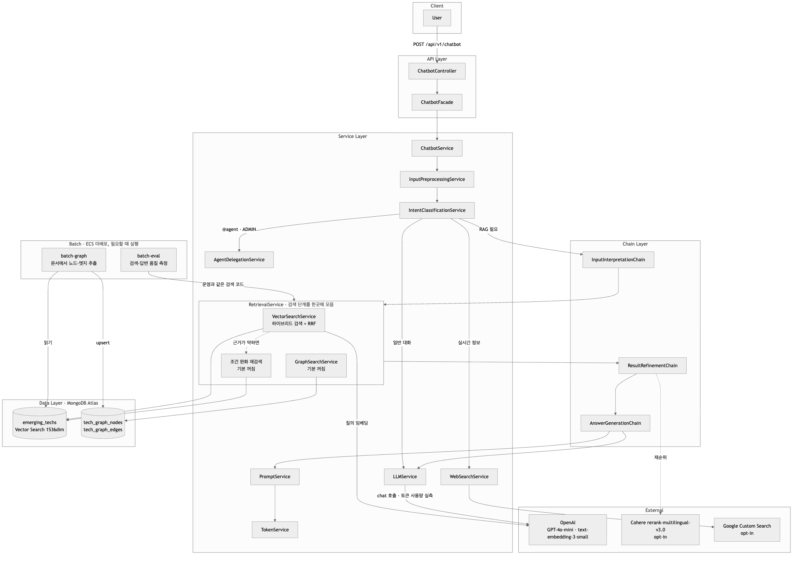
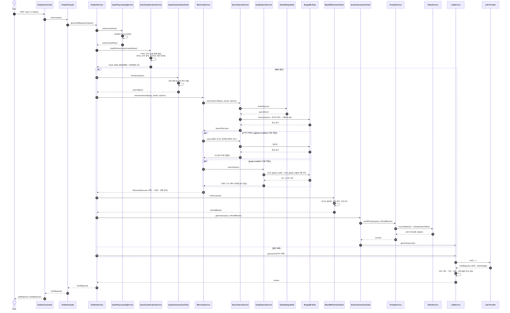

# Chatbot API Module

langchain4j를 활용한 RAG(Retrieval-Augmented Generation) 기반 챗봇 시스템입니다. MongoDB Atlas Vector Search를 활용하여 Emerging Tech(AI 업데이트 정보)를 검색하고 자연어로 질문할 수 있는 기능을 제공합니다. 하이브리드 검색(Score Fusion + RRF)으로 최신 문서 누락을 방지하고, 세션 타이틀 자동생성 기능을 지원합니다.

## 목차

1. [개요](#개요)
2. [아키텍처](#아키텍처)
3. [주요 기능](#주요-기능)
4. [기술 스택](#기술-스택)
5. [API 엔드포인트](#api-엔드포인트)
6. [설정](#설정)
7. [의존성](#의존성)
8. [구현 구조](#구현-구조)
9. [참고 자료](#참고-자료)

---

## 개요

### 배경

현재 프로젝트는 CQRS 패턴을 적용하여 Command Side(Aurora MySQL)와 Query Side(MongoDB Atlas)를 분리하고 있으며, MongoDB Atlas에는 다음 컬렉션이 저장되어 있습니다:

- **EmergingTechDocument**: AI 서비스 업데이트 정보 (OpenAI, Anthropic, Google, Meta, xAI)

이 도큐먼트를 임베딩하여 벡터 검색 기반의 지식 검색 챗봇을 구축함으로써, 사용자가 자연어로 최신 AI 업데이트를 검색하고 질문할 수 있도록 합니다.

### LLM 및 Embedding Model 선택

- **LLM Provider**: OpenAI GPT-4o-mini (기본)
  - 비용 최적화: $0.15/$0.60 per 1M tokens (입력/출력)
  - 빠른 응답 속도
  - 128K 컨텍스트 윈도우

- **Embedding Model**: OpenAI text-embedding-3-small (기본)
  - LLM Provider와 동일한 Provider 사용으로 통합성 최적화
  - 비용 최적화: $0.02 per 1M tokens
  - 1536 dimensions (기본값)

### 설계 원칙

1. **클린코드 원칙**
   - 단일 책임 원칙 (SRP)
   - 의존성 역전 원칙 (DIP)
   - 개방-폐쇄 원칙 (OCP)

2. **최소 구현 원칙**
   - 현재 필요한 기능만 구현
   - 단순하고 명확한 구조
   - 단계적 확장 가능한 구조

3. **운영 환경 고려**
   - 비용 통제 (토큰 사용량 추적 및 제한)
   - 성능 최적화 (검색 결과 수 제한, 프롬프트 최적화)
   - 에러 처리 (각 단계별 에러 핸들링)

---

## 아키텍처

### Overall System Architecture



시스템은 다음과 같은 계층 구조로 구성됩니다:

- **API Layer**: RESTful API 엔드포인트 제공
- **Service Layer**: 비즈니스 로직 처리
- **Chain Layer**: RAG 파이프라인 체인 처리
- **Data Layer**: MongoDB Atlas Vector Search 및 Redis 캐싱
- **External**: LLM Provider 및 Embedding Model

### Chatbot LLM RAG Pipeline



RAG 파이프라인은 다음과 같은 단계로 구성됩니다:

1. **입력 전처리**: 사용자 입력 검증 및 정규화
2. **의도 분류**: RAG 필요 여부 판단
3. **벡터 검색**: MongoDB Atlas Vector Search를 통한 관련 문서 검색
4. **결과 정제**: 유사도 필터링 및 중복 제거
5. **답변 생성**: LLM을 통한 최종 답변 생성

### 데이터 흐름

```
사용자 입력
  ↓
입력 전처리 (검증, 정규화)
  ↓
의도 분류 (RAG 필요 여부)
  ↓
[RAG 필요 시]
  ↓
입력 해석 체인 (검색 쿼리 추출)
  ↓
벡터 검색 (MongoDB Atlas Vector Search)
  ↓
결과 정제 체인 (유사도 필터링, 중복 제거)
  ↓
답변 생성 체인 (프롬프트 구축, LLM 호출)
  ↓
최종 답변 반환
```

---

## 주요 기능

### 1. Emerging Tech 전용 RAG 검색

- `emerging_techs` 컬렉션 전용 MongoDB Atlas Vector Search
- status: PUBLISHED pre-filter 적용
- Emerging Tech 메타데이터(provider, publishedAt, title, url) 포함 프롬프트

### 2. 하이브리드 검색 (Score Fusion + RRF)

- **벡터 검색 + 최신성 결합**: 순수 벡터 유사도만으로는 최신 문서가 누락될 수 있는 문제 해결
- **MongoDB Pipeline 내 Score Fusion**: `$vectorSearch` → `$addFields(recencyScore)` Exponential Decay 함수 → `$addFields(combinedScore)` → `$sort` → `$limit`
- **최신성 직접 쿼리**: `published_at` DESC 정렬로 최신 문서 보장
- **RRF 결합**: 두 검색 소스를 Reciprocal Rank Fusion (k=60) 알고리즘으로 결합
- MongoDB 8.2/8.3의 `$rankFusion`/`$scoreFusion` 효과를 MongoDB 8.0 환경에서 재현

### 3. 세션 타이틀 자동생성

- 새 세션의 첫 메시지-응답 완료 후 `@Async` 비동기 LLM 호출로 3~5단어 타이틀 자동 생성
- 실패 시 예외 흡수 (메인 채팅 흐름에 영향 없음)
- 사용자 수동 변경 지원 (`PATCH /api/v1/chatbot/sessions/{sessionId}/title`)
- 기존 CQRS 인프라 활용 (title 필드, Kafka 이벤트 연동)

### 4. 멀티턴 대화 히스토리 관리

- 세션 기반 대화 컨텍스트 관리
- JWT 토큰 기반 사용자 인증 및 세션 소유권 검증
- ChatMemory를 통한 대화 히스토리 유지
- 메시지 개수 기준 윈도우 관리 (`MessageWindowChatMemory`, 최대 10개 — 설정의 token-window 전환은 TODO)

### 5. 의도 분류

- 4종 자동 분류: `LLM_DIRECT`(일반 대화) / `RAG_REQUIRED` / `WEB_SEARCH_REQUIRED` / `AGENT_COMMAND`
- RAG 필요 시 하이브리드 벡터 검색 수행
- Agent 위임은 `@agent` 프리픽스 명령으로 동작하며 ADMIN 권한 사용자만 가능 (`api-agent`로 feign 위임)
- 일반 대화 시 LLM 직접 호출

### 5-1. Cohere Re-Ranking·웹 검색 (선택 기능, 기본 비활성)

- **Cohere Re-Ranking**: `rerank-multilingual-v3.0` 모델로 검색 결과 재순위. `COHERE_API_KEY` 설정 시 활성화
- **웹 검색**: Google Custom Search API 기반. `GOOGLE_SEARCH_API_KEY`/`GOOGLE_SEARCH_ENGINE_ID` 설정 시 활성화

### 6. 토큰 제어 및 비용 통제

- 입력/출력 토큰 사용량 추적
- 토큰 제한 검증 및 경고
- 캐싱을 통한 중복 호출 방지

### 7. 세션 생명주기 관리

- 비활성 세션 자동 비활성화 (30분 미사용 시)
- 만료된 세션 자동 처리 (90일 경과 시)
- 배치 작업을 통한 세션 정리

---

## 기술 스택

### Core Framework

- **Spring Boot**: 4.0.2
- **Java**: 21
- **Gradle**: 멀티모듈 빌드

### AI/ML 라이브러리

- **langchain4j**: 1.10.0 (mongodb-atlas·cohere 통합 모듈은 1.10.0-beta18)
  - LLM 통합 및 추상화
  - MongoDB Atlas Vector Search 통합
  - ChatMemory 관리
  - Cohere Re-Ranking (`rerank-multilingual-v3.0`, 기본 비활성)

### LLM Provider

- **OpenAI** (기본)
  - Model: GPT-4o-mini
  - Embedding Model: text-embedding-3-small

### 데이터베이스

- **MongoDB Atlas**: Vector Search를 위한 문서 저장소
- **Aurora MySQL**: 세션 및 메시지 히스토리 저장

### 캐싱

- **Redis**: 검색 결과 및 임베딩 캐싱

### 인증

- **Spring Security**: JWT 토큰 기반 인증
- **JWT**: 사용자 식별 및 권한 확인

---

## API 엔드포인트

### 1. 챗봇 대화

**POST** `/api/v1/chatbot`

사용자 메시지를 받아 챗봇 응답을 생성합니다.

**Request Body:**
```json
{
  "message": "최근 AI 관련 대회 정보를 알려주세요",
  "conversationId": "optional-session-id"
}
```

**Response:**
```json
{
  "code": "2000",
  "messageCode": { "code": "SUCCESS", "text": "success" },
  "message": "success",
  "data": {
    "response": "최근 AI 업데이트 정보는 다음과 같습니다...",
    "conversationId": "session-id",
    "title": "AI 업데이트 질문",
    "sources": [
      {
        "documentId": "665f...",
        "collectionType": "emerging_techs",
        "score": 0.87,
        "title": "OpenAI GPT-4o 업데이트",
        "url": "https://example.com/release"
      }
    ]
  }
}
```

응답에 토큰 사용량은 포함되지 않습니다.

### 2. 세션 목록 조회

**GET** `/api/v1/chatbot/sessions?page=1&size=20`

사용자의 대화 세션 목록을 조회합니다.

**Query Parameters:**
- `page`: 페이지 번호 (기본값: 1)
- `size`: 페이지 크기 (기본값: 20)

**Response:**
```json
{
  "code": "2000",
  "messageCode": { "code": "SUCCESS", "text": "success" },
  "message": "success",
  "data": {
    "pageSize": 20,
    "pageNumber": 1,
    "totalPageNumber": 1,
    "totalSize": 10,
    "list": [
      {
        "sessionId": "session-id",
        "title": "AI 관련 질문",
        "createdAt": "2024-01-16T10:00:00",
        "lastMessageAt": "2024-01-16T10:05:00",
        "isActive": true
      }
    ]
  }
}
```

### 3. 세션 상세 조회

**GET** `/api/v1/chatbot/sessions/{sessionId}`

특정 세션의 상세 정보를 조회합니다.

**Response:**
```json
{
  "code": "2000",
  "messageCode": { "code": "SUCCESS", "text": "success" },
  "message": "success",
  "data": {
    "sessionId": "session-id",
    "title": "AI 관련 질문",
    "createdAt": "2024-01-16T10:00:00",
    "lastMessageAt": "2024-01-16T10:05:00",
    "isActive": true
  }
}
```

### 4. 메시지 히스토리 조회

**GET** `/api/v1/chatbot/sessions/{sessionId}/messages?page=1&size=50`

특정 세션의 메시지 히스토리를 조회합니다.

**Query Parameters:**
- `page`: 페이지 번호 (기본값: 1)
- `size`: 페이지 크기 (기본값: 50)

**Response:**
```json
{
  "code": "2000",
  "messageCode": { "code": "SUCCESS", "text": "success" },
  "message": "success",
  "data": {
    "pageSize": 50,
    "pageNumber": 1,
    "totalPageNumber": 1,
    "totalSize": 2,
    "list": [
      {
        "messageId": "message-id",
        "sessionId": "session-id",
        "role": "USER",
        "content": "최근 AI 업데이트 정보를 알려주세요",
        "sequenceNumber": 1,
        "createdAt": "2024-01-16T10:00:00"
      },
      {
        "messageId": "message-id-2",
        "sessionId": "session-id",
        "role": "ASSISTANT",
        "content": "최근 AI 업데이트 정보는 다음과 같습니다...",
        "sequenceNumber": 2,
        "createdAt": "2024-01-16T10:00:05"
      }
    ]
  }
}
```

### 5. 세션 타이틀 수정

**PATCH** `/api/v1/chatbot/sessions/{sessionId}/title`

세션의 타이틀을 수정합니다.

**Request Body:**
```json
{
  "title": "AI 트렌드 대화"
}
```

**Response:**
```json
{
  "code": "2000",
  "messageCode": { "code": "SUCCESS", "text": "성공" },
  "message": "success",
  "data": {
    "sessionId": "session-id",
    "title": "AI 트렌드 대화",
    "createdAt": "2024-01-16T10:00:00",
    "lastMessageAt": "2024-01-16T10:05:00",
    "isActive": true
  }
}
```

### 6. 세션 삭제

**DELETE** `/api/v1/chatbot/sessions/{sessionId}`

특정 세션을 삭제합니다.

**Response:**
```json
{
  "code": "2000",
  "messageCode": { "code": "SUCCESS", "text": "성공" },
  "message": "success"
}
```

### 인증

모든 API 엔드포인트는 JWT 토큰 기반 인증이 필요합니다.

- **Authorization Header**: `Bearer {jwt-token}`
- **userId**: JWT 토큰에서 자동 추출 (요청 본문에 포함하지 않음)
- **세션 소유권 검증**: 모든 세션 관련 작업은 소유권 검증 필수

---

## 설정

### application-chatbot-api.yml

서버 포트는 8084, 로컬 MySQL은 3310(chatbot 스키마)을 쓰며, `application.yml`의 `profiles.include`에 `kafka`, `feign-internal` 프로필이 포함됩니다.

```yaml
spring:
  application:
    name: chatbot-api
  profiles:
    include:
      - common-core
      - api-domain
      - mongodb-domain

module:
  aurora:
    schema: chatbot
    port: 3310

langchain4j:
  open-ai:
    chat-model:
      api-key: ${OPENAI_API_KEY}
      model-name: gpt-4o-mini
      temperature: 0.7
      max-tokens: 2000
      timeout: 60s
    embedding-model:
      api-key: ${OPENAI_API_KEY}
      model-name: text-embedding-3-small
      dimensions: 1536
      timeout: 30s

chatbot:
  rag:
    max-search-results: 5
    min-similarity-score: 0.7
    max-context-tokens: 3000
    recency-months: 6      # 최신성 키워드 감지 시 검색 기간 (개월)

  reranking:
    enabled: false         # Cohere Re-Ranking (COHERE_API_KEY 설정 시 활성화)
    model-name: rerank-multilingual-v3.0

  web-search:
    enabled: false         # Google Custom Search (API 키 설정 시 활성화)
  
  input:
    max-length: 500
    min-length: 1
  
  token:
    max-input-tokens: 4000
    max-output-tokens: 2000
    warning-threshold: 0.8
  
  cache:
    enabled: true
    ttl-hours: 1
    max-size: 1000
  
  session:
    inactive-threshold-minutes: 30
    expiration-days: 90
    batch-enabled: true
  
  chat-memory:
    max-tokens: 2000
    strategy: token-window   # 설정값과 달리 현재 구현은 MessageWindowChatMemory(최대 10개)로 동작
```

### 환경 변수

- `OPENAI_API_KEY`: OpenAI API 키
- `MONGODB_ATLAS_CONNECTION_STRING`: MongoDB Atlas 연결 문자열
- `MONGODB_ATLAS_DATABASE`: MongoDB Atlas 데이터베이스 이름
- `COHERE_API_KEY`: Cohere Re-Ranking용 API 키 (선택)
- `GOOGLE_SEARCH_API_KEY` / `GOOGLE_SEARCH_ENGINE_ID`: Google Custom Search 웹 검색용 (선택)

---

## 의존성

### build.gradle

```gradle
dependencies {
    // langchain4j Core
    implementation 'dev.langchain4j:langchain4j:1.10.0'

    // langchain4j MongoDB Atlas
    implementation 'dev.langchain4j:langchain4j-mongodb-atlas:1.10.0-beta18'

    // langchain4j OpenAI (LLM Provider - 기본 선택)
    implementation 'dev.langchain4j:langchain4j-open-ai:1.10.0'

    // langchain4j Cohere (Re-Ranking)
    implementation 'dev.langchain4j:langchain4j-cohere:1.10.0-beta18'

    // 프로젝트 모듈 의존성
    implementation project(':common-core')
    implementation project(':common-exception')
    implementation project(':common-conversation')
    implementation project(':common-kafka')
    implementation project(':common-security')
    implementation project(':client-feign')
    implementation project(':datasource-aurora')
    implementation project(':datasource-mongodb')
}
```

---

## 구현 구조

### 패키지 구조

```
api/chatbot/
├── src/main/java/com/tech/n/ai/api/chatbot/
│   ├── ApiChatbotApplication.java
│   ├── config/
│   │   ├── LangChain4jConfig.java
│   │   ├── SchedulerConfig.java
│   │   ├── ServerConfig.java
│   │   └── WebSearchConfig.java
│   ├── controller/
│   │   └── ChatbotController.java
│   ├── facade/
│   │   └── ChatbotFacade.java
│   ├── service/
│   │   ├── ChatbotService.java
│   │   ├── InputPreprocessingService.java
│   │   ├── IntentClassificationService.java
│   │   ├── VectorSearchService.java
│   │   ├── PromptService.java
│   │   ├── LLMService.java
│   │   ├── TokenService.java
│   │   ├── CacheService.java
│   │   ├── ReRankingService.java (CohereReRankingServiceImpl)
│   │   ├── WebSearchService.java
│   │   ├── AgentDelegationService.java
│   │   └── SessionTitleGenerationService.java
│   ├── chain/
│   │   ├── InputInterpretationChain.java
│   │   ├── ResultRefinementChain.java
│   │   └── AnswerGenerationChain.java
│   ├── memory/
│   │   └── ConversationChatMemoryProvider.java
│   ├── dto/
│   │   ├── request/
│   │   │   ├── ChatRequest.java
│   │   │   ├── SessionListRequest.java
│   │   │   ├── MessageListRequest.java
│   │   │   └── UpdateSessionTitleRequest.java
│   │   └── response/
│   │       ├── ChatResponse.java
│   │       ├── SessionListResponse.java
│   │       ├── MessageListResponse.java
│   │       └── SourceResponse.java
│   ├── common/
│   │   └── exception/
│   │       ├── ChatbotExceptionHandler.java
│   │       ├── InvalidInputException.java
│   │       └── TokenLimitExceededException.java
│   └── scheduler/
│       └── ConversationSessionLifecycleScheduler.java
└── src/main/resources/
    └── application-chatbot-api.yml
```

### 주요 컴포넌트

#### 1. Controller Layer

- **ChatbotController**: RESTful API 엔드포인트 제공
  - JWT 토큰에서 `userId` 추출
  - 요청/응답 DTO 변환

#### 2. Facade Layer

- **ChatbotFacade**: Controller와 Service 사이의 중간 계층
  - `userId`를 파라미터로 받아 서비스에 전달

#### 3. Service Layer

- **ChatbotService**: 챗봇 응답 생성 오케스트레이션
- **InputPreprocessingService**: 입력 전처리 및 검증
- **IntentClassificationService**: 의도 분류 (RAG 필요 여부)
- **VectorSearchService**: MongoDB Atlas Vector Search 수행
- **PromptService**: 프롬프트 구축 및 최적화
- **LLMService**: LLM 호출 및 응답 처리
- **TokenService**: 토큰 사용량 추적 및 제어
- **CacheService**: 검색 결과 및 임베딩 캐싱
- **ReRankingService**: Cohere 기반 검색 결과 재순위 (기본 비활성)
- **WebSearchService**: Google Custom Search 웹 검색 (기본 비활성)
- **AgentDelegationService**: `@agent` 명령을 api-agent로 feign 위임 (ADMIN 전용)
- **SessionTitleGenerationService**: 비동기 세션 타이틀 자동생성 (LLM 호출)

세션·메시지 CRUD(`ConversationSessionService`, `ConversationMessageService`)와 `MongoDbChatMemoryStore`는 `common-conversation` 모듈이 제공합니다.

#### 4. Chain Layer

- **InputInterpretationChain**: 입력 해석 및 검색 쿼리 추출
- **ResultRefinementChain**: 검색 결과 정제 (유사도 필터링, 중복 제거)
- **AnswerGenerationChain**: 최종 답변 생성

#### 5. Memory Layer

- **ConversationChatMemoryProvider**: 세션별 ChatMemory 제공 (`MessageWindowChatMemory` 최대 10개)
- **MongoDbChatMemoryStore** (`common-conversation`): MongoDB 기반 ChatMemory 저장소

---

## 참고 자료

### 공식 문서

#### langchain4j

- **공식 문서**: https://docs.langchain4j.dev/
- **GitHub**: https://github.com/langchain4j/langchain4j
- **MongoDB Atlas 통합**: https://docs.langchain4j.dev/integrations/embedding-stores/mongodb-atlas

#### MongoDB Atlas Vector Search

- **공식 문서**: https://www.mongodb.com/docs/atlas/atlas-vector-search/
- **Vector Search Index 생성**: https://www.mongodb.com/docs/atlas/atlas-vector-search/create-index/

#### OpenAI

- **공식 문서**: https://platform.openai.com/docs
- **Chat Completions API**: https://platform.openai.com/docs/guides/chat-completions
- **GPT-4o-mini**: https://platform.openai.com/docs/models/gpt-4o-mini
- **Embeddings**: https://platform.openai.com/docs/guides/embeddings
- **text-embedding-3-small**: https://platform.openai.com/docs/models/text-embedding-3-small
- **Pricing**: https://openai.com/api/pricing/

#### Spring Security

- **공식 문서**: https://docs.spring.io/spring-security/reference/index.html
- **JWT 공식 스펙 (RFC 7519)**: https://tools.ietf.org/html/rfc7519

### 프로젝트 내 참고 문서

- **RAG 챗봇 설계서**: `docs/step12/rag-chatbot-design.md`
- **Emerging Tech 전용 RAG 검색 개선 설계서**: `docs/reference/api-chatbot/1-emerging-tech-rag-redesign.md`
- **하이브리드 검색 Score Fusion 설계서**: `docs/reference/api-chatbot/2-hybrid-search-score-fusion-design.md`
- **세션 타이틀 자동생성 설계서**: `docs/reference/api-chatbot/3-session-title-generation-design.md`
- **Chatbot API 명세서**: `docs/reference/API-SPECIFICATIONS/api-chatbot-specification.md`
- **MongoDB 스키마 설계**: `docs/step1/2. mongodb-schema-design.md`
- **CQRS Kafka 동기화 설계**: `docs/step11/cqrs-kafka-sync-design.md`
- **API 엔드포인트 설계**: `docs/step2/1. api-endpoint-design.md`
- **Spring Security 인증 설계**: `docs/step6/spring-security-auth-design-guide.md`

---

## 버전 정보

- **langchain4j**: 1.10.0 (mongodb-atlas·cohere 통합 모듈은 1.10.0-beta18)
- **Spring Boot**: 4.0.2
- **Java**: 21
- **MongoDB Atlas**: 8.0

---

**문서 버전**: 1.2
**최종 업데이트**: 2026-07-22

