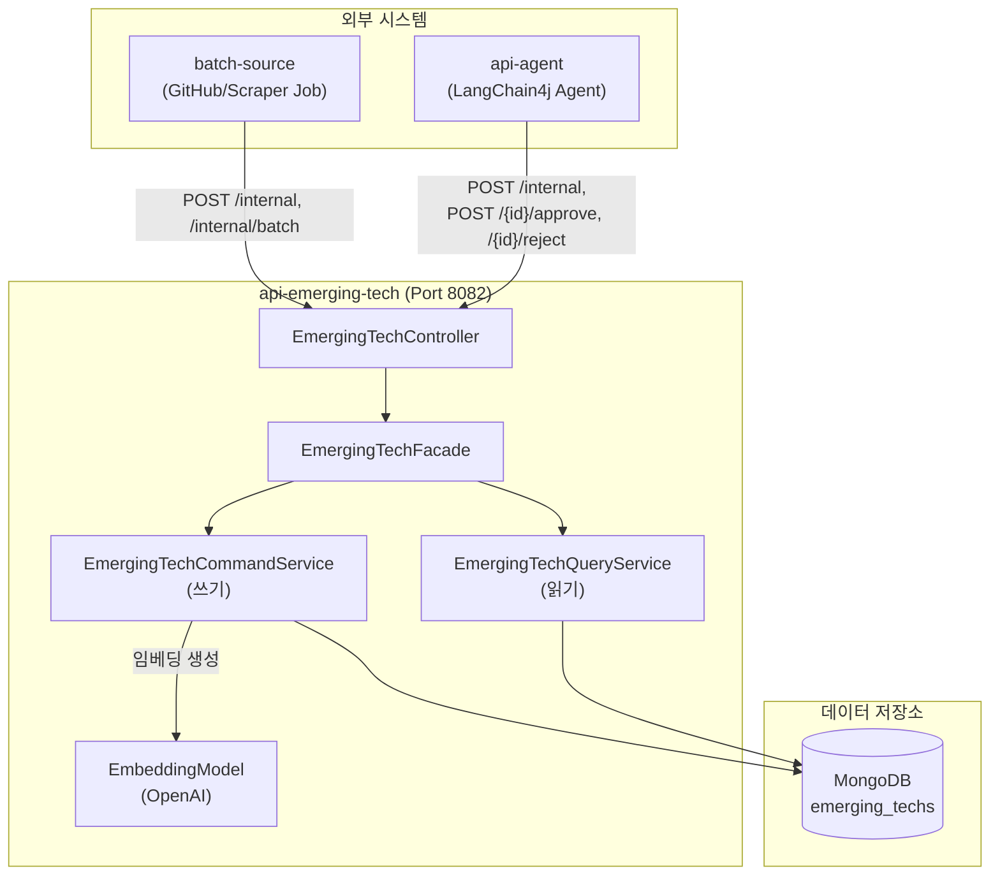

# api-emerging-tech 모듈

빅테크 AI 서비스의 최신 기술 업데이트(모델 출시, API 변경, SDK 릴리스 등)를 저장하고 조회하는 REST API 서비스입니다.

## 개요

`api-emerging-tech`는 OpenAI, Anthropic, Google, Meta, xAI 같은 AI 제공자의 업데이트 정보를 MongoDB에 모아두고 조회·검색하는 API를 제공합니다. 데이터는 직접 사용자가 입력하지 않고, `batch-source`(GitHub Release 추적·웹 스크래핑)와 `api-agent`(LangChain4j 에이전트)가 내부 API로 밀어 넣습니다.

전체 CQRS 구조에서 이 모듈은 **읽기(Query) 쪽**에 속합니다. 저장소로 MongoDB Atlas만 사용하며, 문서를 저장할 때 제목·요약 등을 합쳐 OpenAI 임베딩 벡터를 같이 만들어 둡니다. 이 벡터는 나중에 챗봇·에이전트 모듈이 Vector Search 기반 RAG에서 검색 대상으로 씁니다.

서비스는 Aurora/JPA를 쓰지 않으므로 메인 클래스에서 JPA·DataSource 자동 설정을 모두 제외합니다.

## 아키텍처



모듈 안에서도 쓰기/읽기를 나눕니다. `EmergingTechFacade`가 컨트롤러와 두 서비스 사이를 조율합니다. 쓰기는 `EmergingTechCommandService`(중복 검사 + 임베딩 생성 + 저장), 읽기는 `EmergingTechQueryService`(`MongoTemplate` 동적 Criteria 필터, ID 조회, 제목 검색)가 맡습니다.

## 주요 기능

| 기능 | 설명 |
|------|------|
| 목록 조회 | provider·updateType·status·sourceType 필터, 게시일 기간 필터, 정렬, 페이지네이션 |
| 상세 조회 | ObjectId로 단건 조회 |
| 검색 | 제목 부분 일치 검색 (대소문자 무시) |
| 단건 생성 | 내부 API. externalId·url 기준 중복 검사 후 신규만 저장 |
| 다건 생성 | 내부 API. 중복 검사·임베딩·저장을 요청 단위로 한 번씩 처리 |
| 상태 변경 | 승인(PUBLISHED) / 거부(REJECTED) |
| 임베딩 생성 | 저장 시 제목·요약 등으로 OpenAI 임베딩 벡터(1536차원)를 만들어 함께 저장 |

## 데이터 모델

### EmergingTechDocument (MongoDB, 컬렉션 `emerging_techs`)

MongoDB 필드명은 snake_case이고, 응답 DTO에서는 camelCase로 내려갑니다.

| 필드 (DB) | 타입 | 설명 |
|------|------|------|
| `_id` | ObjectId | Primary Key (응답에서는 hex 문자열 `id`) |
| `provider` | String | AI 제공자 (`TechProvider`) |
| `update_type` | String | 업데이트 유형 (`EmergingTechType`) |
| `title` | String | 제목 |
| `summary` | String | 요약 |
| `url` | String | 원본 URL (중복 검사에 사용) |
| `published_at` | LocalDateTime | 게시 일시 |
| `source_type` | String | 수집 소스 (`SourceType`) |
| `status` | String | 상태 (`PostStatus`) |
| `external_id` | String | 외부 식별자 (저장 전 조회로 중복 검사에 사용) |
| `embedding_text` | String | 임베딩 대상 텍스트 (provider·githubRepo·title·summary·tags 결합) |
| `embedding_vector` | List\<Float\> | 임베딩 벡터 (1536차원) |
| `metadata` | Object | 부가 정보 (version, tags, author, githubRepo, additionalInfo) |
| `created_at` / `updated_at` | LocalDateTime | 생성·수정 일시 |

실제 인덱스는 `MongoIndexConfig`가 만듭니다: `url` unique 인덱스와 `provider`/`status`/`update_type` + `published_at` 복합 인덱스입니다. `external_id`의 `@Indexed(unique = true)` 애너테이션은 `auto-index-creation`이 꺼져 있어 실제 인덱스를 만들지 않으며, external_id 중복은 저장 전 조회로 검사합니다.

### Enum 값

| Enum | 값 |
|------|------|
| `TechProvider` | OPENAI, ANTHROPIC, GOOGLE, META, XAI |
| `EmergingTechType` | MODEL_RELEASE, API_UPDATE, SDK_RELEASE, PRODUCT_LAUNCH, PLATFORM_UPDATE, BLOG_POST |
| `PostStatus` | DRAFT, PENDING, PUBLISHED, REJECTED |
| `SourceType` | GITHUB_RELEASE, RSS, WEB_SCRAPING |

## API 엔드포인트

기본 경로는 `/api/v1/emerging-tech`입니다.

### 공개 조회 API

외부 트래픽은 `api-gateway`를 통해 들어옵니다.

| Method | Path | 설명 |
|--------|------|------|
| GET | `/api/v1/emerging-tech` | 목록 조회 (필터·정렬·페이지네이션) |
| GET | `/api/v1/emerging-tech/{id}` | 상세 조회 |
| GET | `/api/v1/emerging-tech/search` | 제목 검색 |

### 내부 API

`X-Internal-Api-Key` 헤더 인증이 필요합니다.

| Method | Path | 설명 |
|--------|------|------|
| POST | `/api/v1/emerging-tech/internal` | 단건 생성 |
| POST | `/api/v1/emerging-tech/internal/batch` | 다건 생성 |
| POST | `/api/v1/emerging-tech/{id}/approve` | 승인 (PUBLISHED) |
| POST | `/api/v1/emerging-tech/{id}/reject` | 거부 (REJECTED) |

### 페이지네이션·필터 규칙

- `page`는 1부터 시작하고 기본값 1, `size`는 기본값 20에 최대 100입니다.
- 목록 조회의 `sort`는 `field,direction` 형식입니다. 허용 필드는 `publishedAt`, `createdAt`, `updatedAt`, `title`, `provider`이고, 방향은 `asc` / `desc`입니다. 기본값은 `publishedAt,desc`입니다.
- `startDate` / `endDate`는 `YYYY-MM-DD` 형식이며 `published_at` 기간 필터로 동작합니다.
- 필터로 넘긴 enum 값이 정의되지 않은 값이면 400(BAD_REQUEST)으로 거부합니다.

### Request/Response 예시

**목록 조회 요청**

```
GET /api/v1/emerging-tech?page=1&size=20&provider=OPENAI&status=PUBLISHED&sort=publishedAt,desc
```

**단건 생성 요청**

```
POST /api/v1/emerging-tech/internal
X-Internal-Api-Key: {api-key}
```

```json
{
  "provider": "OPENAI",
  "updateType": "SDK_RELEASE",
  "title": "OpenAI Python SDK v1.50.0",
  "summary": "새로운 기능 및 버그 수정 포함",
  "url": "https://github.com/openai/openai-python/releases/tag/v1.50.0",
  "publishedAt": "2024-01-15T10:00:00",
  "sourceType": "GITHUB_RELEASE",
  "status": "DRAFT",
  "externalId": "github:openai/openai-python:v1.50.0",
  "metadata": {
    "version": "v1.50.0",
    "tags": ["sdk", "python"],
    "githubRepo": "openai/openai-python"
  }
}
```

`provider`, `updateType`, `url`, `sourceType`, `status`, `title`은 필수입니다.

**다건 생성 응답**

다건 생성은 중복 검사·임베딩·저장을 요청 단위로 한 번씩 처리합니다. 저장 단계에서 실패하면 그 요청을 전건 실패로 보고합니다.

다만 MongoDB 는 순서대로 삽입하다 첫 실패에서 멈추므로, 실패 지점 앞 문서는 저장돼 있을 수 있습니다. 응답의 `failureCount` 는 이 경우에도 `totalCount` 가 됩니다. 같은 요청을 다시 보내면 이미 들어간 문서는 중복으로 걸러집니다.

```json
{
  "totalCount": 10,
  "successCount": 9,
  "newCount": 7,
  "duplicateCount": 2,
  "failureCount": 1,
  "failureMessages": ["Emerging Tech 저장 실패: title=..., error=..."]
}
```

`successCount`는 신규(`newCount`)와 중복으로 건너뛴 건(`duplicateCount`)을 합친 값입니다.

## 동작 세부

### 중복 검사

단건 저장 시 `externalId`로 먼저 조회하고, 없으면 `url`로 조회합니다. 이미 있으면 저장하지 않고 기존 문서를 반환하며(`isNew = false`), 다건 생성에서는 이 건을 `duplicateCount`로 셉니다.

### 임베딩 생성

문서를 새로 저장할 때 `provider`, `githubRepo`, `title`, `summary`, `tags`를 공백으로 이어 붙여 `embedding_text`를 만들고, OpenAI `text-embedding-3-small`(1536차원)로 벡터를 생성해 `embedding_vector`에 저장합니다. 임베딩 생성에 실패해도 문서 저장 자체는 진행됩니다(에러는 로그로 남김).

### 조회 쿼리

목록 조회는 `MongoTemplate`의 동적 `Criteria`로 필터를 조합해 처리합니다. 검색은 Repository의 `findByTitleContainingIgnoreCase`로 제목 부분 일치를 찾습니다.

## 디렉토리 구조

```
api/emerging-tech/
├── src/main/java/.../api/emergingtech/
│   ├── ApiEmergingTechApplication.java
│   ├── controller/
│   │   └── EmergingTechController.java
│   ├── facade/
│   │   └── EmergingTechFacade.java
│   ├── service/
│   │   ├── EmergingTechCommandService.java
│   │   ├── EmergingTechCommandServiceImpl.java
│   │   ├── EmergingTechQueryService.java
│   │   └── EmergingTechQueryServiceImpl.java
│   ├── dto/
│   │   ├── request/
│   │   │   ├── EmergingTechCreateRequest.java
│   │   │   ├── EmergingTechBatchRequest.java
│   │   │   ├── EmergingTechListRequest.java
│   │   │   └── EmergingTechSearchRequest.java
│   │   └── response/
│   │       ├── EmergingTechDetailResponse.java
│   │       ├── EmergingTechPageResponse.java
│   │       └── EmergingTechBatchResponse.java
│   ├── config/
│   │   ├── ServerConfig.java
│   │   ├── EmbeddingConfig.java
│   │   ├── EmergingTechConfig.java
│   │   └── WebConfig.java
│   └── common/
│       ├── InternalApiKeyValidator.java
│       └── SlackNotifier.java
└── src/main/resources/
    ├── application.yml
    └── application-emerging-tech-api.yml
```

> `EmergingTechDocument`, `EmergingTechRepository`, enum들은 이 모듈이 아니라 `datasource-mongodb`에 있습니다.

> `SlackNotifier`는 현재 로그만 출력하는 스텁이며 아직 어디에도 연결돼 있지 않습니다.

## 설정

### application.yml

```yaml
server:
  port: 8082

spring:
  application:
    name: emerging-tech-api
  profiles:
    include:
      - common-core
      - mongodb-domain
      - emerging-tech-api
```

### application-emerging-tech-api.yml

```yaml
emerging-tech:
  internal:
    api-key: ${EMERGING_TECH_INTERNAL_API_KEY:default-emerging-tech-api-key}

# 임베딩 설정 (OpenAI text-embedding-3-small)
langchain4j:
  open-ai:
    embedding-model:
      api-key: ${OPENAI_API_KEY:}
      model-name: text-embedding-3-small
      dimensions: 1536
      timeout: 30s

# Slack 알림 설정 (현재 미사용)
slack:
  emerging-tech:
    enabled: false
    channel: "#emerging-tech"
```

### 환경 변수

| 변수명 | 설명 | 필수 |
|--------|------|------|
| `EMERGING_TECH_INTERNAL_API_KEY` | 내부 API 인증 키 | No (기본값 `default-emerging-tech-api-key`) |
| `OPENAI_API_KEY` | 임베딩 생성용 OpenAI API 키 | 임베딩 생성 시 필요 |
| `MONGODB_ATLAS_CONNECTION_STRING` | MongoDB Atlas 연결 문자열 | Yes |
| `MONGODB_ATLAS_DATABASE` | MongoDB 데이터베이스 이름 | No (기본값 `tech_n_ai`) |

## 의존성

```gradle
dependencies {
    // 버전은 루트 build.gradle의 langchain4j-bom이 정한다
    implementation 'dev.langchain4j:langchain4j'
    implementation 'dev.langchain4j:langchain4j-open-ai'

    implementation project(':common-core')
    implementation project(':common-exception')
    implementation project(':datasource-mongodb')
}
```

## 실행

```bash
# 빌드
./gradlew :api-emerging-tech:build

# 실행 (기본 local 프로필, 포트 8082)
./gradlew :api-emerging-tech:bootRun

# 테스트
./gradlew :api-emerging-tech:test
```

## 연동 모듈

- **batch-source**: GitHub Release·웹 스크래핑으로 수집한 데이터를 `/internal`, `/internal/batch`로 저장
- **api-agent**: LangChain4j 에이전트가 검색·생성·승인/거부 API를 호출
- **datasource-mongodb**: `EmergingTechDocument`, `EmergingTechRepository`, enum 제공. 저장된 임베딩 벡터는 챗봇·에이전트의 Vector Search RAG가 사용

## 참고 자료

- [Spring Data MongoDB Reference](https://docs.spring.io/spring-data/mongodb/reference/)
- [Spring Boot Reference](https://docs.spring.io/spring-boot/reference/)
- [LangChain4j Documentation](https://docs.langchain4j.dev/)
