# AWS 배포 아키텍처 다이어그램

`devops/terraform/` 로 올리는 AWS 인프라를 `dev`·`beta`·`prod` 환경별로 그린 다이어그램이다.
환경마다 네 장을 둔다 — 레퍼런스 아키텍처, 네트워크 토폴로지, 보안, 관측성.

- **편집 소스**: `*.drawio` — [app.diagrams.net](https://app.diagrams.net) 또는 draw.io 데스크톱에서 열어 편집
- **렌더본**: `*.png` — GitHub 에서 바로 보이는 이미지 (draw.io CLI 로 `.drawio` 에서 생성)
- **텍스트 자료**: [mermaid/architecture.md](mermaid/architecture.md) · [architecture-facts.md](architecture-facts.md) · [well-architected-review.md](well-architected-review.md)

## prod

### 레퍼런스 아키텍처


### 네트워크 토폴로지
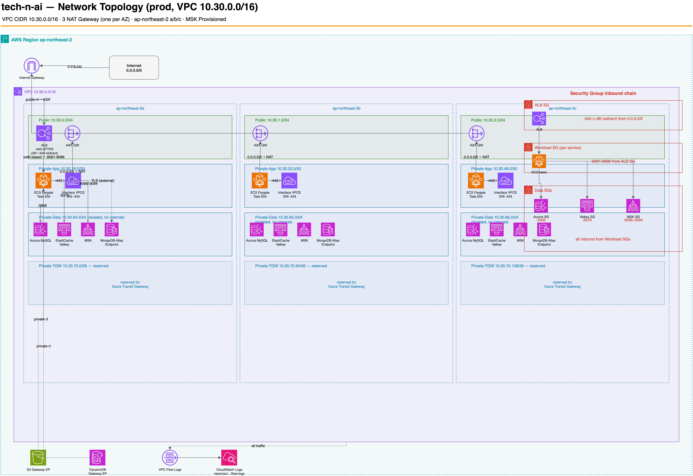

### 보안
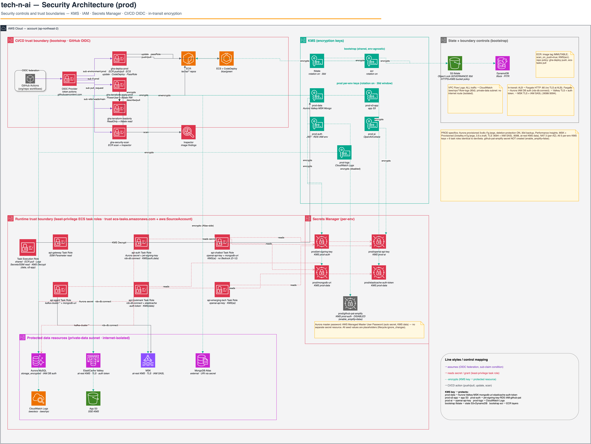

### 관측성
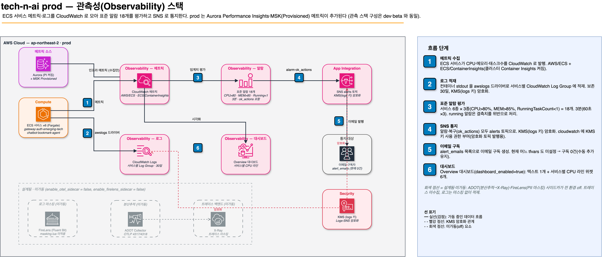

## beta

### 레퍼런스 아키텍처
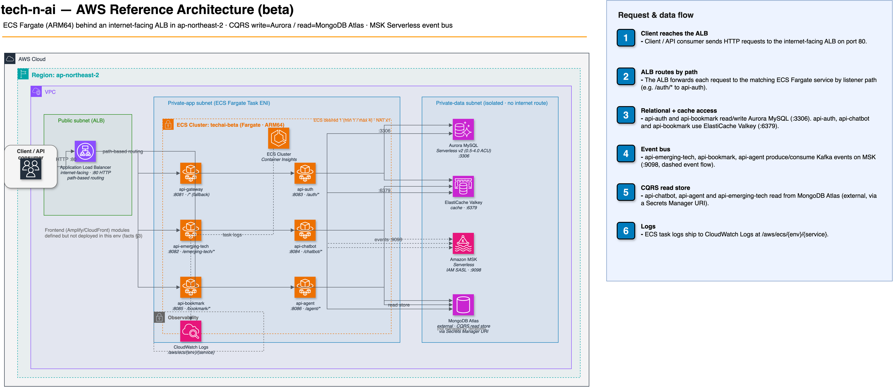

### 네트워크 토폴로지
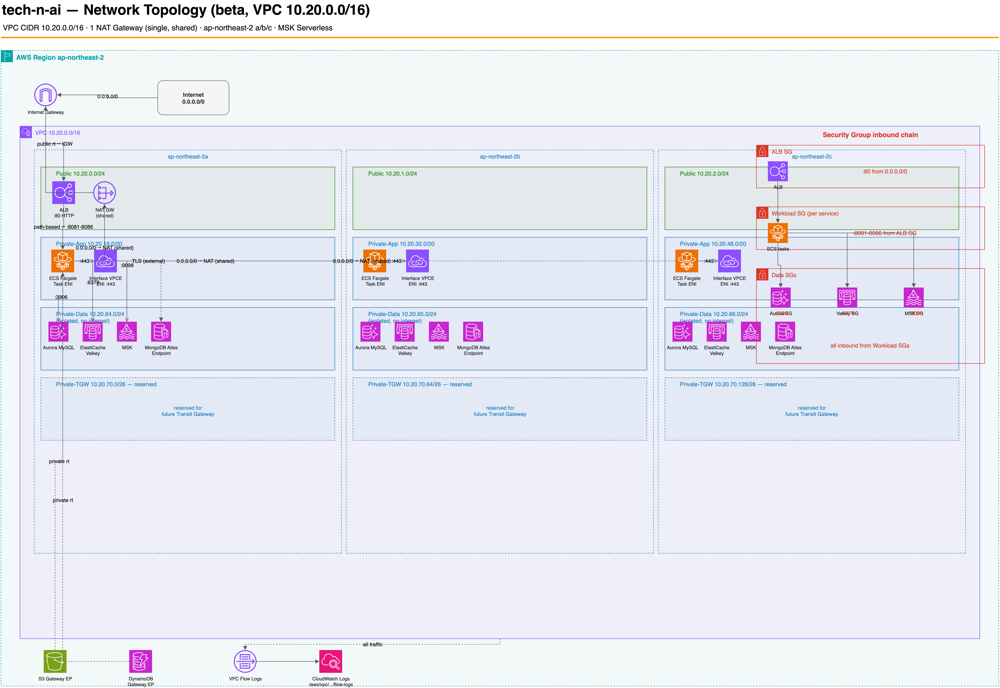

### 보안
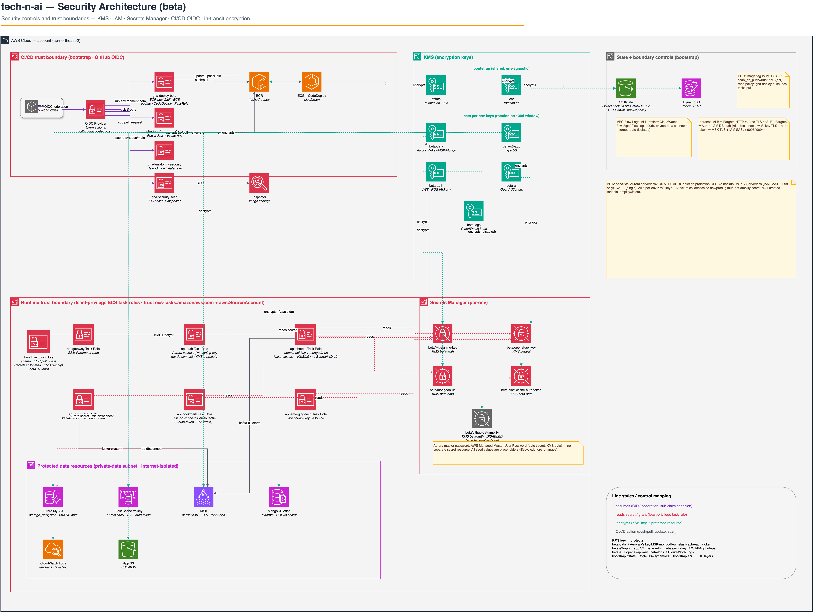

### 관측성
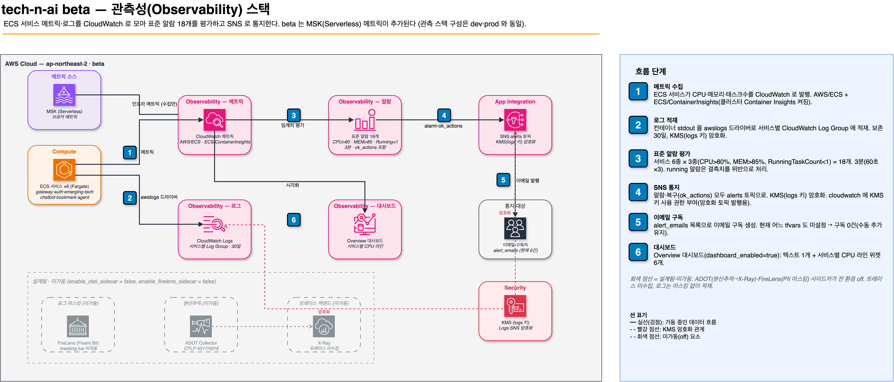

## dev

### 레퍼런스 아키텍처
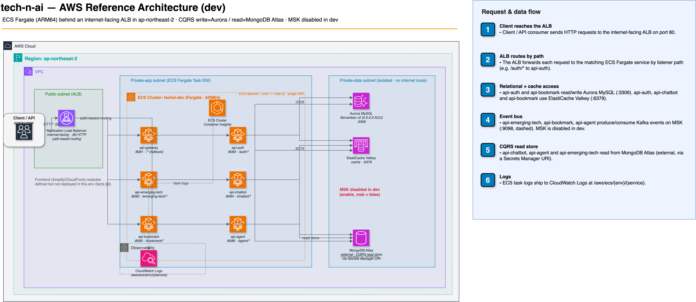

### 네트워크 토폴로지
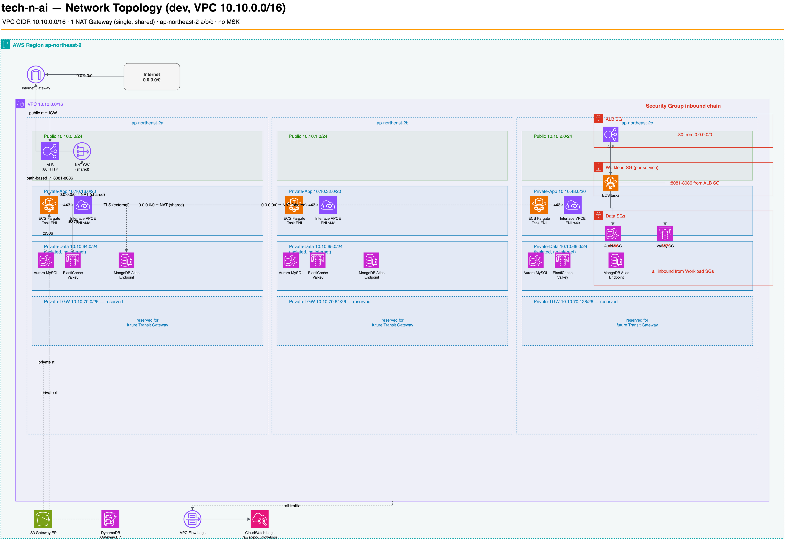

### 보안
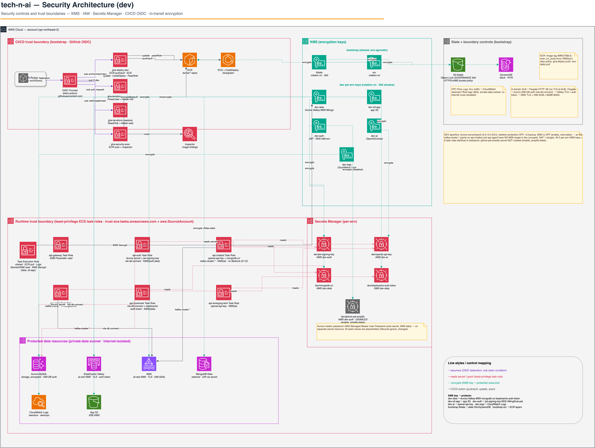

### 관측성
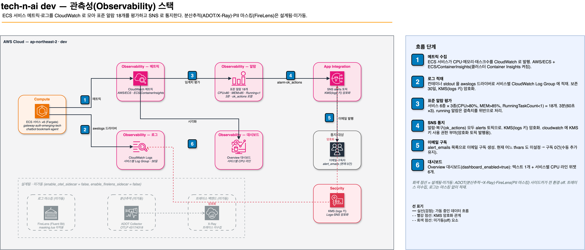

## PNG 를 다시 생성하려면

draw.io 데스크톱(CLI 포함)을 설치한 뒤 이 폴더에서 `.drawio` 마다 PNG 를 뽑는다.

```bash
brew install --cask drawio
for f in */*.drawio; do
  drawio -x -f png -s 2 --no-sandbox -o "${f%.drawio}.png" "$f"
done
```

SVG 가 아니라 PNG 로 뽑는 이유: draw.io 는 도형 라벨을 `foreignObject`(HTML) 로 내보내는데,
GitHub 이 SVG 를 이미지로 렌더할 때는 이 부분의 텍스트가 빠진다. PNG 는 래스터라 라벨까지 그대로 보인다.
