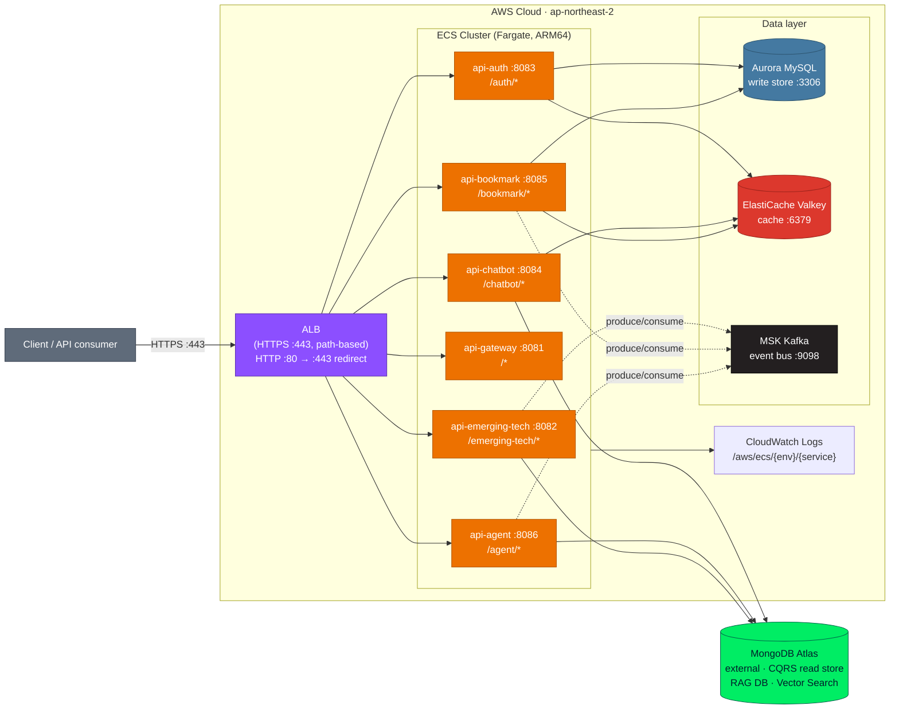
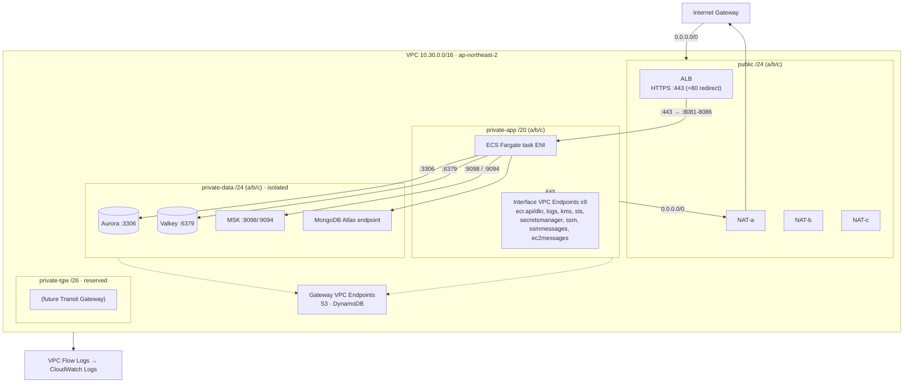
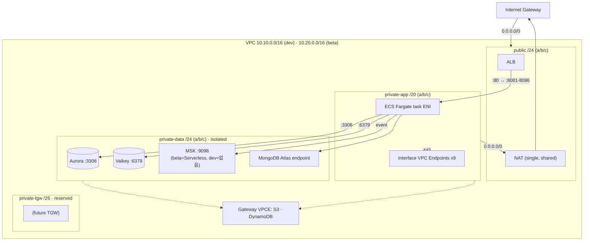
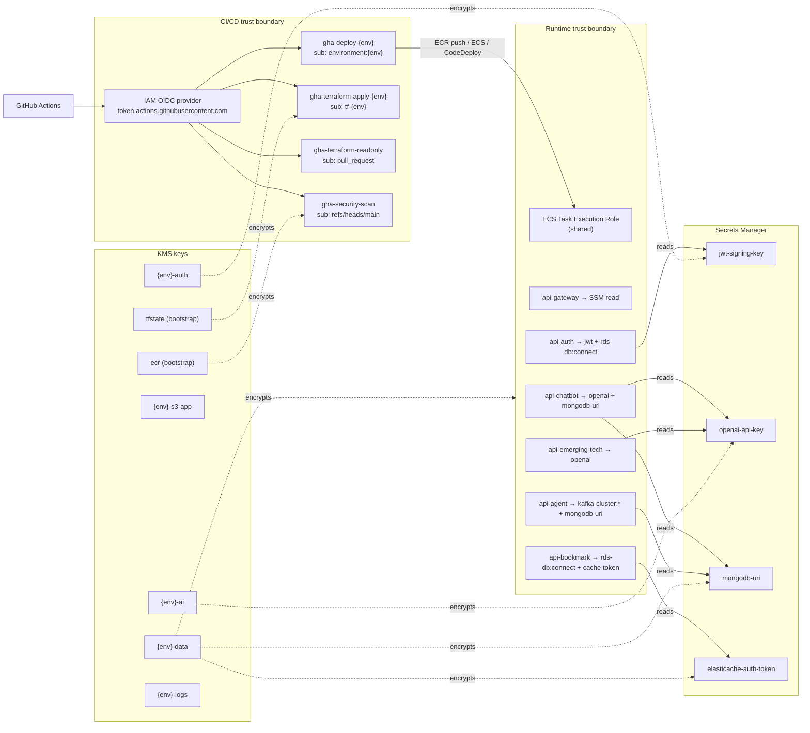

# tech-n-ai Architecture (Mermaid)

> 근거: `devops/aws/architecture-facts.md` (Terraform 코드에서 추출). drawio 다이어그램과 같은 사실을 텍스트로 표현합니다.
>
> 현재 **배포되는** 구조 기준입니다. CloudFront·Amplify는 모듈만 있고 어느 env에서도 호출되지 않아(facts §3) 진입점은 ALB 뿐입니다. ALB 프로토콜은 환경마다 다릅니다 — prod 는 HTTPS(443) + HTTP(80)→443 리다이렉트(`alb_certificate_arn` 설정), dev/beta 는 HTTP(80) 단독입니다.

## 1. Reference Architecture

ALB(prod=HTTPS 443, dev/beta=HTTP 80, path 라우팅) → ECS Fargate 서비스 6개 → 데이터 저장소. 이벤트 흐름은 점선.
MSK는 env별로 다릅니다(prod=Provisioned, beta=Serverless, dev=없음). 아래는 prod 기준이며, dev는 MSK 노드와 연결이 빠집니다.

> 색상 구분: Client(회색) · ALB(AWS 네트워킹 보라 `#8C4FFF`) · ECS 서비스(AWS 컴퓨트 주황 `#ED7100`) · Aurora MySQL(MySQL 블루 `#4479A1`) · ElastiCache Valkey(캐시 레드 `#DC382D`) · MSK Kafka(Kafka 블랙 `#231F20`) · MongoDB Atlas(MongoDB 브랜드 그린 `#00ED64`). MongoDB Atlas는 챗봇의 **RAG 지식베이스**로 쓰며 **Vector Search**로 임베딩을 검색합니다.

## 2. Network Topology

VPC 4-tier 서브넷. 핵심 환경 차이는 **NAT 개수**(prod=3, dev·beta=1)와 VPC CIDR입니다.
private-data는 인터넷 라우트가 없는 격리 tier입니다.

### 2-1. prod (VPC 10.30.0.0/16, NAT ×3)

### 2-2. dev / beta (NAT ×1 single)

dev = `10.10.0.0/16`, beta = `10.20.0.0/16`. 둘 다 NAT 1개를 모든 private-app 서브넷이 공유합니다.
**dev에는 MSK가 없습니다**(beta는 MSK Serverless).

## 3. Security

신뢰 경계: CI/CD(GitHub OIDC → 역할 4종)와 Runtime(서비스별 task role 6종 → 시크릿/데이터),
중앙에 KMS(부트스트랩 2 + env별 5). 환경 간 보안 구조는 동일하고, 키 5종·역할 6종은 dev/beta/prod 공통입니다.

## 4. 환경 차이 요약

| 항목 | dev | beta | prod |
|---|---|---|---|
| ALB 프로토콜 | HTTP 80 | HTTP 80 | HTTPS 443 (+80→443 리다이렉트) |
| VPC CIDR | 10.10.0.0/16 | 10.20.0.0/16 | 10.30.0.0/16 |
| NAT Gateway | 1 (shared) | 1 (shared) | 3 (per AZ) |
| Aurora | serverless v2 0.5–2.0 ACU | serverless v2 0.5–4.0 ACU | provisioned 3×db.r7g.large |
| ElastiCache Valkey | t4g.micro, 0 replica, single-AZ | t4g.small, 1 replica, Multi-AZ | t4g.small, 1 replica, Multi-AZ |
| MSK | 없음 | Serverless | Provisioned 3×kafka.m7g.large |
| ECS desired/min/max | 1 / 1 / 3 | 1 / 1 / 4 | 2 / 2 / 6 |
| Aurora backup / 삭제보호 | 1d / off | 7d / off | 30d / on |
| KMS 키 | env 5 (+bootstrap 2) | env 5 | env 5 |
| Amplify / CloudFront | 미배포 | 미배포 | 미배포 |

> 주의: ECS autoscaling min/max는 api-gateway·api-auth에만 tfvars 값이 전달되고, 나머지 4개 서비스는 모듈 default(min 2 / max 10)를 씁니다(facts §1).
