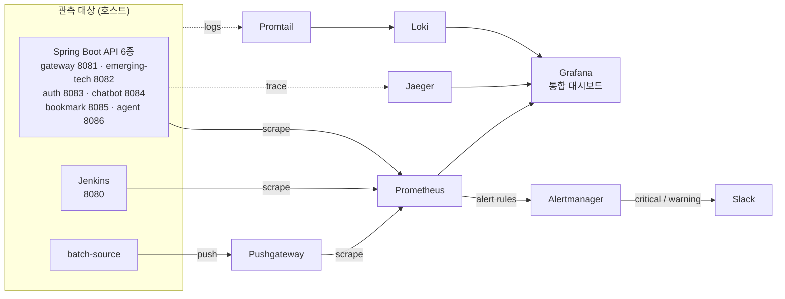

# 관측성 스택 다이어그램 작도 도구 조사

대상: `tech-n-ai-backend/monitoring`의 로컬 관측 스택을 다이어그램으로 그리는 데 쓸 도구.
범주는 (a) MCP 서버, (b) Claude Code 스킬/플러그인, (c) 텍스트→다이어그램 엔진.

> **검증 메모(중요).** 이 보고서는 deep-research 워크플로우로 만들었는데, 마지막 적대적 검증 단계가
> 세션 한도(rate limit)에 걸려 한 표도 던지지 못하고 전부 실패했다. 즉 워크플로우가 출력한
> "주장 반증됨"은 실제 반증이 아니라 검증이 안 돈 것이다. 그래서 아래 내용은 **검색 단계가 모은
> 공식 출처 URL과 작성자(Claude)의 자체 지식을 교차 확인한 결과**이며, 라이선스·최근 릴리스 날짜처럼
> 시간이 지나면 바뀌는 항목은 도입 전에 해당 URL에서 직접 확인하기를 권한다.

---

## 대상 스택 (로컬 파일에서 확인한 사실)

`monitoring/README.md`와 각 설정 파일에서 직접 읽은 흐름이다.

- **메트릭**: Spring Boot API 6종(gateway 8081, emerging-tech 8082, auth 8083, chatbot 8084,
  bookmark 8085, agent 8086) + Jenkins(8080)을 **Prometheus가 스크랩**한다.
  `batch-source`는 단발성 메트릭을 **Pushgateway에 밀어 넣고**, Prometheus가 Pushgateway를 다시 스크랩한다.
  Prometheus는 규칙에 맞으면 **Alertmanager**로 알림을 보내고, Alertmanager가 **Slack**(critical/warning)으로 발송한다.
- **로그**: 앱/컨테이너 로그 → **Promtail** → **Loki**.
- **트레이스**: 앱 → **Jaeger**.
- **통합 시각화**: **Grafana**가 Prometheus·Loki·Jaeger를 데이터소스로 묶는다(시작점은 Grafana 하나).
- **실행 단위**: 루트 `docker-compose.yml`의 단일 컨테이너 그룹(로컬). 운영(AWS)은 별개로 CloudWatch + X-Ray + Amazon Managed Grafana.

---

## 1) 후보 비교표

| 도구 | 범주 | 입력 방식 | 출력 형식 | 라이선스 | 유지보수 | 공식 출처 URL | 이 스택 적합도 |
|---|---|---|---|---|---|---|---|
| **mingrammer Diagrams** | 텍스트(코드)→다이어그램 | Python 코드 | PNG·SVG·PDF 등(Graphviz 렌더) | MIT | 활발 | https://github.com/mingrammer/diagrams · https://diagrams.mingrammer.com/docs/nodes/onprem | **상** |
| **Mermaid** | 텍스트→다이어그램 | Mermaid 문법(텍스트) | SVG·PNG(마크다운 인라인 렌더) | MIT | 활발 | https://github.com/mermaid-js/mermaid | **상** |
| **D2** | 텍스트→다이어그램 | D2 선언형 문법(텍스트) | SVG·PNG·PDF | MPL-2.0 (확인 필요) | 활발 | https://github.com/terrastruct/d2 · https://d2lang.com | 중 |
| **PlantUML** | 텍스트→다이어그램 | PlantUML 문법(텍스트) | PNG·SVG 등 | GPL 계열(확인 필요) | 활발 | https://plantuml.com | 중 |
| **Graphviz (DOT)** | 텍스트→다이어그램 | DOT 문법 | SVG·PNG·PDF 등 | EPL-1.0 | 활발 | https://graphviz.org | 중(저수준) |
| **mermaid-mcp-server** (peng-shawn) | MCP 서버(커뮤니티) | Mermaid 코드 | PNG·SVG | 저장소에서 확인 | 커뮤니티 | https://github.com/peng-shawn/mermaid-mcp-server | 중 |
| **Mermaid Chart 공식 MCP** | MCP 서버(벤더 공식) | 자연어/Mermaid | Mermaid 생성·검증·렌더 | 벤더 제공 | 공식 | https://docs.mermaidchart.com (MCP 문서) | 중 |
| **deploy-on-aws : aws-architecture-diagram** | Claude Code 스킬 | 자연어 지시 | 다이어그램(주로 AWS) | 플러그인 제공 | 이 세션에 설치됨 | (Claude Code 플러그인) | 운영(AWS) 쪽에 상, 로컬엔 하 |
| 공식 Claude 플러그인 디렉터리의 "다이어그램 전용" 플러그인 | Claude Code 플러그인 | — | — | — | — | https://github.com/anthropics/claude-plugins-official | **없음(확인됨)** |

### 표에 대한 주석

- **mingrammer Diagrams**는 `diagrams.onprem.monitoring.Prometheus`·`...Grafana`,
  `diagrams.onprem.logging.Loki`, `diagrams.onprem.tracing.Jaeger`(분산 트레이스용 `Tempo`도 있음)처럼
  **이 스택의 컴포넌트 로고를 그대로 가진 노드**를 제공한다. 그래서 적합도가 가장 높다.
  단, **Pushgateway 전용 노드가 있는지는 확인 불가** — 없으면 일반 노드나 라벨로 대체하면 된다(아래 코드 참고).
- **Mermaid**는 기본 flowchart에는 관측성 로고가 내장돼 있지 않다. 다만 `architecture-beta` 다이어그램에서
  iconify 아이콘 팩(예: `logos:prometheus`)을 등록해 로고를 넣을 수 있다(이 부분은 **추정**이며 도입 시 확인 권장).
  로고 없이도 노드+방향 엣지로 흐름은 충분히 표현된다.
- **공식 Claude 플러그인 디렉터리**(`anthropics/claude-plugins-official`)에는 mermaid/plantuml/d2/graphviz 같은
  **다이어그램 전용 플러그인이 없다**(디자인 계열은 `frontend-design` 하나). 이는 검색 단계에서 확인된 사실이다.
- **이 세션 한정**: `deploy-on-aws:aws-architecture-diagram` 스킬이 이미 로드돼 있어, **운영(AWS) 관측 구성**
  (CloudWatch·X-Ray·Managed Grafana) 다이어그램은 추가 설치 없이 바로 그릴 수 있다. 로컬 Prometheus/Loki/Jaeger
  스택에는 초점이 안 맞으므로 로컬 적합도는 낮다.

---

## 2) 최종 추천

### 1순위 — Mermaid (문서에 바로 박을 다이어그램)

결과물이 `docs/monitoring` 아래 마크다운으로 남고 GitHub에서 읽히므로, **툴체인 설치 없이 마크다운 코드블록이
그대로 그림으로 렌더되는** Mermaid가 가장 실용적이다. MIT 라이선스, 노드와 방향 엣지로 스크랩·푸시·로그·트레이스
파이프라인을 모두 표현할 수 있다. 약점은 컴포넌트 로고가 기본 제공되지 않는다는 점(라벨로 충분히 대체 가능).

### 2순위 — mingrammer Diagrams (로고가 들어간 아키텍처 그림이 필요할 때)

Prometheus·Grafana·Loki·Jaeger 로고 노드를 내장하고 있어, 발표 자료나 설계 문서용 **로고 박힌 아키텍처 포스터**를
만들 때 품질이 가장 높다. 트레이드오프: **Python + Graphviz를 설치해야 하고 출력이 이미지 파일**이라, 마크다운에
인라인으로 박히지 않고 PNG/SVG를 따로 첨부해야 한다. Pushgateway 전용 노드 유무는 확인이 필요하다.

> **MCP가 꼭 필요하면**: 에이전트가 Mermaid 코드를 이미지로 렌더하게 하려면 커뮤니티 `mermaid-mcp-server`나
> Mermaid Chart 공식 MCP를 붙일 수 있다. 다만 이 스택을 그리는 데 MCP가 필수는 아니다 — Mermaid 코드 자체가
> 이미 GitHub에서 렌더된다.

---

## 3) 즉시 사용 가능한 다이어그램 초안

### (A) Mermaid — 마크다운에 그대로 붙이면 렌더됨 (1순위)



### (B) mingrammer Diagrams — 로고 박힌 이미지가 필요할 때 (2순위)

```python
# pip install diagrams  (Graphviz 설치 필요)
# python this_file.py  ->  observability_stack.png 생성
from diagrams import Diagram, Cluster, Edge
from diagrams.onprem.monitoring import Prometheus, Grafana
from diagrams.onprem.logging import Loki, Promtail
from diagrams.onprem.tracing import Jaeger
from diagrams.onprem.queue import Kafka  # 예시용, 필요 없으면 제거
from diagrams.onprem.ci import Jenkins
from diagrams.programming.framework import Spring

with Diagram("Tech-N-AI 로컬 관측 스택", filename="observability_stack", direction="LR", show=False):
    with Cluster("관측 대상 (호스트)"):
        apis = Spring("Spring Boot API 6종\n8081~8086")
        jenkins = Jenkins("Jenkins 8080")

    # 메트릭
    prom = Prometheus("Prometheus")
    pgw = Prometheus("Pushgateway")        # 전용 노드 없으면 라벨로 대체
    apis >> Edge(label="scrape") >> prom
    jenkins >> Edge(label="scrape") >> prom
    pgw >> Edge(label="scrape") >> prom    # batch-source -> Pushgateway -> Prometheus

    # 로그 / 트레이스
    promtail = Promtail("Promtail")
    loki = Loki("Loki")
    jaeger = Jaeger("Jaeger")
    apis >> Edge(label="logs", style="dashed") >> promtail >> loki
    apis >> Edge(label="trace", style="dashed") >> jaeger

    # 통합
    grafana = Grafana("Grafana")
    prom >> grafana
    loki >> grafana
    jaeger >> grafana
```

> 위 Python 코드의 노드 import 경로(`diagrams.onprem.monitoring.Prometheus` 등)는 공식 노드 목록
> (https://diagrams.mingrammer.com/docs/nodes/onprem)에서 확인한 것이다. `Promtail`·`Pushgateway` 노드의
> 정확한 클래스명은 설치한 버전에서 한 번 확인하고, 없으면 가장 가까운 노드나 일반 노드로 대체하면 된다.

---

## 출처

- mingrammer Diagrams: https://github.com/mingrammer/diagrams , https://diagrams.mingrammer.com/docs/nodes/onprem
- Mermaid: https://github.com/mermaid-js/mermaid
- D2: https://github.com/terrastruct/d2 , https://d2lang.com
- mermaid-mcp-server (커뮤니티): https://github.com/peng-shawn/mermaid-mcp-server
- MCP 공식 레지스트리: https://github.com/modelcontextprotocol/registry
- Claude 공식 플러그인 디렉터리: https://github.com/anthropics/claude-plugins-official
