# RAG 아키텍처 발전사: Naive RAG에서 Agentic RAG까지

> Retrieval-Augmented Generation(RAG)은 LLM의 파라메트릭 지식 한계를 외부 검색으로 보완하는 패러다임이다.
> 본 문서는 2020년 RAG 최초 제안부터 2025년 Agentic RAG에 이르기까지의 아키텍처 발전 흐름을
> 공식 논문 기반으로 분석한다.

---

## 1. 발전사 타임라인

> 아래 다이어그램은 Naive RAG의 한계가 후속 기법들의 등장을 촉발한 인과 관계를 보여준다.
> 분류 체계는 Gao et al. (arXiv:2312.10997)의 Naive/Advanced/Modular RAG 패러다임과
> Singh et al. (arXiv:2501.09136)의 Agentic RAG 분류를 함께 따른다.

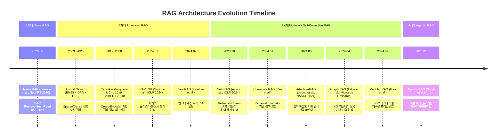


**한계 → 해결 인과관계:**

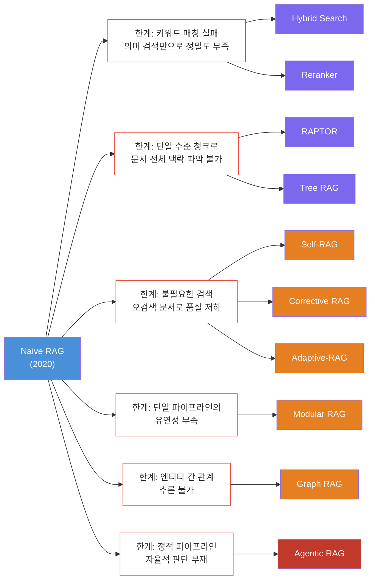


---

## 2. 개별 기법 분석

### 2.1 Naive RAG (2020)

**기원 논문**

- Lewis et al., *"Retrieval-Augmented Generation for Knowledge-Intensive NLP Tasks"*, NeurIPS 2020
- arXiv:2005.11401

> 아래 다이어그램은 Lewis et al. (2020) 논문의 RAG 아키텍처를 재현한 것이다.
> Query Encoder(BERT_q)와 Document Index(BERT_d로 사전 인코딩된 Wikipedia Dense Vector Index)가
> MIPS(Maximum Inner Product Search)로 연결되고, 검색된 문서가 Generator(BART)에 전달된다.

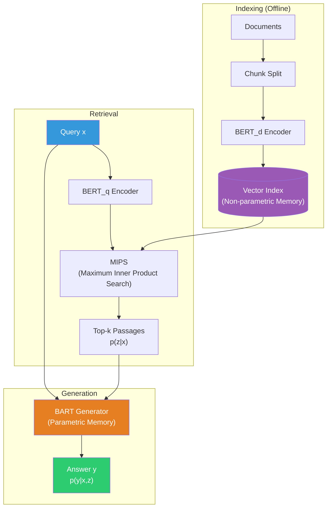


**RAG-Sequence vs RAG-Token 변형** (Lewis et al., 2020):

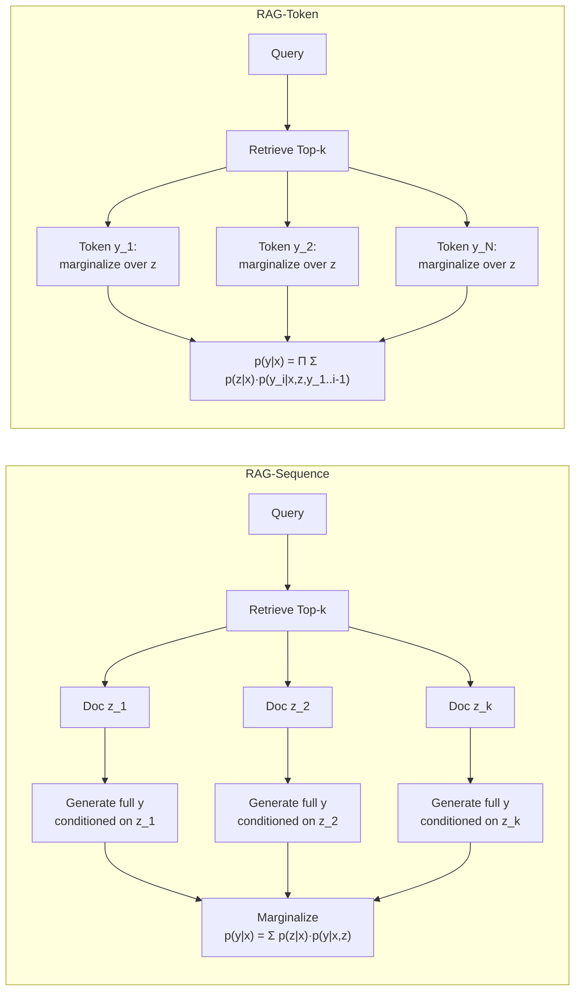


**A. 등장배경**
사전학습 LM은 파라미터에 사실 지식을 저장하지만, 지식 접근·조작 능력이 제한적이며 지식 갱신이 불가능하다. 이 문제를 해결하기 위해 파라메트릭 메모리(seq2seq 모델)와 비파라메트릭 메모리(위키피디아 Dense Vector Index)를 결합하는 방식이 제안되었다.

**B. 핵심 개념**
`Indexing → Retrieval → Generation`의 3단계 파이프라인으로 구성된다. 문서를 청크 단위로 분할하여 벡터 DB에 저장하고, 질의와 의미적 유사도가 높은 Top-k 청크를 검색한 뒤, 원래 질문과 함께 LLM에 입력하여 답변을 생성한다. RAG-Sequence(전체 시퀀스에 동일 문서 조건부)와 RAG-Token(토큰별 다른 문서 참조) 두 가지 변형이 제안되었다.

**C. 기술적 기여**
3개 Open-domain QA 벤치마크에서 SOTA를 달성했으며, 생성 태스크에서 파라메트릭 전용 모델 대비 더 구체적이고 다양하며 사실적인 텍스트를 생성했다 (Lewis et al., 2020).

**D. 한계점**

- 검색 품질에 전적으로 의존: 관련 없는 문서가 검색되면 환각 발생
- 키워드·희귀 엔티티에 대한 의미 검색의 한계
- 문서 전체의 거시적 맥락을 파악하지 못하는 청크 단위 검색
- 검색 필요 여부를 판단하지 않는 무조건적 검색

---

### 2.2 Hybrid Search (Sparse + Dense Retrieval, 2009~2020)

**기원 논문**

- **Sparse (BM25)**: Robertson & Zaragoza, *"The Probabilistic Relevance Framework: BM25 and Beyond"*, Foundations and Trends in IR, 2009
- **Dense (DPR)**: Karpukhin et al., *"Dense Passage Retrieval for Open-Domain Question Answering"*, EMNLP 2020 (arXiv:2004.04906)
- **Fusion (RRF)**: Cormack et al., *"Reciprocal Rank Fusion outperforms Condorcet and Individual Rank Learning Methods"*, SIGIR 2009

> 아래 다이어그램은 Hybrid Search의 Late Fusion 아키텍처를 나타낸다.
> BM25(Robertson & Zaragoza, 2009)와 DPR(Karpukhin et al., 2020)이 독립 실행된 후,
> RRF(Cormack et al., 2009) 또는 가중 합산으로 결과를 융합한다.

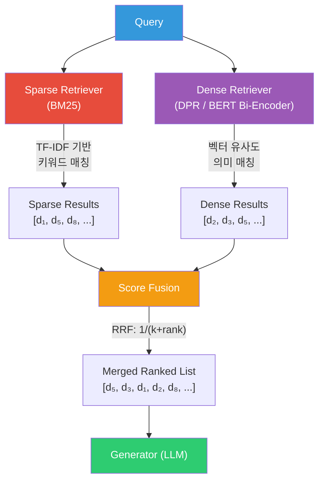


**Sparse vs Dense 상호 보완성** (Karpukhin et al., 2020):

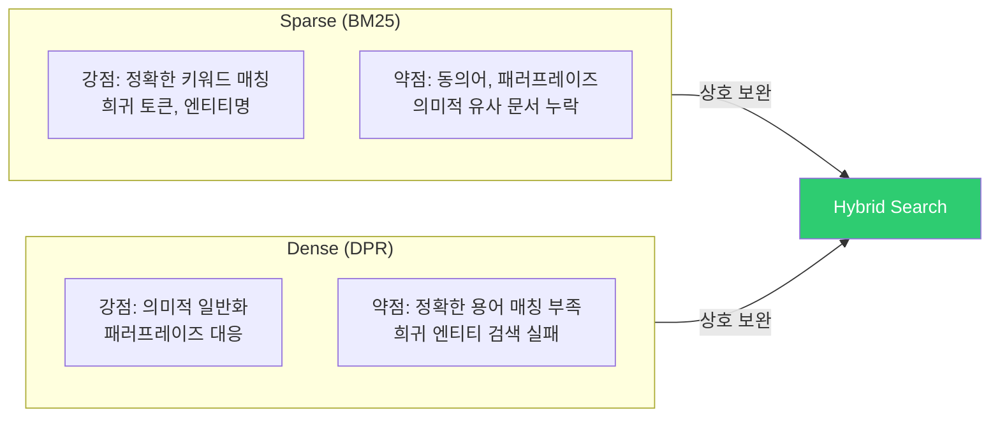


**A. 등장배경**
Sparse 검색(BM25)은 정확한 키워드·희귀 토큰 매칭에 강하지만 의미적 유사 문서를 놓치고, Dense 검색(DPR)은 의미적 일반화에 강하지만 정확한 용어 매칭에 약하다. 두 방식이 **상호 보완적인 문서 집합**을 검색한다는 실험적 관찰이 결합의 동기가 되었다 (Karpukhin et al., 2020).

**B. 핵심 개념**
BM25(TF-IDF 기반 확률 모델)와 Dense Retriever(BERT 인코더 기반 벡터 유사도)를 독립적으로 실행한 뒤, 결과를 융합한다. 대표적 융합 전략:

- **Late Score Fusion**: 각 검색기의 점수를 정규화 후 가중 합산
- **Reciprocal Rank Fusion (RRF)**: 순위 기반 융합으로 점수 정규화 문제를 회피 (Cormack et al., 2009)
- **Unified Single-Model**: 단일 모델에서 Sparse/Dense 표현을 동시 생성

**C. 기술적 기여**
DPR은 BM25 대비 Top-20 검색 정확도에서 **9~19% 절대 향상**을 달성했으며, Hybrid 방식은 단독 사용 대비 일관된 성능 향상을 보였다 (Karpukhin et al., 2020).

**D. 한계점**

- 두 검색기 모두 관련성이 낮은 문서를 상위에 반환할 수 있음
- 융합 가중치 튜닝이 데이터셋에 따라 필요
- 검색 후 정밀 순위 조정 메커니즘의 부재 → Reranker의 등장 배경

---

### 2.3 Reranker (Cross-Encoder Reranking, 2019~2020)

**기원 논문**

- Nogueira & Cho, *"Passage Re-ranking with BERT"*, arXiv:1901.04085, 2019
- Khattab & Zaharia, *"ColBERT: Efficient and Effective Passage Search via Contextualized Late Interaction over BERT"*, SIGIR 2020 (arXiv:2004.12832)

> 아래 다이어그램은 2단계 Retrieve-then-Rerank 파이프라인을 나타낸다.
> 1단계 Bi-Encoder(효율적 후보 검색)와 2단계 Cross-Encoder(정밀 재순위화)의 구조적 차이를
> Nogueira & Cho (2019) 및 Khattab & Zaharia (2020) 논문에 기반하여 표현했다.

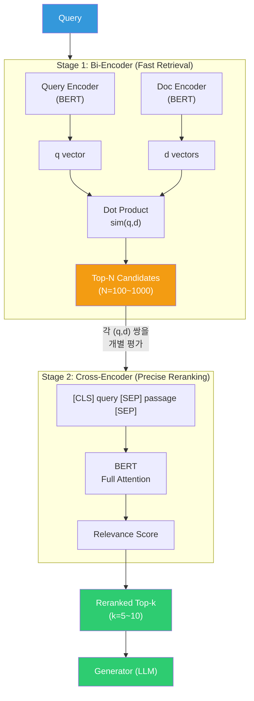


**Bi-Encoder vs Cross-Encoder vs Late Interaction (ColBERT) 비교:**

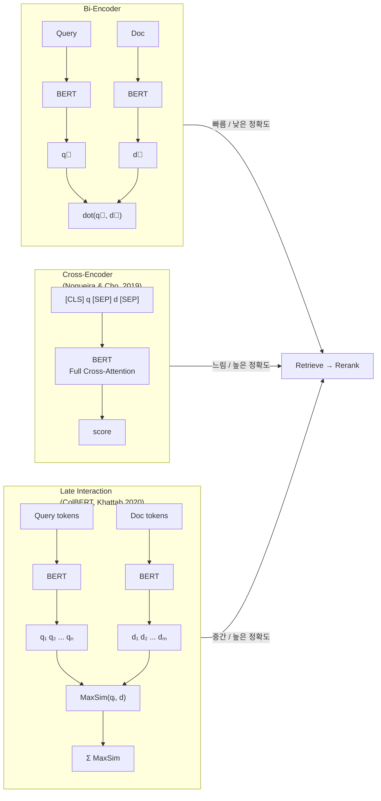


**A. 등장배경**
Bi-encoder(질의·문서 독립 인코딩)는 대규모 검색에 효율적이나, 질의-문서 간 세밀한 상호작용을 포착하지 못한다. 초기 검색 결과의 **정밀도를 높이기 위한 2단계 파이프라인**(Retrieve → Rerank)이 필요했다.

**B. 핵심 개념**

- **Cross-Encoder**: 질의와 문서를 `[CLS] query [SEP] passage [SEP]`로 연결하여 BERT에 입력, 관련성 점수를 직접 산출. 높은 정확도를 제공하나 O(N)의 계산 비용이 발생 (Nogueira & Cho, 2019).
- **Late Interaction (ColBERT)**: 질의·문서를 독립 인코딩한 뒤 토큰 수준의 MaxSim 연산으로 세밀한 유사도를 계산. Cross-Encoder에 근접한 정확도를 유지하면서 효율성을 확보 (Khattab & Zaharia, 2020).

**C. 기술적 기여**
Nogueira & Cho의 BERT Reranker는 MS MARCO Passage Retrieval에서 당시 리더보드 1위를 달성했다. ColBERT는 MS MARCO에서 BERT base 대비 170배 이상 빠른 검색 속도를 달성하면서도 효과적인 reranking을 수행했다.

**D. 한계점**

- Cross-Encoder의 높은 추론 비용으로 실시간 서비스 적용에 제약
- 검색된 문서 자체의 품질 문제(오검색)는 해결하지 못함
- 문서의 다층적 맥락(요약, 상세)을 계층적으로 검색하지 못함

---

### 2.4 Self-RAG (2023)

**기원 논문**

- Asai et al., *"Self-RAG: Learning to Retrieve, Generate, and Critique through Self-Reflection"*, ICLR 2024
- arXiv:2310.11511

> 아래 다이어그램은 Asai et al. (2023) 논문의 Self-RAG 추론 알고리즘을 재현한 것이다.
> LM이 Retrieve 토큰을 출력하여 검색 필요 여부를 판단하고,
> 검색 시 ISREL → ISSUP → ISUSE 토큰으로 단계적 비평을 수행한다.
> Segment-level Beam Search에서 Critique 토큰의 가중 확률로 최적 출력을 선택한다.

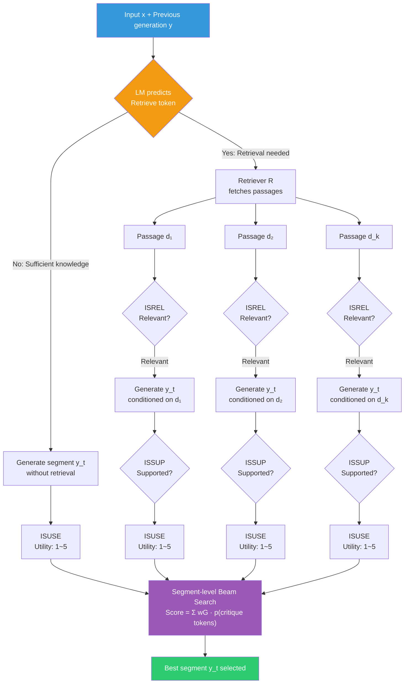


**A. 등장배경**
기존 RAG는 질의 유형과 무관하게 **항상 고정 수의 문서를 검색**하여, 불필요한 검색으로 노이즈를 유입시키거나, 반대로 필요한 검색을 수행하지 못하는 문제가 있었다. 검색 여부·검색 결과 품질·생성 결과 품질을 LLM 스스로 판단할 수 있는 메커니즘이 요구되었다.

**B. 핵심 개념**
단일 LM을 학습하여 **Reflection Token**이라는 특수 토큰을 통해 자기 성찰적 검색·생성·비평을 수행한다:


| Reflection Token | 역할                                                    |
| ---------------- | ----------------------------------------------------- |
| **Retrieve**     | 현재 시점에서 외부 검색이 필요한지 판단                                |
| **ISREL**        | 검색된 문서가 질의에 관련 있는지 평가                                 |
| **ISSUP**        | 생성된 문장이 검색 문서에 의해 뒷받침되는지 평가 (Full/Partial/No Support) |
| **ISUSE**        | 최종 응답이 질의에 유용한지 1~5점으로 평가                             |


Segment-level Beam Search를 통해 Critique 토큰의 가중 확률에 기반하여 최적 출력을 선택한다.

**C. 기술적 기여**
Self-RAG (7B, 13B)는 ChatGPT, Llama2-chat, Retrieval-augmented Llama2-chat을 포함한 기존 모델들을 다양한 태스크에서 유의미하게 능가했다. 추론 시 Reflection Token 가중치를 조정하여 재학습 없이 태스크별 최적화가 가능하다 (Asai et al., 2023).

**D. 한계점**

- Reflection Token 학습을 위한 별도 Critic 모델과 학습 데이터가 필요
- 검색 결과가 전반적으로 저품질인 경우의 교정 메커니즘 부재 → CRAG의 등장 배경

---

### 2.5 RAPTOR (2024)

**기원 논문**

- Sarthi et al., *"RAPTOR: Recursive Abstractive Processing for Tree-Organized Retrieval"*, ICLR 2024
- arXiv:2401.18059

> 아래 다이어그램은 Sarthi et al. (2024) 논문의 RAPTOR 트리 구축 과정을 재현한 것이다.
> SBERT로 임베딩 → UMAP 차원 축소 → GMM 소프트 클러스터링 → LLM(GPT-3.5-turbo) 요약을
> 재귀적으로 반복하여 다층 추상화 트리를 구축한다.
> 검색은 Tree Traversal(계층별 Top-k 선택) 또는 Collapsed Tree(전체 노드 평탄화 후 검색) 방식으로 수행된다.

**트리 구축 프로세스 (Bottom-up):**

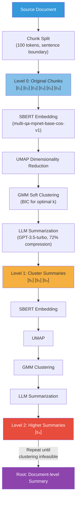


**두 가지 검색 방법:**

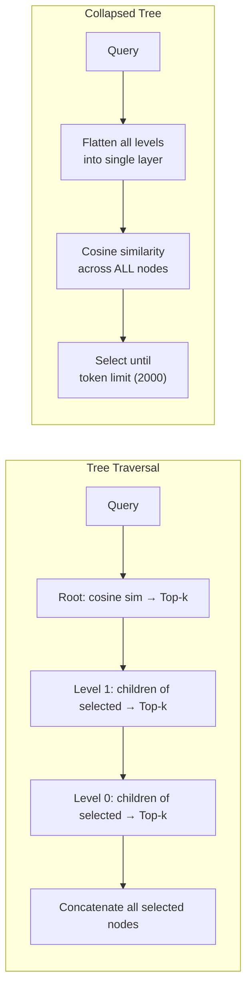


**A. 등장배경**
기존 검색 방식은 **짧은 연속 청크만 검색**하여 문서 전체의 거시적 맥락을 이해하지 못했다. 세부 사실과 상위 주제를 동시에 파악해야 하는 복잡한 다단계 추론 질의에서 한계가 뚜렷했다.

**B. 핵심 개념**
Bottom-up 방식으로 텍스트 청크를 재귀적으로 임베딩 → 클러스터링 → 요약하여 **다층적 추상화 트리**를 구축한다. 리프 노드는 원본 청크, 상위 노드일수록 더 추상적인 요약을 담는다. 질의 시 트리의 여러 계층에서 관련 정보를 통합 검색할 수 있다.

**C. 기술적 기여**
GPT-4와 RAPTOR 검색을 결합하여 QuALITY 벤치마크에서 기존 최고 성능 대비 **절대 정확도 20% 향상**을 달성했다. 긴 문서에서의 다단계 추론 태스크에서 전통적 RAG 대비 유의미한 개선을 보였다 (Sarthi et al., 2024).

**D. 한계점**

- 트리 구축 과정의 계산 비용 (재귀적 클러스터링 + LLM 요약)
- 정적 트리 구조로 인해 문서 변경 시 전체 재구축 필요
- 범용 도메인보다는 긴 문서·복잡한 추론에 특화

---

### 2.6 Tree RAG (T-RAG, 2024)

**기원 논문**

- Fatehkia et al., *"T-RAG: Lessons from the LLM Trenches"*, arXiv:2402.07483, 2024

> 아래 다이어그램은 Fatehkia et al. (2024) 논문의 T-RAG 아키텍처를 재현한 것이다.
> 기존 RAG 파이프라인(Vector DB 검색)에 엔티티 계층 트리에서 생성된 텍스트 설명을 컨텍스트로 추가하고,
> Fine-tuned LLM으로 응답을 생성하는 하이브리드 접근법이다.

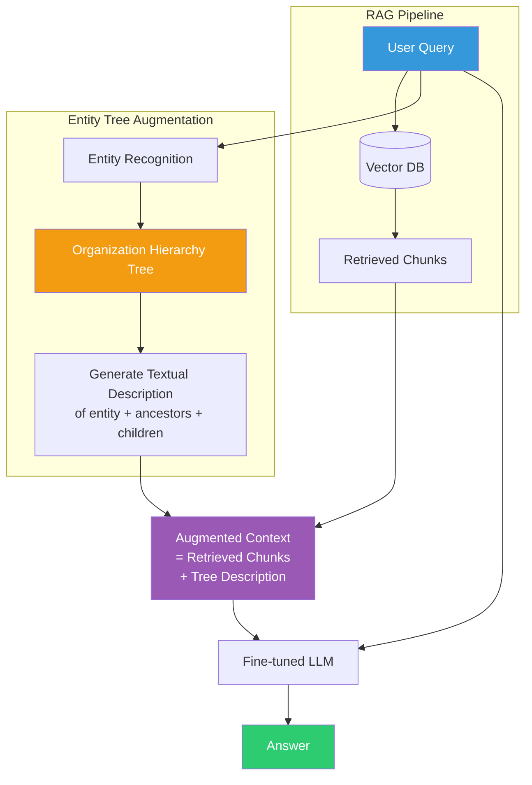


**엔티티 트리 구조 예시:**

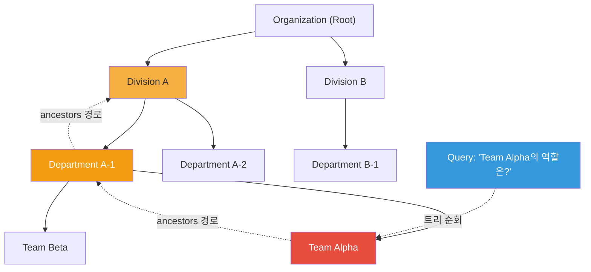


**A. 등장배경**
조직 내부 지식(거버넌스 매뉴얼, 조직도 등)에 대한 QA에서, 엔티티 간 **계층적 관계**(부서-팀-담당자)를 평면적 청크 검색만으로는 정확히 표현할 수 없었다. 조직 구조와 같은 계층 정보를 명시적으로 활용해야 했다.

**B. 핵심 개념**
조직의 엔티티 계층을 **트리 구조**로 표현하고, 특정 엔티티 관련 질의 시 트리를 순회하여 해당 엔티티의 텍스트 설명을 생성, 이를 컨텍스트로 활용한다. RAG와 Fine-tuning을 결합한 하이브리드 접근법을 채택했다.

**C. 기술적 기여**
계층 정보를 트리 구조로 활용하면 조직 내 엔티티 관련 질의에 대해 시스템의 **강건성(robustness)이 향상**되었다. 개발 과정에서 최종 사용자 피드백을 반복적으로 반영하는 실용적 방법론을 제시했다 (Fatehkia et al., 2024).

**D. 한계점**

- 트리 깊이와 데이터셋 규모 증가 시 **검색 시간의 확장성 문제** (CFT-RAG (arXiv:2501.15098)에서 지적)
- 도메인 특화(조직 구조) 설계로 범용성 제한
- RAPTOR와 달리 자동 트리 구축이 아닌 수동 설계 의존

---

### 2.7 Corrective RAG (CRAG, 2024)

**기원 논문**

- Yan et al., *"Corrective Retrieval Augmented Generation"*, arXiv:2401.15884, 2024

> 아래 다이어그램은 Yan et al. (2024) 논문의 CRAG 파이프라인을 재현한 것이다.
> 핵심 구성요소: (1) T5-large 기반 경량 Retrieval Evaluator가 문서 관련성을 평가,
> (2) Correct/Ambiguous/Incorrect 세 가지 경로로 분기,
> (3) Decompose-then-Recompose 알고리즘으로 지식을 정제한다.

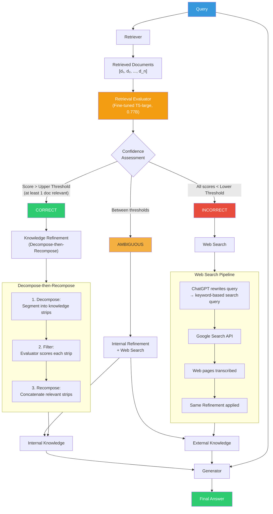


**A. 등장배경**
RAG 시스템은 검색 문서의 관련성에 전적으로 의존하지만, **검색이 실패했을 때 어떻게 대응할 것인가**에 대한 메커니즘이 부재했다. Self-RAG가 검색 필요 여부를 판단하는 데 집중했다면, CRAG는 **검색 결과 자체를 교정**하는 데 초점을 맞춘다.

**B. 핵심 개념**
경량 Retrieval Evaluator가 검색 문서의 품질을 `Correct / Ambiguous / Incorrect`로 평가하고, 각 판정에 따라 차별화된 지식 검색 액션을 실행한다:


| 판정            | 액션                                              |
| ------------- | ----------------------------------------------- |
| **Correct**   | 검색 문서를 Decompose-then-Recompose로 정제하여 핵심 정보만 추출 |
| **Ambiguous** | 내부 검색 + 외부 웹 검색을 함께 수행                          |
| **Incorrect** | 내부 검색을 폐기하고 대규모 웹 검색으로 대체                       |


**Decompose-then-Recompose**: 검색 문서를 세분화하여 관련 정보만 선별적으로 추출하고, 불필요한 정보를 필터링한 뒤 재구성한다.

**C. 기술적 기여**
4개 데이터셋(Short-form & Long-form 생성 태스크)에서 기존 RAG 대비 유의미한 성능 향상을 보였다. Plug-and-play 설계로 **다양한 RAG 접근법에 결합 가능**하다 (Yan et al., 2024).

**D. 한계점**

- 외부 웹 검색 의존으로 지연 시간 증가 및 폐쇄망 환경 적용 제약
- Retrieval Evaluator의 정확도에 의존하는 파이프라인
- 개별 기법의 최적 조합을 체계적으로 설계하는 프레임워크 부재 → Modular RAG의 등장 배경

---

### 2.8 Modular RAG (2024)

**기원 논문**

- Gao et al., *"Modular RAG: Transforming RAG Systems into LEGO-like Reconfigurable Frameworks"*, arXiv:2407.21059, 2024
- Gao et al., *"Retrieval-Augmented Generation for Large Language Models: A Survey"*, arXiv:2312.10997, 2024

> 아래 다이어그램은 Gao et al. (2024, arXiv:2407.21059) 논문의 Modular RAG 프레임워크를 재현한 것이다.
> 6대 핵심 모듈(Indexing, Pre-Retrieval, Retrieval, Post-Retrieval, Generation, Orchestration)과
> 각 모듈의 하위 오퍼레이터, 그리고 4가지 흐름 패턴(Linear, Conditional, Branching, Loop)을 표현한다.

**6대 모듈 아키텍처:**

```mermaid
flowchart TB
    subgraph ORCH["Orchestration Module"]
        direction LR
        ROUTE["Routing"]
        SCHED["Scheduling"]
        FUSE["Fusion"]
    end

    subgraph IDX["Indexing Module"]
        direction LR
        CO["Chunk Optimization<br/>(sliding window, metadata)"]
        SO["Structure Organization<br/>(hierarchical, KG)"]
    end

    subgraph PRE["Pre-Retrieval Module"]
        direction LR
        QE["Query Expansion<br/>(multi-query, sub-query)"]
        QT["Query Transformation<br/>(rewrite, HyDE, step-back)"]
        QC["Query Construction<br/>(text-to-SQL, text-to-Cypher)"]
    end

    subgraph RET["Retrieval Module"]
        direction LR
        RS["Retriever Selection<br/>(sparse, dense, hybrid)"]
        RF["Retriever Fine-tuning<br/>(SL, LM-supervised, adapter)"]
    end

    subgraph POST["Post-Retrieval Module"]
        direction LR
        RR["Reranking<br/>(rule-based, model-based)"]
        COMP["Compression<br/>(token removal, prompt compression)"]
        SEL["Selection<br/>(filtering irrelevant docs)"]
    end

    subgraph GEN["Generation Module"]
        direction LR
        GFT["Generator Fine-tuning<br/>(instruction, RL, dual)"]
        VER["Verification<br/>(KB-based, model-based)"]
    end

    ORCH --> IDX
    IDX --> PRE
    PRE --> RET
    RET --> POST
    POST --> GEN

    style ORCH fill:#8E44AD,color:#fff
    style IDX fill:#3498DB,color:#fff
    style PRE fill:#2980B9,color:#fff
    style RET fill:#27AE60,color:#fff
    style POST fill:#F39C12,color:#fff
    style GEN fill:#E74C3C,color:#fff
```


**4가지 흐름 패턴 (Gao et al., 2024):**

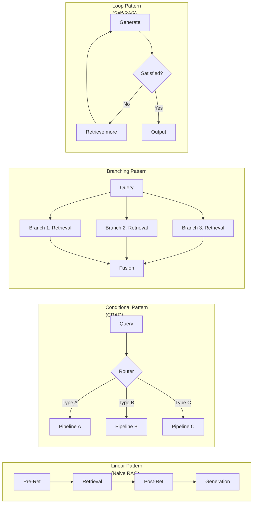


**A. 등장배경**
RAG 기법들이 빠르게 발전하면서 단순한 "Retrieve-then-Generate" 패러다임으로는 다양한 방법론들을 통합적으로 설명할 수 없게 되었다. Self-RAG, CRAG, RAPTOR 등 각각의 기법이 독자적 파이프라인을 구성하며, 이를 **체계적으로 조합·재구성하는 프레임워크**가 필요했다.

**B. 핵심 개념**
RAG 시스템을 독립 모듈과 특수 오퍼레이터로 분해하여 LEGO 블록처럼 재구성 가능한 프레임워크를 구축한다.

**6대 핵심 모듈**:

1. **Indexing**: 문서 분할, 임베딩, 인덱스 구축
2. **Pre-Retrieval**: 쿼리 재작성, 확장, 분해
3. **Retrieval**: Sparse, Dense, Hybrid 검색
4. **Post-Retrieval**: Reranking, 필터링, 압축
5. **Generation**: 프롬프트 구성, LLM 생성
6. **Orchestration**: 라우팅, 스케줄링, 흐름 제어

**RAG 흐름 패턴**:

- **Linear**: 순차 파이프라인 (Naive RAG)
- **Conditional**: 조건 분기 (CRAG)
- **Branching**: 병렬 검색 후 합산
- **Looping**: 반복적 검색-생성 (Self-RAG)

**C. 기술적 기여**
기존 RAG 연구들을 통합하는 분류 체계를 확립하고, 다양한 RAG 패턴의 구현 방식을 체계적으로 분석했다. 새로운 RAG 기법이 등장해도 모듈 단위로 교체·추가할 수 있는 확장 가능한 프레임워크를 제시했다 (Gao et al., 2024).

**D. 한계점**

- 모듈 간 최적 조합을 자동으로 탐색하는 메커니즘 부재
- 모듈 수 증가에 따른 설계 복잡도 상승
- Agentic RAG로의 진화 가능성 (LLM이 오케스트레이터 역할)

---

### 2.9 Adaptive-RAG (2024)

**기원 논문**

- Jeong et al., *"Adaptive-RAG: Learning to Adapt Retrieval-Augmented Large Language Models through Question Complexity"*, NAACL 2024
- arXiv:2403.14403

> 아래 다이어그램은 Jeong et al. (2024) 논문의 Adaptive-RAG 아키텍처를 재현한 것이다.
> 소형 LM 기반 분류기가 질의 복잡도를 판별하고, 복잡도에 따라
> No Retrieval / Single-step Retrieval / Multi-step (Iterative) Retrieval 전략 중 하나를 선택한다.

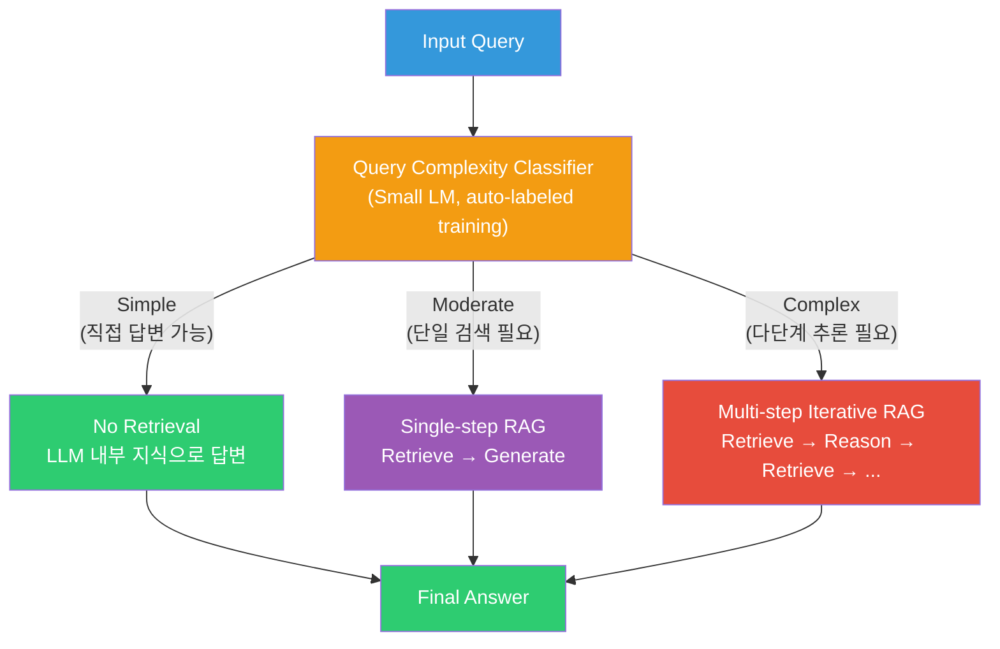


**Multi-step Iterative Retrieval 상세 흐름:**

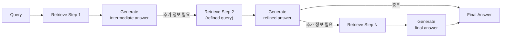


**A. 등장배경**
Self-RAG와 CRAG가 검색 결과의 품질을 사후 평가하는 데 집중한 반면, **질의 자체의 복잡도에 따라 검색 전략을 사전에 결정**하는 접근이 부재했다. 단순 질의에 복잡한 다단계 검색을 적용하면 불필요한 비용이 발생하고, 복잡한 질의에 단순 검색을 적용하면 답변 품질이 저하된다.

**B. 핵심 개념**
소형 LM 기반 분류기(classifier)를 학습하여 질의 복잡도를 자동 분류하고, 복잡도에 따라 3가지 전략을 동적으로 선택한다:

- **Simple**: LLM 내부 지식만으로 직접 답변 (No Retrieval)
- **Moderate**: 단일 검색 후 답변 (Single-step RAG)
- **Complex**: 반복적 검색-추론 사이클 (Iterative Multi-step RAG)

분류기는 수동 레이블 없이, 각 전략의 실제 예측 결과와 데이터셋의 귀납적 편향(inductive bias)으로부터 자동 수집된 레이블로 학습된다 (Jeong et al., 2024).

**C. 기술적 기여**
다양한 복잡도의 Open-domain QA 데이터셋에서 기존 적응적 검색 접근법 대비 **전체적인 효율성과 정확도 모두 향상**되었다. 질의 복잡도에 맞는 최소한의 검색만 수행하여 불필요한 계산 비용을 절감했다 (Jeong et al., 2024).

**D. 한계점**

- 분류기의 복잡도 판별 오류가 전체 파이프라인 성능에 직결
- 사전 정의된 3단계 복잡도 구분의 유연성 제한
- 검색 결과 자체의 품질 교정 메커니즘은 포함하지 않음

---

### 2.10 Graph RAG (2024)

**기원 논문**

- Edge et al., *"From Local to Global: A Graph RAG Approach to Query-Focused Summarization"*, arXiv:2404.16130, 2024 (Microsoft Research)

> 아래 다이어그램은 Edge et al. (2024) 논문의 Graph RAG 인덱싱 파이프라인을 재현한 것이다.
> 소스 문서에서 LLM으로 엔티티/관계를 추출하여 Knowledge Graph를 구축하고,
> Leiden 알고리즘으로 커뮤니티를 탐지한 뒤, 각 커뮤니티의 LLM 요약을 사전 생성한다.
> 질의 시 Map-Reduce 방식으로 커뮤니티 요약에서 부분 답변을 생성하고 종합한다.

**인덱싱 파이프라인 (Offline):**

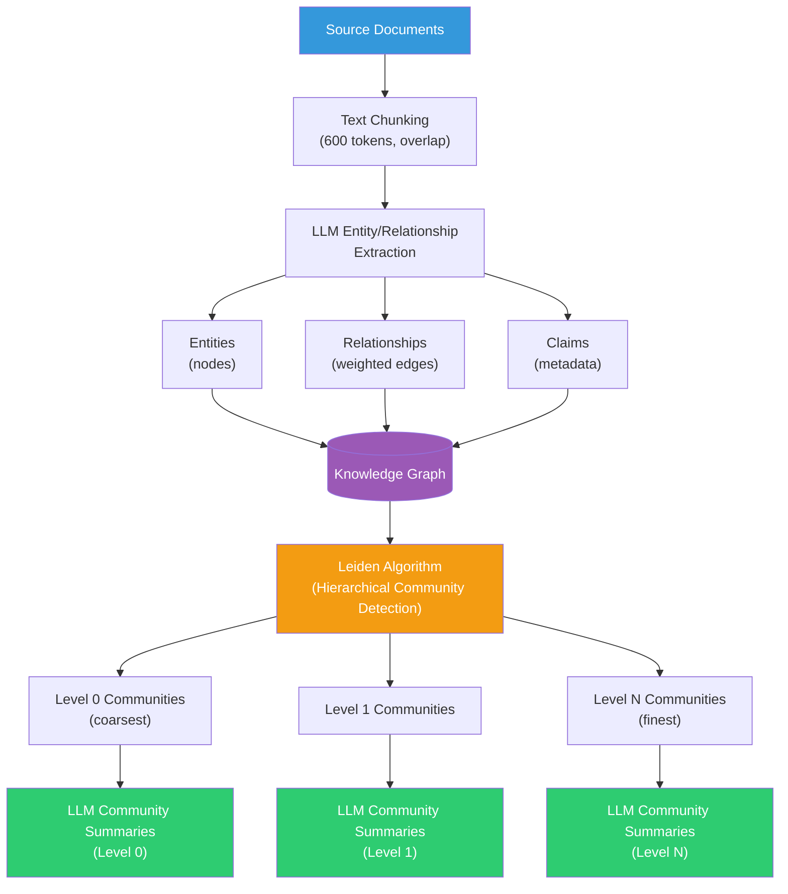


**질의 처리 (Map-Reduce):**

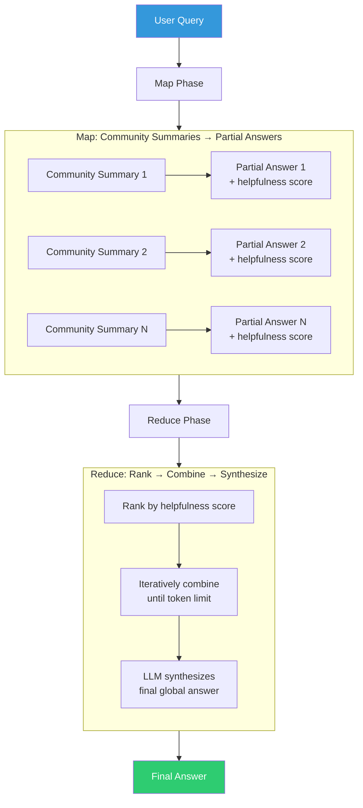


**A. 등장배경**
기존 RAG는 질의와 의미적으로 유사한 개별 텍스트 청크를 검색하는 **지역적(local) 검색**에 특화되어 있으나, "이 데이터셋의 주요 테마는 무엇인가?"와 같은 **전역적(global) 질의**에는 대응하지 못했다. 엔티티 간 관계를 통한 다단계 추론(multi-hop reasoning)이 불가능했다 (Edge et al., 2024).

**B. 핵심 개념**
LLM으로 소스 문서에서 엔티티와 관계를 추출하여 Knowledge Graph를 구축하고, Leiden 알고리즘으로 계층적 커뮤니티를 탐지한다. 각 커뮤니티에 대해 LLM 요약을 사전 생성하여, 질의 시 Map-Reduce 방식으로 커뮤니티 요약들로부터 부분 답변을 생성하고 종합한다.

**C. 기술적 기여**
100만 토큰 규모 데이터셋에서 기존 벡터 RAG 대비:

- **Comprehensiveness (포괄성)**: 72~83% win rate (p<0.001)
- **Diversity (다양성)**: 62~82% win rate (p<0.01)
- Root-level 커뮤니티 요약은 전체 소스 텍스트 요약 대비 **97% 적은 토큰**으로 72% 포괄성 우위 달성 (Edge et al., 2024)

**D. 한계점**

- KG 구축 시 LLM 호출 비용이 높음 (인덱싱 비용)
- 엔티티/관계 추출 품질이 LLM 성능에 의존
- 지역적(local) 세부 질의에는 기존 벡터 RAG가 더 효과적일 수 있음

---

### 2.11 Agentic RAG (2025)

**기원 논문**

- Singh et al., *"Agentic Retrieval-Augmented Generation: A Survey on Agentic RAG"*, arXiv:2501.09136, 2025

> 아래 다이어그램은 Singh et al. (2025) 논문의 Agentic RAG 분류 체계를 재현한 것이다.
> 자율 에이전트가 RAG 파이프라인에 내장되어, Reflection(자기 평가) · Planning(계획 수립) ·
> Tool Use(외부 도구 활용) · Multi-Agent Collaboration(다중 에이전트 협업)의
> 4가지 에이전틱 디자인 패턴을 통해 동적으로 검색 전략을 관리한다.

**Agentic RAG 아키텍처 분류:**

```mermaid
flowchart TB
    subgraph Single["Single-Agent RAG"]
        direction TB
        SA_Q["Query"] --> SA_AGENT["Central Agent<br/>(Router + Reasoner)"]
        SA_AGENT --> SA_SQL["Text-to-SQL<br/>Engine"]
        SA_AGENT --> SA_SEM["Semantic<br/>Search"]
        SA_AGENT --> SA_WEB["Web<br/>Search"]
        SA_AGENT --> SA_REC["Recommendation<br/>System"]
        SA_SQL --> SA_ANS["Synthesized Answer"]
        SA_SEM --> SA_ANS
        SA_WEB --> SA_ANS
        SA_REC --> SA_ANS
    end

    subgraph Multi["Multi-Agent RAG"]
        direction TB
        MA_Q["Query"] --> MA_COORD["Coordinator Agent"]
        MA_COORD --> MA_A1["SQL Agent"]
        MA_COORD --> MA_A2["Semantic Agent"]
        MA_COORD --> MA_A3["Web Agent"]
        MA_COORD --> MA_A4["Domain Agent"]
        MA_A1 --> MA_SYNTH["LLM Synthesis"]
        MA_A2 --> MA_SYNTH
        MA_A3 --> MA_SYNTH
        MA_A4 --> MA_SYNTH
    end

    subgraph Hier["Hierarchical Agentic RAG"]
        direction TB
        HA_Q["Query"] --> HA_TOP["Strategic Agent<br/>(prioritization)"]
        HA_TOP --> HA_MID1["Supervisor Agent 1"]
        HA_TOP --> HA_MID2["Supervisor Agent 2"]
        HA_MID1 --> HA_W1["Worker Agent"]
        HA_MID1 --> HA_W2["Worker Agent"]
        HA_MID2 --> HA_W3["Worker Agent"]
        HA_MID2 --> HA_W4["Worker Agent"]
    end
```


**4가지 에이전틱 디자인 패턴 (Singh et al., 2025):**

```mermaid
flowchart TB
    subgraph Reflection["Reflection Pattern"]
        direction LR
        RF1["Generate output"] --> RF2["Self-evaluate<br/>quality/accuracy"]
        RF2 --> |"Not satisfied"| RF3["Refine and<br/>regenerate"]
        RF3 --> RF2
        RF2 --> |"Satisfied"| RF4["Final output"]
    end

    subgraph Planning["Planning Pattern"]
        direction LR
        PL1["Complex query"] --> PL2["Decompose into<br/>sub-tasks"]
        PL2 --> PL3["Execute sub-task 1"]
        PL2 --> PL4["Execute sub-task 2"]
        PL2 --> PL5["Execute sub-task N"]
        PL3 --> PL6["Aggregate results"]
        PL4 --> PL6
        PL5 --> PL6
    end

    subgraph ToolUse["Tool Use Pattern"]
        direction LR
        TU1["Agent decides<br/>which tool to use"] --> TU2["API call"]
        TU1 --> TU3["Database query"]
        TU1 --> TU4["Calculator"]
        TU1 --> TU5["Code executor"]
    end

    subgraph MultiAgent["Multi-Agent Collaboration"]
        direction LR
        MC1["Agent A<br/>(Retrieval specialist)"]
        MC2["Agent B<br/>(Reasoning specialist)"]
        MC3["Agent C<br/>(Verification specialist)"]
        MC1 --> MC4["Shared<br/>workspace"]
        MC2 --> MC4
        MC3 --> MC4
    end
```


**RAG 패러다임 진화 경로 (Singh et al., 2025):**

```mermaid
flowchart LR
    N["Naive RAG<br/>키워드 기반 정적 검색"]
    --> A["Advanced RAG<br/>Dense retrieval + Reranking"]
    --> M["Modular RAG<br/>조합 가능한 파이프라인"]
    --> G["Graph RAG<br/>관계 구조 활용"]
    --> AG["Agentic RAG<br/>자율 에이전트 기반<br/>동적 의사결정"]

    style N fill:#3498DB,color:#fff
    style A fill:#7B68EE,color:#fff
    style M fill:#E67E22,color:#fff
    style G fill:#27AE60,color:#fff
    style AG fill:#C0392B,color:#fff
```


**A. 등장배경**
Modular RAG가 파이프라인의 모듈화를 달성했으나, 각 모듈의 선택과 조합은 여전히 사전 설계에 의존했다. 질의의 특성에 따라 검색 전략·도구·추론 경로를 **자율적으로 결정**하고, 결과를 **반복적으로 개선**할 수 있는 지능형 시스템이 요구되었다 (Singh et al., 2025).

**B. 핵심 개념**
자율 AI 에이전트를 RAG 파이프라인에 내장하여, 4가지 에이전틱 디자인 패턴으로 동적 검색을 관리한다:


| 디자인 패턴          | 역할                    | RAG 적용                         |
| --------------- | --------------------- | ------------------------------ |
| **Reflection**  | 출력을 자체 평가하고 반복 개선     | 생성 결과의 사실성·완전성 자기 검증           |
| **Planning**    | 복잡한 질의를 하위 태스크로 분해    | Multi-hop 질의의 검색 계획 수립         |
| **Tool Use**    | 외부 API·DB·계산기 등 도구 활용 | Text-to-SQL, 웹 검색, 코드 실행 동적 선택 |
| **Multi-Agent** | 전문 에이전트 간 협업          | 검색·추론·검증 에이전트 병렬 동작            |


아키텍처는 Single-Agent(중앙 라우터), Multi-Agent(병렬 전문가), Hierarchical(계층적 위임)의 3가지 변형으로 분류된다.

**C. 기술적 기여**
기존 RAG 계보(Naive → Advanced → Modular → Graph)를 통합하고 그 위에 자율적 의사결정 계층을 추가하는 포괄적 분류 체계를 확립했다. 의료·금융·교육 등 산업 도메인의 실제 구현 사례와 함께 실용적 구현 전략을 제시했다 (Singh et al., 2025).

**D. 한계점**

- 에이전트 간 통신 및 태스크 위임의 오케스트레이션 복잡도
- 다중 에이전트 시스템의 지연 시간(latency) 증가
- 에이전트의 자율적 판단 오류에 대한 안전장치(guardrail) 필요
- 재현성과 디버깅의 어려움

---

## 3. 종합 비교표


| 기법                | 시기        | Retrieval 전략                        | Generation 전략      | 핵심 혁신                                    | 대표 벤치마크 결과                    |
| ----------------- | --------- | ----------------------------------- | ------------------ | ---------------------------------------- | ----------------------------- |
| **Naive RAG**     | 2020.05   | Dense (DPR)                         | Seq2Seq (BART)     | 파라메트릭 + 비파라메트릭 메모리 결합                    | Open-domain QA 3개 SOTA        |
| **Hybrid Search** | 2009~2020 | BM25 + Dense + RRF                  | 기존 LM 활용           | Sparse/Dense 상호 보완                       | DPR 대비 Top-20 정확도 +9~19%      |
| **Reranker**      | 2019~2020 | Bi-encoder → Cross-encoder          | 기존 LM 활용           | 질의-문서 세밀 상호작용                            | MS MARCO 리더보드 1위 (2019)       |
| **Self-RAG**      | 2023.10   | Adaptive (Reflection Token)         | Self-reflective LM | 검색·생성·비평의 자기 성찰 통합                       | 6개 태스크에서 ChatGPT 능가           |
| **RAPTOR**        | 2024.01   | 다층 트리 검색                            | GPT-4 활용           | 재귀적 클러스터링-요약 트리                          | QuALITY 절대 정확도 +20%           |
| **Tree RAG**      | 2024.02   | 엔티티 트리 순회                           | RAG + Fine-tuning  | 계층적 조직 지식 표현                             | 엔티티 QA 강건성 향상                 |
| **CRAG**          | 2024.01   | 품질 평가 기반 교정 + 웹 검색                  | 정제된 컨텍스트 생성        | Retrieval Evaluator + 웹 검색 폴백            | 4개 데이터셋 RAG 대비 유의미 향상         |
| **Adaptive-RAG**  | 2024.03   | 복잡도 기반 동적 선택 (No/Single/Multi-step) | 기존 LM 활용           | 질의 복잡도 분류기 기반 전략 라우팅                     | 적응적 검색 대비 효율성+정확도 향상          |
| **Graph RAG**     | 2024.04   | KG 커뮤니티 요약 + Map-Reduce             | LLM (GPT-4)        | Leiden 커뮤니티 탐지 + 전역 질의 대응                | 포괄성 72~83% win rate vs 벡터 RAG |
| **Modular RAG**   | 2024.07   | 모듈 조합 (Sparse/Dense/Hybrid)         | 모듈 조합 (다양한 LM)     | LEGO식 6대 모듈 재구성 프레임워크                    | 통합 분류 체계 확립                   |
| **Agentic RAG**   | 2025.01   | 에이전트 자율 선택 (다중 도구)                  | 에이전트 반복 개선         | Reflection·Planning·Tool Use·Multi-Agent | 의료·금융·교육 도메인 실증               |


---

## 4. 패러다임 전환 분석

> 아래 다이어그램은 Gao et al. (arXiv:2312.10997)의 Naive/Advanced/Modular RAG 패러다임 분류와
> Singh et al. (arXiv:2501.09136)의 Agentic RAG 분류를 통합하여,
> 각 세대에 속하는 기법들과 세대 간 전환을 촉발한 핵심 동기를 시각화한 것이다.

```mermaid
flowchart TB
    subgraph Gen1["1세대: Naive RAG (2020)"]
        direction LR
        G1A["Retrieve → Read 단순 파이프라인"]
        G1B["Naive RAG"]
    end

    subgraph Gen2["2세대: Advanced RAG (2019~2024)"]
        direction LR
        G2A["검색 품질 강화"]
        G2B["Hybrid Search"]
        G2C["Reranker"]
        G2D["RAPTOR"]
        G2E["Tree RAG"]
    end

    subgraph Gen3["3세대: Modular / Self-Corrective RAG (2023~2024)"]
        direction LR
        G3A["자기 성찰 + 교정 + 적응 + 모듈화"]
        G3B["Self-RAG"]
        G3C["CRAG"]
        G3D["Adaptive-RAG"]
        G3E["Graph RAG"]
        G3F["Modular RAG"]
    end

    subgraph Gen4["4세대: Agentic RAG (2025~)"]
        direction LR
        G4A["자율 에이전트 기반 동적 파이프라인"]
        G4B["Single-Agent RAG"]
        G4C["Multi-Agent RAG"]
        G4D["Hierarchical Agentic RAG"]
    end

    Gen1 --> |"검색 품질 의존 한계"| Gen2
    Gen2 --> |"통합·자기교정 부재"| Gen3
    Gen3 --> |"정적 파이프라인의 한계"| Gen4

    style Gen1 fill:#3498DB,color:#fff
    style Gen2 fill:#7B68EE,color:#fff
    style Gen3 fill:#E67E22,color:#fff
    style Gen4 fill:#C0392B,color:#fff
```


### 1세대: Naive RAG (2020)

**특징**: `Retrieve → Read` 단순 파이프라인

단일 Dense Retriever로 Top-k 청크를 검색하고 LLM에 직접 전달하는 구조이다. 구현이 단순하나 검색 품질에 전적으로 의존하며, 노이즈 문서 유입, 거시적 맥락 부재, 불필요한 검색 등의 근본적 한계를 가진다 (Gao et al., 2024, arXiv:2312.10997).

### 2세대: Advanced RAG (2019~2024)

**특징**: 검색 품질 강화에 집중한 파이프라인 고도화

Naive RAG의 검색 한계를 **전·중·후 단계**에서 보강한다:

- **Pre-Retrieval**: 쿼리 재작성, Hybrid Search로 검색 범위 확대
- **Retrieval**: Dense + Sparse 결합, 다층 트리 검색 (RAPTOR)
- **Post-Retrieval**: Cross-Encoder Reranking으로 정밀도 향상

이 세대의 핵심은 "더 좋은 문서를 더 정확하게 가져오는 것"이다. 그러나 파이프라인의 각 단계가 독립적으로 발전하면서, 전체적인 통합과 자기 교정 능력이 부족하다는 한계가 드러났다.

### 3세대: Modular / Self-Corrective RAG (2023~2024)

**특징**: 자기 성찰, 교정, 적응, 구조화, 모듈화를 통한 지능형 파이프라인

검색 품질 향상을 넘어 **시스템 수준의 지능**을 추가한다:

- **자기 성찰**: Self-RAG의 Reflection Token으로 검색 필요성·결과 품질·응답 유용성을 LM 스스로 판단
- **자기 교정**: CRAG의 Retrieval Evaluator로 검색 실패를 감지하고 웹 검색으로 교정
- **적응적 라우팅**: Adaptive-RAG의 복잡도 분류기로 질의별 최적 검색 전략 동적 선택
- **구조적 검색**: Graph RAG의 Knowledge Graph + 커뮤니티 요약으로 전역 질의 대응
- **모듈화**: Modular RAG로 모든 기법을 독립 모듈로 분해, 태스크별 최적 조합 가능

이 세대는 파이프라인의 각 단계에서 지능적 판단을 도입했으나, 여전히 사전 설계된 흐름에 의존한다는 한계가 있다.

### 4세대: Agentic RAG (2025~)

**특징**: 자율 에이전트가 RAG 파이프라인을 동적으로 오케스트레이션

Singh et al. (2025)가 정의한 Agentic RAG는 이전 세대의 모든 기법을 **도구(tool)**로 활용할 수 있는 자율 에이전트를 파이프라인의 중심에 배치한다:

- **Reflection**: 생성 결과를 자체 평가하고 반복적으로 개선
- **Planning**: 복잡한 질의를 하위 태스크로 분해하여 다단계 추론 계획 수립
- **Tool Use**: 벡터 검색, KG 검색, SQL, 웹 검색, 계산기 등을 상황에 따라 동적 선택
- **Multi-Agent Collaboration**: 검색·추론·검증 전문 에이전트가 병렬 협업

이 세대의 방향성은 "LLM 에이전트가 RAG 파이프라인의 모든 구성요소를 자율적으로 조합·실행·검증하는 것"이다.

---

## 5. References

> 모든 논문은 2025년 3월 기준 arXiv, ACM DL, OpenReview 등에서 실재를 개별 검증하였다.


| #   | 논문                                                                                                                                                                                                                                                                                      | 검증 상태 |
| --- | --------------------------------------------------------------------------------------------------------------------------------------------------------------------------------------------------------------------------------------------------------------------------------------- | ----- |
| 1   | Lewis, P., Perez, E., Piktus, A., Petroni, F., Karpukhin, V., Goyal, N., ... & Kiela, D. (2020). *Retrieval-Augmented Generation for Knowledge-Intensive NLP Tasks*. **NeurIPS 2020**.                                                                                                  | ✅     |
|     | [arXiv:2005.11401](https://arxiv.org/abs/2005.11401) · [NeurIPS Proceedings](https://proceedings.neurips.cc/paper/2020/hash/6b493230205f780e1bc26945df7481e5-Abstract.html)                                                                                                             |       |
| 2   | Karpukhin, V., Oguz, B., Min, S., Lewis, P., Wu, L., Edunov, S., Chen, D., & Yih, W. (2020). *Dense Passage Retrieval for Open-Domain Question Answering*. **EMNLP 2020**.                                                                                                              | ✅     |
|     | [arXiv:2004.04906](https://arxiv.org/abs/2004.04906) · [ACL Anthology](https://aclanthology.org/2020.emnlp-main.550/)                                                                                                                                                                   |       |
| 3   | Robertson, S., & Zaragoza, H. (2009). *The Probabilistic Relevance Framework: BM25 and Beyond*. **Foundations and Trends in Information Retrieval**, 3(4), 333-389.                                                                                                                     | ✅     |
|     | [DOI:10.1561/1500000019](https://dl.acm.org/doi/abs/10.1561/1500000019) · [Semantic Scholar](https://www.semanticscholar.org/paper/The-Probabilistic-Relevance-Framework:-BM25-and-Robertson-Zaragoza/47ced790a563344efae66588b5fb7fe6cca29ed3)                                         |       |
| 4   | Cormack, G. V., Clarke, C. L., & Buettcher, S. (2009). *Reciprocal Rank Fusion outperforms Condorcet and Individual Rank Learning Methods*. **SIGIR 2009**, pp. 758-759.                                                                                                                | ✅     |
|     | [DOI:10.1145/1571941.1572114](https://dl.acm.org/doi/10.1145/1571941.1572114) · [Author PDF](https://cormack.uwaterloo.ca/cormacksigir09-rrf.pdf)                                                                                                                                       |       |
| 5   | Nogueira, R., & Cho, K. (2019). *Passage Re-ranking with BERT*.                                                                                                                                                                                                                         | ✅     |
|     | [arXiv:1901.04085](https://arxiv.org/abs/1901.04085) · [Semantic Scholar](https://www.semanticscholar.org/paper/Passage-Re-ranking-with-BERT-Nogueira-Cho/85e07116316e686bf787114ba10ca60f4ea7c5b2)                                                                                     |       |
| 6   | Khattab, O., & Zaharia, M. (2020). *ColBERT: Efficient and Effective Passage Search via Contextualized Late Interaction over BERT*. **SIGIR 2020**.                                                                                                                                     | ✅     |
|     | [arXiv:2004.12832](https://arxiv.org/abs/2004.12832) · [ACM DL](https://dl.acm.org/doi/10.1145/3397271.3401075)                                                                                                                                                                         |       |
| 7   | Asai, A., Wu, Z., Wang, Y., Sil, A., & Hajishirzi, H. (2023). *Self-RAG: Learning to Retrieve, Generate, and Critique through Self-Reflection*. **ICLR 2024 (Oral, Top 1%)**.                                                                                                           | ✅     |
|     | [arXiv:2310.11511](https://arxiv.org/abs/2310.11511) · [OpenReview](https://openreview.net/forum?id=hSyW5go0v8) · [ICLR Proceedings](https://proceedings.iclr.cc/paper_files/paper/2024/file/25f7be9694d7b32d5cc670927b8091e1-Paper-Conference.pdf)                                     |       |
| 8   | Sarthi, P., Abdullah, S., Tuli, A., Khanna, S., Goldie, A., & Manning, C. D. (2024). *RAPTOR: Recursive Abstractive Processing for Tree-Organized Retrieval*. **ICLR 2024**.                                                                                                            | ✅     |
|     | [arXiv:2401.18059](https://arxiv.org/abs/2401.18059) · [OpenReview](https://openreview.net/forum?id=GN921JHCRw) · [GitHub](https://github.com/parthsarthi03/raptor)                                                                                                                     |       |
| 9   | Fatehkia, M., Lucas, J. K., & Chawla, S. (2024). *T-RAG: Lessons from the LLM Trenches*.                                                                                                                                                                                                | ✅     |
|     | [arXiv:2402.07483](https://arxiv.org/abs/2402.07483) · [Hugging Face](https://huggingface.co/papers/2402.07483)                                                                                                                                                                         |       |
| 10  | Yan, S.-Q., Gu, J.-C., Zhu, Y., & Ling, Z.-H. (2024). *Corrective Retrieval Augmented Generation*.                                                                                                                                                                                      | ✅     |
|     | [arXiv:2401.15884](https://arxiv.org/abs/2401.15884) · [Semantic Scholar](https://www.semanticscholar.org/paper/Corrective-Retrieval-Augmented-Generation-Yan-Gu/5bbc2b5aa6c63c6a2cfccf095d6020b063ad47ac) · [GitHub](https://github.com/HuskyInSalt/CRAG)                              |       |
| 11  | Gao, Y., Xiong, Y., Gao, X., Jia, K., Pan, J., Bi, Y., Dai, Y., Sun, J., & Wang, H. (2024). *Retrieval-Augmented Generation for Large Language Models: A Survey*.                                                                                                                       | ✅     |
|     | [arXiv:2312.10997](https://arxiv.org/abs/2312.10997) · [Semantic Scholar](https://www.semanticscholar.org/paper/Retrieval-Augmented-Generation-for-Large-Language-A-Gao-Xiong/46f9f7b8f88f72e12cbdb21e3311f995eb6e65c5)                                                                 |       |
| 12  | Gao, Y., Xiong, Y., Wang, M., & Wang, H. (2024). *Modular RAG: Transforming RAG Systems into LEGO-like Reconfigurable Frameworks*.                                                                                                                                                      | ✅     |
|     | [arXiv:2407.21059](https://arxiv.org/abs/2407.21059) · [Semantic Scholar](https://www.semanticscholar.org/paper/Modular-RAG:-Transforming-RAG-Systems-into-Gao-Xiong/21620a67bbef3a4c607bf17be07d42514163dfaf)                                                                          |       |
| 13  | Gupta, S., Ranjan, R., & Singh, S. N. (2024). *A Comprehensive Survey of Retrieval-Augmented Generation (RAG): Evolution, Current Landscape and Future Directions*.                                                                                                                     | ✅     |
|     | [arXiv:2410.12837](https://arxiv.org/abs/2410.12837) · [ResearchGate](https://www.researchgate.net/publication/385009890)                                                                                                                                                               |       |
| 14  | Jeong, S., Baek, J., Cho, S., Hwang, S. J., & Park, J. C. (2024). *Adaptive-RAG: Learning to Adapt Retrieval-Augmented Large Language Models through Question Complexity*. **NAACL 2024**.                                                                                              | ✅     |
|     | [arXiv:2403.14403](https://arxiv.org/abs/2403.14403) · [ACL Anthology](https://aclanthology.org/2024.naacl-long.389/) · [GitHub](https://github.com/starsuzi/Adaptive-RAG)                                                                                                              |       |
| 15  | Edge, D., Trinh, H., Cheng, N., Bradley, J., Chao, A., Mody, A., Truitt, S., Metropolitansky, D., Ness, R. O., & Larson, J. (2024). *From Local to Global: A Graph RAG Approach to Query-Focused Summarization*. **Microsoft Research**.                                                | ✅     |
|     | [arXiv:2404.16130](https://arxiv.org/abs/2404.16130) · [Microsoft Research](https://www.microsoft.com/en-us/research/publication/from-local-to-global-a-graph-rag-approach-to-query-focused-summarization/) · [GitHub](https://github.com/microsoft/graphrag)                           |       |
| 16  | Singh, A., Ehtesham, A., Kumar, S., & Khoei, T. T. (2025). *Agentic Retrieval-Augmented Generation: A Sur/vey on Agentic RAG*.                                                                                                                                                          | ✅     |
|     | [arXiv:2501.09136](https://arxiv.org/abs/2501.09136) · [Semantic Scholar](https://www.semanticscholar.org/paper/Agentic-Retrieval-Augmented-Generation:-A-Survey-on-Singh-Ehtesham/f1d6bb6b8f0273986094b5e166538a980c674fea) · [GitHub](https://github.com/asinghcsu/AgenticRAG-Survey) |       |


