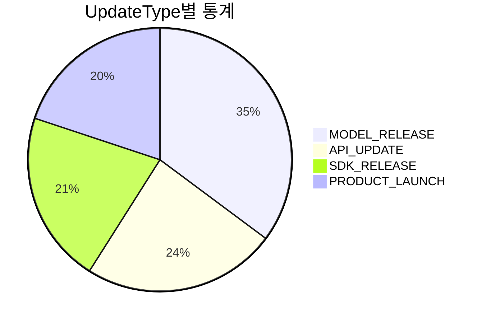
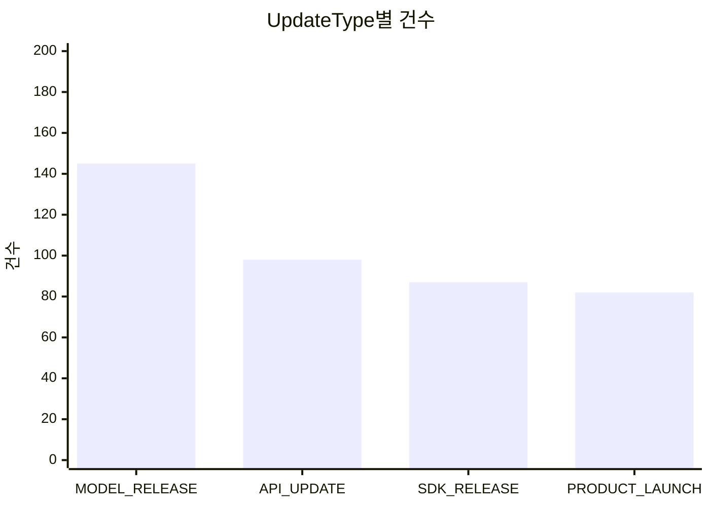

# Agent 통계 Tool 루프 문제 진단 및 해결 방안

> 작성일: 2026-03-20
> 관련 모듈: `api-agent`, `tech-n-ai-frontend/admin`

## 현상

사용자가 "업데이트 유형별 통계를 차트로 보여주세요." 요청 시:
- `get_emerging_tech_statistics` Tool이 정상 호출되고, MongoDB 집계 결과(`StatisticsDto`)가 LLM에 전달됨
- **GPT-4o-mini가 Tool 결과를 텍스트 응답으로 변환하지 않고, 동일한 인자로 같은 Tool을 30회 반복 호출**
- `exceeded 30 sequential tool invocations` 예외 발생 후 실패 응답 반환

---

## 해결 과제 1: GPT-4o-mini Tool 루프 문제

### 근본 원인

GPT-4o-mini가 `ToolExecutionResultMessage`(StatisticsDto JSON)를 받은 후, 텍스트 응답을 생성하는 대신 동일한 Tool을 재호출하는 루프에 빠진다.

### 현재 데이터 흐름

```
사용자 요청
  → AgentPromptConfig.buildPrompt(goal)로 시스템 프롬프트 생성
  → AgentAssistant.chat(sessionId, prompt) 호출
  → GPT-4o-mini가 get_emerging_tech_statistics Tool 호출 결정
  → EmergingTechAgentTools.getStatistics() 실행
  → AnalyticsToolAdapter → EmergingTechAggregationService.countByGroup()
  → StatisticsDto JSON 반환 (정상 데이터)
  → LangChain4j가 ToolExecutionResultMessage로 LLM에 전달
  → ★ LLM이 텍스트 응답을 생성하지 않고 같은 Tool 재호출 ← 문제 지점
  → 30회 반복 후 RuntimeException
```

### StatisticsDto - LLM이 받는 JSON 형태

```json
{
  "groupBy": "update_type",
  "startDate": "",
  "endDate": "",
  "totalCount": 478,
  "groups": [
    {"name": "MODEL_RELEASE", "count": 145},
    {"name": "API_UPDATE", "count": 98},
    {"name": "SDK_RELEASE", "count": 87},
    {"name": "PRODUCT_LAUNCH", "count": 82},
    {"name": "PLATFORM_UPDATE", "count": 40},
    {"name": "BLOG_POST", "count": 26}
  ],
  "message": null
}
```

### 현재 적용된 방어 로직

| 파일 | 로직 | 한계 |
|------|------|------|
| `ToolExecutionMetrics.isConsecutiveDuplicate()` | 동일 Tool+인자 연속 3회 초과 감지 | 감지는 되지만 STOP 메시지 DTO를 반환해도 LLM이 무시 |
| `EmergingTechAgentTools.isConsecutiveDuplicate()` | 6회 초과 시 `AgentLoopDetectedException` throw | 루프를 강제 종료하지만, 정상 응답이 아닌 에러 메시지 반환 |
| `EmergingTechAgentImpl.execute()` | `AgentLoopDetectedException` catch → 정상 응답 변환 | "반복 조회 루프 감지로 자동 종료" 메시지만 반환 (통계 데이터 없음) |

### 해결 방안 후보

#### 방안 A: 모델 변경 (GPT-4o 또는 다른 모델)

- GPT-4o-mini는 Tool calling 후 응답 생성에서 루프 경향이 있음
- GPT-4o 또는 Claude 등 더 큰 모델로 변경하면 루프 없이 정상 동작 가능성 높음
- **장점**: 코드 변경 최소화, 응답 품질 향상
- **단점**: 비용 증가, 응답 시간 증가

#### 방안 B: 시스템 프롬프트 강화

현재 `AgentPromptConfig.rules`의 규칙 4:
> "통계 요청 시 get_emerging_tech_statistics로 집계하고, Markdown 표와 Mermaid 차트로 정리"

다음과 같이 강화:
- Tool 결과를 받으면 **반드시 즉시 텍스트 응답을 생성**하라는 명시적 지시 추가
- "동일한 Tool을 같은 인자로 2회 이상 호출하지 마라" 규칙 추가
- Tool 결과 활용 예시를 프롬프트에 포함 (few-shot)

**장점**: 비용 변화 없음
**단점**: GPT-4o-mini에서 효과가 보장되지 않음

#### 방안 C: 아키텍처 변경 - Tool 결과 직접 반환

LLM의 텍스트 생성에 의존하지 않고, Tool 실행 결과를 직접 프론트엔드에 구조화된 데이터로 전달:
1. `AgentExecutionResult`에 `toolResults` 필드 추가
2. Tool 실행 시 결과를 별도 저장
3. 프론트엔드에서 `toolResults`의 구조화된 데이터를 직접 차트로 렌더링
4. LLM의 `summary`는 텍스트 설명용으로만 활용

**장점**: LLM 루프와 무관하게 데이터 전달 보장, 프론트엔드에서 정확한 차트 렌더링
**단점**: 아키텍처 변경 범위가 큼

#### 방안 D: 방안 B + 루프 감지 시 캐시된 결과 반환 (권장)

1. 시스템 프롬프트 강화 (방안 B)
2. 루프 감지 시 `AgentLoopDetectedException` catch 블록에서 **첫 번째 정상 Tool 결과를 캐시**하여 해당 데이터로 응답 생성
3. `ToolExecutionMetrics`에 마지막 정상 Tool 결과 저장 기능 추가

**장점**: 기존 아키텍처 유지, 루프가 발생해도 정상 데이터 반환
**단점**: 캐시 관리 복잡도 약간 증가

### 관련 파일

| 파일 | 경로 |
|------|------|
| Tool 정의 | `api/agent/src/main/java/.../tool/EmergingTechAgentTools.java` |
| Tool 어댑터 | `api/agent/src/main/java/.../tool/adapter/AnalyticsToolAdapter.java` |
| Tool DTO | `api/agent/src/main/java/.../tool/dto/StatisticsDto.java` |
| MongoDB 집계 | `datasource/mongodb/src/main/java/.../service/EmergingTechAggregationService.java` |
| Agent 실행 | `api/agent/src/main/java/.../agent/EmergingTechAgentImpl.java` |
| Agent 결과 | `api/agent/src/main/java/.../agent/AgentExecutionResult.java` |
| 시스템 프롬프트 | `api/agent/src/main/java/.../config/AgentPromptConfig.java` |
| 메트릭 | `api/agent/src/main/java/.../metrics/ToolExecutionMetrics.java` |

---

## 해결 과제 2: 프론트엔드 Mermaid 차트 렌더링 미구현

### 근본 원인

시스템 프롬프트(`AgentPromptConfig.visualization`)에서:
> "프론트엔드에서 자동으로 렌더링됩니다."

라고 LLM에 안내하고 있지만, 실제 프론트엔드에는 Mermaid 렌더링이 구현되어 있지 않다.

### 현재 상태

`agent-message-bubble.tsx`의 렌더링 스택:

```
AgentMessageBubble
  → ReactMarkdown (remarkGfm 플러그인)
    → GFM 테이블: ✅ 정상 렌더링 (th/td 커스텀 스타일 적용)
    → Mermaid 코드 블록: ❌ <pre><code class="language-mermaid"> 로만 표시
      → mermaid 라이브러리 미설치
      → mermaid.initialize() / mermaid.run() 호출 없음
      → 원본 Mermaid 구문이 코드 블록으로 그대로 표시됨
```

### LLM이 생성하는 Mermaid 예시

시스템 프롬프트의 시각화 가이드에 따라 LLM은 다음과 같은 Mermaid 구문을 생성:





### 해결 방안

#### 방안 A: mermaid 라이브러리 통합

1. `npm install mermaid` 설치
2. `agent-message-bubble.tsx`의 `code` 컴포넌트 오버라이드에서 `language-mermaid` 감지
3. 해당 코드 블록을 `MermaidChart` 컴포넌트로 교체
4. `MermaidChart` 내부에서 `mermaid.render()` 호출하여 SVG 생성

```tsx
// MermaidChart 컴포넌트 구조 (예시)
'use client'
import { useEffect, useRef, useState } from 'react'
import mermaid from 'mermaid'

export function MermaidChart({ chart }: { chart: string }) {
  const ref = useRef<HTMLDivElement>(null)
  const [svg, setSvg] = useState<string>('')

  useEffect(() => {
    mermaid.initialize({ startOnLoad: false, theme: 'neutral' })
    const id = `mermaid-${crypto.randomUUID()}`
    mermaid.render(id, chart).then(({ svg }) => setSvg(svg))
  }, [chart])

  return <div ref={ref} dangerouslySetInnerHTML={{ __html: svg }} />
}
```

**장점**: LLM이 이미 Mermaid 구문을 생성하므로 백엔드 변경 불필요
**단점**: `dangerouslySetInnerHTML` 사용 시 XSS 주의 (mermaid 라이브러리의 sanitize 옵션 활용)

#### 방안 B: 차트 라이브러리로 직접 렌더링 (recharts 등)

1. LLM 응답에서 Mermaid 대신 구조화된 JSON 데이터를 추출
2. recharts/chart.js 등으로 네이티브 차트 렌더링
3. 해결 과제 1의 방안 C와 연계하여 `toolResults`에서 직접 차트 데이터 획득

**장점**: 더 정교한 인터랙티브 차트, XSS 위험 없음
**단점**: 아키텍처 변경 범위가 큼, LLM 응답에서 데이터 파싱 로직 필요

### 관련 파일

| 파일 | 경로 |
|------|------|
| 메시지 렌더링 | `tech-n-ai-frontend/admin/src/components/agent/agent-message-bubble.tsx` |
| Agent 페이지 | `tech-n-ai-frontend/admin/src/app/agent/page.tsx` |
| 시스템 프롬프트 (시각화 가이드) | `api/agent/src/main/java/.../config/AgentPromptConfig.java` (line 93-119) |
| Agent 타입 정의 | `tech-n-ai-frontend/admin/src/types/agent.ts` |

---

## 우선순위 권장

| 순서 | 과제 | 이유 |
|------|------|------|
| 1 | **GPT-4o-mini Tool 루프 해결** | 이 문제가 해결되지 않으면 통계 응답 자체가 생성되지 않음 |
| 2 | **Mermaid 렌더링 구현** | 루프 해결 후 LLM이 Mermaid 구문을 생성하면 차트로 표시 가능 |
