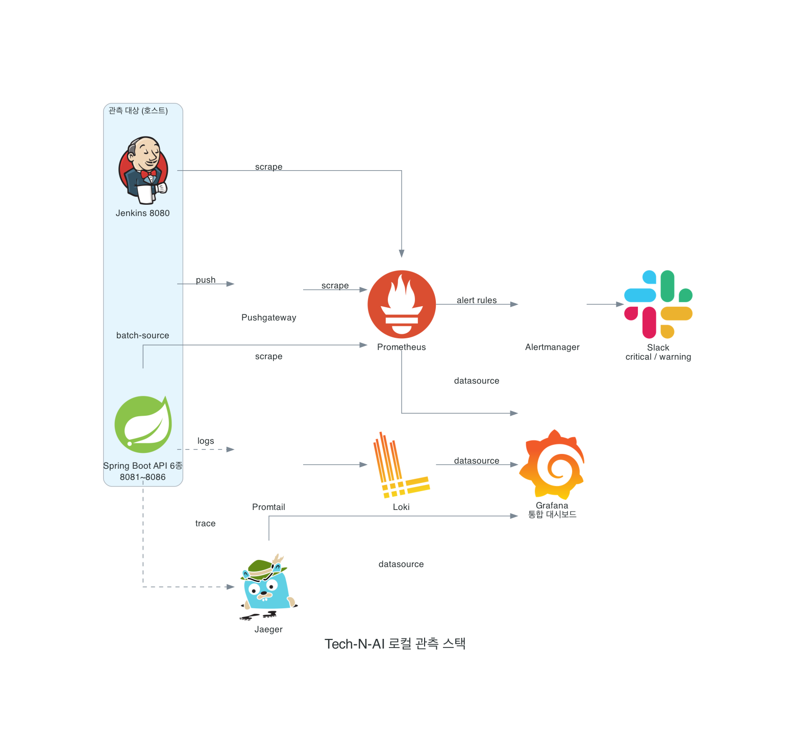

# 로컬 관측 스택 — 브라우저 접속 가이드

로컬 개발 환경에서 메트릭·로그·트레이스를 브라우저로 보기 위한 안내다.
여기서 다루는 것은 **루트 `docker-compose.yml`로 띄우는 로컬 도구들**이다.

> 운영(AWS) 관측은 별개다. 운영은 CloudWatch + X-Ray + Amazon Managed Grafana로
> 설계돼 있고, 그 내용은 [`../devops/results/08-observability.md`](../devops/results/08-observability.md)에 있다.
> 이 문서와 헷갈리지 말 것 — 여기 적힌 URL은 전부 **내 PC 로컬**이다.

---

## 1. 먼저 띄우기

관측 스택은 루트의 `docker-compose.yml` 한 파일에 데이터베이스·Kafka와 함께 들어 있다.
관측 도구만 골라 띄우거나, 전체를 한 번에 띄운다.

```bash
# tech-n-ai-backend 디렉터리에서 실행

# 전체 (DB·Kafka·관측 스택 모두)
docker compose up -d

# 관측 스택만
docker compose up -d prometheus pushgateway alertmanager jaeger loki promtail grafana

# 상태 확인
docker compose ps

# 로그 보기 (예: grafana)
docker compose logs -f grafana

# 내릴 때
docker compose down
```

> 메트릭을 보려면 관측 스택뿐 아니라 **관측 대상(API 서버, Jenkins)도 떠 있어야** 한다.
> Prometheus는 호스트의 `8081~8086`(API 6종)과 `8080`(Jenkins)을 긁어가는데, 그 포트에
> 아무것도 안 떠 있으면 해당 타깃은 그냥 `DOWN`으로 보인다(스택 자체 문제는 아니다).

---

## 2. 브라우저로 여는 주소

| 도구 | 로컬 주소 | 계정 | 무엇을 보나 |
|---|---|---|---|
| **Grafana** | http://localhost:3002 | `admin` / `admin` | 메트릭·로그·트레이스를 한곳에서 (시작점) |
| **Prometheus** | http://localhost:9091 | 없음 | 메트릭 원본, 스크랩 타깃 상태(`Status → Targets`) |
| **Alertmanager** | http://localhost:9094 | 없음 | 발화된 알림 확인 |
| **Pushgateway** | http://localhost:9095 | 없음 | batch-source가 밀어 넣은 단발성 메트릭 |
| **Jaeger** | http://localhost:16686 | 없음 | 분산 트레이스(요청이 서비스들을 거친 경로) |
| **Kafka UI** | http://localhost:9090 | 없음 | Kafka 토픽·메시지·컨슈머 랙 |
| **Jenkins** | http://localhost:8080 | 설치 시 설정 | 배치 잡 빌드·스케줄 (→ [4. Jenkins](#4-jenkins) 참고) |

> 포트가 헷갈리기 쉽다. compose에서 컨테이너 안쪽 포트와 호스트 포트를 바꿔 매핑한
> 것들이 있다 — 예: Grafana는 컨테이너 `3000`을 호스트 `3002`로, Prometheus는 `9090`을
> `9091`로, Kafka UI는 `8080`을 `9090`으로 내보낸다. **브라우저에는 위 표의 "로컬 주소"를
> 그대로** 쓰면 된다.

대부분의 경우 **Grafana(3002) 하나만** 열면 된다. Prometheus·Loki·Jaeger는 Grafana에
데이터소스로 이미 연결돼 있어서, 메트릭·로그·트레이스를 Grafana 안에서 함께 본다.
나머지 주소는 원본을 직접 들여다보거나 문제를 추적할 때 쓴다.

---

## 3. 데이터가 흐르는 방식



> 위 그림 소스: [`../docs/monitoring/observability_stack.py`](../docs/monitoring/observability_stack.py)
> (mingrammer Diagrams). 아래 텍스트 버전은 그림이 안 보일 때를 위한 대체본이다.

```
[API 서버 8081~8086]  --/actuator/prometheus-->  ┐
[Jenkins 8080]        --/prometheus/----------->  ├─> [Prometheus 9091] ─┐
[batch-source]        --push-->  [Pushgateway] ─> ┘                      │
                                                                         ├─> [Grafana 3002]
[앱 로그 파일]   --> [Promtail] --> [Loki 3100] ─────────────────────────┤
[Jenkins 로그]   ┘                                                       │
                                                                         │
[앱 트레이스]  --OTLP 4317/4318--> [Jaeger 16686] ───────────────────────┘
```

- **메트릭**: 각 서비스가 노출하는 `/actuator/prometheus`(Spring Boot), `/prometheus/`(Jenkins)를
  Prometheus가 15초마다 긁어온다. 배치 잡처럼 잠깐 떴다 사라지는 프로세스는 Pushgateway로 밀어 넣는다.
  Prometheus 스크랩 대상은 [`prometheus/prometheus.yml`](prometheus/prometheus.yml)에 있다.
- **로그**: Promtail이 앱 로그(`logs/`)와 Jenkins 로그(`~/.jenkins/logs`)를 읽어 Loki로 보낸다.
  Loki는 보통 직접 안 열고 Grafana의 `Explore`에서 조회한다.
- **트레이스**: 앱이 OTLP(`4317` gRPC / `4318` HTTP)로 Jaeger에 트레이스를 보낸다.

Grafana 데이터소스(Prometheus·Loki·Jaeger)는
[`grafana/provisioning/datasources/datasources.yml`](grafana/provisioning/datasources/datasources.yml)로
**자동 연결**된다. 로그인 후 따로 추가할 필요 없다. 트레이스↔로그 연결도 걸려 있어서,
Jaeger 트레이스에서 같은 `traceId`의 로그로 바로 넘어갈 수 있다.

> **대시보드는 기본 제공이 없다.** 데이터소스만 자동 연결돼 있고 미리 만든 대시보드 JSON은
> 커밋돼 있지 않다. 필요하면 Grafana에서 직접 만들거나 [grafana.com/dashboards](https://grafana.com/grafana/dashboards/)에서
> 가져와(Import) `/var/lib/grafana/dashboards`에 두면 자동 인식된다
> (provider 설정: [`grafana/provisioning/dashboards/dashboards.yml`](grafana/provisioning/dashboards/dashboards.yml)).

---

## 4. Jenkins

Jenkins는 **docker-compose에 들어 있지 않다.** 호스트(내 PC)에 직접 설치해 운영하는 전제다.

### 왜 compose에 없나

compose의 서비스들은 개발 세션마다 `up`/`down` 하는 일회성 인프라다. 반면 Jenkins는
잡 설정·빌드 이력·크리덴셜을 `~/.jenkins`에 쌓아두고 `docker compose down`과 무관하게
계속 떠 있어야 한다. 그래서 컨테이너 대신 **OS 서비스 매니저(launchd/systemd)에 맡겨**
별도로 둔다. 관측 스택은 Jenkins를 **읽기 전용으로 로그만 가져다 보고**, 메트릭은
`localhost:8080`을 긁어갈 뿐 실행에는 관여하지 않는다.

### 설치·실행 (macOS)

```bash
brew install jenkins-lts
brew services start jenkins-lts      # launchd가 관리, 종료 시 자동 재시작
brew services info jenkins-lts       # 상태 확인
```

설치·초기 설정·클라우드(systemd) 배포까지의 자세한 절차는
[`../docs/jenkins/batch/01-jenkins-cicd-scheduling-design.md`](../docs/jenkins/batch/01-jenkins-cicd-scheduling-design.md)에 있다.

### Jenkins를 Grafana에서 보려면

- **로그**: Promtail이 `~/.jenkins/logs/*.log`를 읽는다(compose의 `promtail` 마운트). 별도 설정 불필요.
- **메트릭**: Prometheus가 `http://localhost:8080/prometheus/`를 긁는다. 이 경로가 뜨려면
  Jenkins에 **Prometheus metrics 플러그인**이 설치돼 있어야 한다. 없으면 Prometheus의
  `jenkins` 타깃이 `DOWN`으로 보인다.

> 운영용 CI/CD는 Jenkins가 아니라 **GitHub Actions**다([`../devops/results/07-cicd-overview.md`](../devops/results/07-cicd-overview.md)).
> 여기 Jenkins는 로컬에서 배치 잡 스케줄링을 다루기 위한 것으로, 둘은 별개다.

---

## 5. 자주 겪는 문제

| 증상 | 확인할 것 |
|---|---|
| Grafana는 떴는데 그래프가 비어 있음 | 관측 **대상**(API 서버·Jenkins)이 떠 있는지. Prometheus `Status → Targets`에서 `UP`인지 확인 |
| Prometheus 타깃이 전부 `DOWN` | 컨테이너 안에서 호스트로 나가는 길이 `host.docker.internal`이다. Docker Desktop이 아닌 환경에선 동작이 다를 수 있다 |
| Jenkins 메트릭만 `DOWN` | Jenkins에 Prometheus metrics 플러그인이 있는지, `http://localhost:8080/prometheus/`가 브라우저에서 열리는지 |
| 로그가 Loki에 안 보임 | 앱이 `logs/` 아래에 JSON 로그 파일을 쓰고 있는지, `~/.jenkins/logs`에 로그가 있는지 |
| 포트 충돌로 컨테이너가 안 뜸 | 위 표의 호스트 포트(3002·9091·9094·9095·16686·9090·3100 등)를 이미 다른 게 쓰고 있는지 `lsof -i :<포트>`로 확인 |

설정 파일 위치:

- Prometheus: [`prometheus/prometheus.yml`](prometheus/prometheus.yml), 알림 규칙 [`prometheus/alert-rules.yml`](prometheus/alert-rules.yml)
- Alertmanager: [`alertmanager/alertmanager.yml`](alertmanager/alertmanager.yml)
- Loki: [`loki/loki-config.yml`](loki/loki-config.yml) · Promtail: [`promtail/promtail-config.yml`](promtail/promtail-config.yml)
- Jaeger: [`jaeger/jaeger-config.yml`](jaeger/jaeger-config.yml)
- Grafana provisioning: [`grafana/provisioning/`](grafana/provisioning/)
