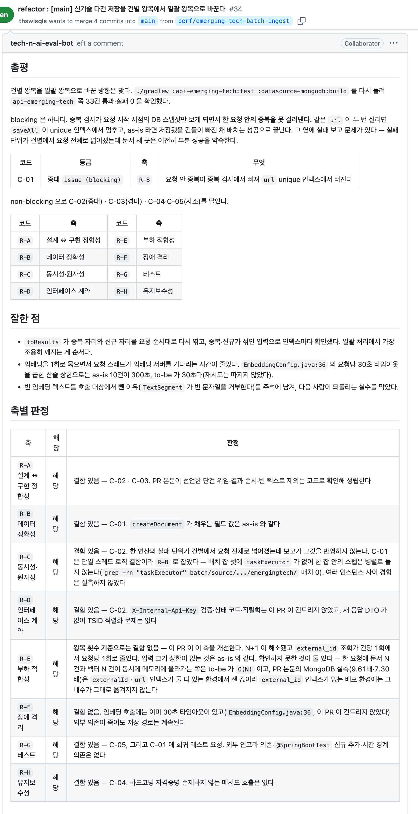
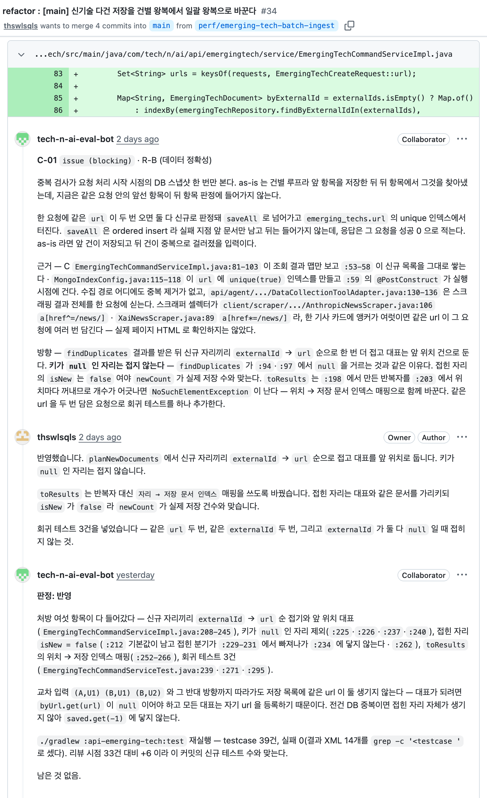
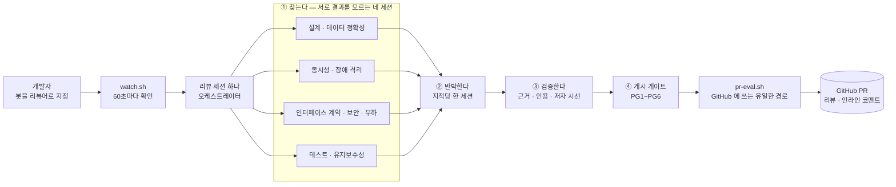
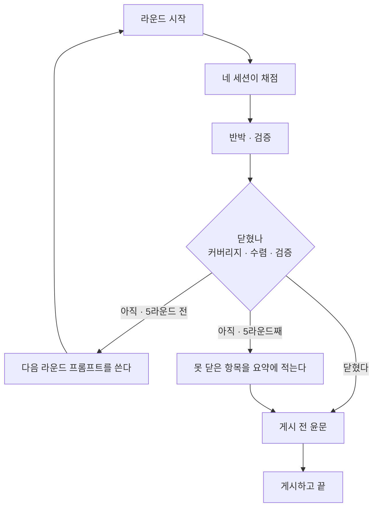
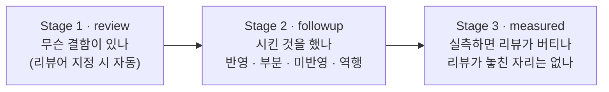

# eval-bot

AI 에이전트가 쓴 코드를 사람이 읽기 전에 먼저 읽는 리뷰 봇이다.
GitHub 에서 `tech-n-ai-eval-bot` 계정을 리뷰어로 지정하면, 봇이 알아서 PR 을 읽고 리뷰를 남긴다.
남기는 방식은 사람 리뷰어와 같다 — 요약 한 건과, 문제가 있는 코드 줄에 직접 붙는 인라인 코멘트들이다.

## 왜 만들었나

기능 하나를 브랜치 하나로 끊어 AI 에이전트에게 구현시키면 코드는 빨리 나온다.
남는 일은 **그 코드가 맞는지 확인하는 것**인데, 이쪽은 빨라지지 않는다.
"LLM 이 만든 결과물의 품질을 어떻게 검증했나"에 답하려면 검증하는 절차 자체를 만들어야 했다.

그래서 리뷰를 한 번에 끝내지 않고, **찾는 일 / 반박하는 일 / 저자 입장에서 읽는 일**을 서로 다른 세션에 나눠 맡겼다.
한 세션이 자기가 찾은 것을 스스로 옳다고 판정하면 그건 검사가 아니라 자기 확인이기 때문이다.

## 실제로 붙은 리뷰

**[thswlsqls/tech-n-ai-backend PR #34](https://github.com/thswlsqls/tech-n-ai-backend/pull/34)** — 신기술 다건 저장을 건별 왕복에서 일괄 왕복으로 바꾼 리팩토링.
봇이 인라인 코멘트 6건과 요약 한 건을 남겼다.

리뷰 요약. 머지를 막을 만한 것 하나를 먼저 적고, 리뷰 축을 하나씩 짚어 무엇이 걸렸고 무엇을 확인하지 못했는지 표로 정리했다.

인라인 코멘트 한 건. 문제가 되는 코드 줄에 그대로 붙고, 근거로 든 파일과 줄 번호가 전부 적혀 있다.
가운데가 저자의 답이고, 그 아래는 저자가 고친 뒤 봇이 같은 스레드에 남긴 후속 판정이다.

## 무엇을 근거로 판단하나

리뷰에 적히는 모든 지적은 아래 여섯 단계를 통과한 것만 남는다.

| 단계 | 하는 일 |
|---|---|
| **① 기준을 먼저 정한다** | 근거를 네 등급으로 나눈다 — 저장소 규범 문서(A) · 공식 문서 인용(B) · 코드 사실(C) · 직접 실행해 본 결과(D). 인용문이 말하는 범위를 넘어선 주장은 무효로 뺀다 |
| **② 실행할 수 있으면 실행한다** | 코드를 한 줄도 고치지 않은 채 영향 모듈의 테스트와 빌드를 다시 돌린다. 읽어서 추론한 것과 돌려서 본 것을 리뷰 안에서 섞지 않는다 |
| **③ 축을 나눠 따로 채점한다** | 리뷰 관점 아홉 축을 나눠 서로의 결과를 모르는 네 세션에 맡긴다. 각 세션은 자기 축만 보고, 찾기만 할 뿐 옳은지는 판정하지 않는다 |
| **④ 나온 지적을 반박시킨다** | 별도 세션이 근거가 가리키는 파일과 줄을 실제로 열어 본다. 코드가 이미 그것을 다루고 있지 않은지, 수치가 맞는지 다시 센다. **확실하지 않으면 반박됨으로 판정한다** |
| **⑤ 저자 입장에서 읽힌다** | 다 쓴 리뷰를 "내가 이 PR 을 쓴 사람이라면" 하는 시선으로 다시 읽어, 사실이 틀렸거나 취향을 문제로 몰아붙인 코멘트를 걸러낸다 |
| **⑥ 라운드를 이어 돈다** | 확인이 끝난 사실과 반박에 떨어진 지적을 한 줄씩 쌓아 두고 다음 라운드 프롬프트에 골라 넣는다. 고쳐지는 것은 리뷰만이 아니라 리뷰를 만드는 절차다 |

점수는 쓰지 않는다. 총점을 매기면 저자가 코드를 고치는 대신 점수에 항변하게 되기 때문에,
남는 판정은 **치명 · 중대 · 경미 · 사소** 네 등급뿐이다. 잘한 점도 최소 한 건은 반드시 적는다.

## 리뷰 아홉 축과 네 세션

지적이 나오는 관점을 아홉 개로 나누고, 서로 결과를 모르는 네 세션에 나눠 맡긴다.
각 세션은 자기 축의 정의와 "이 축에서는 보지 않을 것" 목록만 받는다.
한 세션이 아홉 축을 한꺼번에 보면 눈에 먼저 띄는 몇 개에서 멈추기 때문이다.

| 세션 | 맡는 축 | 무엇을 보나 |
|---|---|---|
| **J1** | `R-A` 설계 ↔ 구현 정합성 `R-B` 데이터 정확성 | 설계 문서와 PR 본문이 선언한 의도를 코드가 실제로 지키는가. 쓰기용 DB 와 읽기용 DB 의 값이 어긋나는가, 이벤트를 다시 처리하면 중복·누락이 생기는가 |
| **J2** | `R-C` 동시성·원자성 `R-F` 장애 격리 | 서버가 여러 대이거나 요청이 재시도될 때 깨지는 연산. 외부 시스템(LLM·Kafka·DB)이 죽었을 때 우리 서비스가 같이 죽는가 |
| **J3** | `R-D` 인터페이스 계약 `R-I` 보안 `R-E` 부하 적합성 | API 응답 형식과 상태 코드가 스펙과 맞는가. **남의 데이터를 id 만 바꿔 꺼낼 수 있는가, 토큰이나 키가 로그와 소스에 남는가.** 쿼리가 건수만큼 늘어나는가, 페이지네이션 없이 전건을 읽는가 |
| **J4** | `R-G` 테스트 `R-H` 유지보수성 | 코드가 깨졌을 때 테스트가 실제로 실패하는가. 죽은 코드·하드코딩된 값·로그 없이 조용히 실패하는 자리 |

> **`R-I` 는 조건부 축이다.** 모든 PR 이 보안 경로를 건드리지는 않는다. 인증·인가 코드가 바뀌었는지, 새 HTTP 엔드포인트가 생겼는지, 사용자별 데이터를 다루는지 같은 다섯 신호를 정해진 명령으로 세어 발동 여부를 가린다. 걸리는 것이 하나도 없으면 그 PR 에서는 여덟 축으로 돈다.
>
> 축 코드는 저장소마다 뜻이 조금 다르다. 프런트엔드에는 `R-I` 가 없고, `R-C` 가 상태 경합, `R-E` 가 클라이언트 성능,
> `R-H` 가 접근성을 포함하고 `R-G` 는 조건부 축이다. 자세한 정의는 [`profiles/`](profiles/) 에 있다.

세션 번호는 점수가 아니라 **중복 제거 순서**다. 같은 자리를 둘이 지적하면 J1 쪽을 남긴다 —
설계와 데이터가 틀렸다는 판단이 나머지 지적의 전제이기 때문이다.

## 기준의 출처

축을 어떤 순서로 두고 어디까지 문제 삼을지는 임의로 정하지 않고, 공개된 코드리뷰 기준에서 가져왔다.
인용문이 말하는 범위를 넘어선 주장은 무효로 빼는 것이 검증 단계 ①의 규칙이다.

| 하니스의 규칙 | 출처 | 근거가 된 문장 |
|---|---|---|
| 설계를 가장 먼저 본다 — `R-A` 가 첫 축이고 중복 제거에서 J1 이 우선인 이유 | Google, [What to look for in a code review](https://google.github.io/eng-practices/review/reviewer/looking-for.html) | "The most important thing to cover in a review is the overall design of the CL." |
| 동시성을 별도 축(`R-C`)으로 떼어 낸다 | 같은 문서, Functionality 절 | "…if there is some sort of **parallel programming** going on in the CL that could theoretically cause deadlocks or race conditions." |
| 테스트 축의 판정 문구 — "테스트가 있는가"가 아니라 "깨졌을 때 실패하는가" | 같은 문서, Tests 절 | "Will the tests actually fail when the code is broken?" |
| 잘한 점을 최소 한 건 반드시 적는다 | 같은 문서 Good Things 절 · [Conventional Comments](https://conventionalcomments.org/) | "If you see something nice in the CL, tell the developer…" · "Try to leave at least one of these comments per review." |
| 판정 문구가 "이상적인 설계인가"가 아니라 "코드 헬스를 악화시키는가" | Google, [The Standard of Code Review](https://google.github.io/eng-practices/review/reviewer/standard.html) | "reviewers should favor approving a CL once it is in a state where it definitely improves the overall code health of the system being worked on, even if the CL isn't perfect." |
| 근거 없는 취향은 `nitpick` 까지만 쓴다 | 같은 문서 | "On matters of style, the style guide is the absolute authority. Any purely style point (whitespace, etc.) that is not in the style guide is a matter of personal preference." |
| 코멘트 라벨 표기 — `issue (blocking)` · `suggestion` · `nitpick (non-blocking)` · `praise` | [Conventional Comments](https://conventionalcomments.org/) | 라벨 + 괄호 표시(blocking / non-blocking) 형식을 그대로 따랐다 |
| 보안 축(`R-I`)의 첫 항목이 인가 누락인 이유 | OWASP, [ASVS 5.0.0](https://github.com/OWASP/ASVS/blob/v5.0.0/5.0/en/0x17-V8-Authorization.md) V8 Authorization, 8.2.2 (Level 1) | "Verify that the application ensures that data-specific access is restricted to consumers with explicit permissions to specific data items to mitigate insecure direct object reference (IDOR) and broken object level authorization (BOLA)." |
| 토큰·자격증명이 로그에 남는 것을 결함으로 보는 근거 | [같은 문서](https://github.com/OWASP/ASVS/blob/v5.0.0/5.0/en/0x25-V16-Security-Logging-and-Error-Handling.md) V16 Security Logging and Error Handling, 16.2.5 (Level 2) | "Verify that when logging sensitive data, the application enforces logging based on the data's protection level. For example, it may not be allowed to log certain data, such as credentials or payment details. Other data, such as session tokens, may only be logged by being hashed or masked, either in full or partially." |

테스트 축에서 세게 몰아붙이지 않는 이유도 여기에 있다. 근거가 되는 문장이
*"Ask for unit, integration, or end-to-end tests **as appropriate** for the change."* 라는 선택지형이라,
"이런 테스트가 없으니 blocking" 이라고 쓰면 인용이 뒷받침하는 범위를 넘는다.

> Google eng-practices 저장소는 현재 아카이브 상태다(마지막 push 2024-09-19). 위 인용은 그 시점의 문서 기준이다.
>
> **ASVS 는 점검표로 돌리지 않는다.** 두 인용문을 보안 축 정의문의 근거로만 쓴다.
> 표준 요구사항 상당수는 설정·아키텍처·런타임 증거를 봐야 판정되는데 봇이 보는 것은 PR 의 diff 다.
> 전건 점검표로 돌리면 근거로 댈 코드 줄이 없는 지적만 잔뜩 나온다.

## 어떻게 도나

리뷰 한 판이 한 라운드다. 한 라운드가 끝나면 새로 나온 지적이 얼마나 줄었는지를 보고,
아직 안 닫혔으면 다음 라운드로 이어 간다. 라운드마다 새 지적은 줄고, 대신 앞 라운드가 쓴 글이 틀렸다는 것이 나온다.

## 리뷰는 세 번에 나눠 붙는다

한 번 리뷰하고 끝내면 "지적이 실제로 반영됐는지"와 "리뷰가 놓친 게 있는지"를 아무도 확인하지 않는다.
그래서 스테이지를 셋으로 나눴다.

PR #34 에서는 Stage 1 이 코멘트 6건(그중 잘한 점 1건)을 남겼고, 저자가 고친 뒤 Stage 2 가 전건을 판정했다 —
반영 5건, 부분 1건. Stage 3 은 반영한 커밋을 따로 받아 빌드와 테스트를 다시 돌려,
리뷰가 놓쳤던 테스트 사각지대 1건을 새로 찾아냈다. 저자가 그것까지 고치자 Stage 2 를 한 번 더 돌려 전건 반영을 확인했다.

## 봇이 못 하는 일

리뷰 봇에게 코드를 고칠 권한을 주면 리뷰가 아니라 또 하나의 작성자가 된다. 그래서 처음부터 막아 뒀다.

- **코드를 고치지 않는다.** 봇 계정의 저장소 권한은 읽기 전용이다. 문서 약속이 아니라 GitHub 권한으로 막는다.
- **승인도 변경요청도 하지 않는다.** 코멘트만 단다. 봇이 머지 게이트를 쥐면 사람이 봇을 통과시키려고 리뷰를 왜곡하게 된다.
- **봇 토큰을 세션이 갖지 않는다.** GitHub 에 쓰는 것은 스크립트 하나뿐이고, 토큰은 그 안에서만 읽힌다.
- **확인하지 못한 것은 게시하지 않는다.** 근거를 못 댄 의심은 작업 폴더에만 남는다.

## 더 볼 것

| 파일 | 무엇 |
|---|---|
| [`CLAUDE.md`](CLAUDE.md) | 하니스 운영 문서 — 스크립트 계약 · 산출물 규격 · 설치 · 실측으로 확인한 것 |
| [`00-criteria.md`](00-criteria.md) | 세 스테이지 공통 규칙 — 무효 조건 · 등급 · 출처 등급 · 코멘트 규격 |
| [`01-stages.md`](01-stages.md) | 스테이지별 규격 · 게시 게이트 · 종료 조건 · 지표 |
| [`02-judges.md`](02-judges.md) | 채점 세션 · 반박자 · 검증자에게 주는 지시문 |
| [`profiles/`](profiles/) | 저장소별 리뷰 축 정의와 축마다 "볼 것 / 보지 않을 것" |
| [`_memory/learnings.md`](_memory/learnings.md) | PR 을 넘어 남는 학습. 라운드마다 한 줄씩 쌓인다 |
